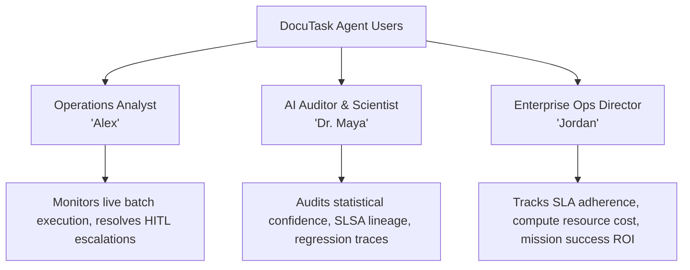
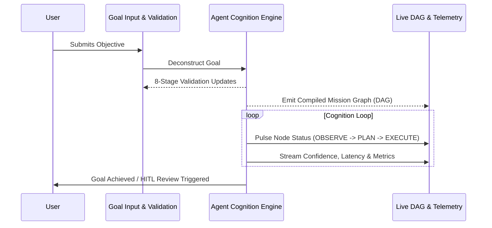

# DocuTask Agent — UI Architecture & UX Foundation

## 1. Executive Vision & Theme

**DocuTask Agent** is not a generic SaaS dashboard or CRUD administrative portal. It is an **Autonomous AI Coworker Experience**.

The interface communicates at every interaction:
> *"An autonomous AI agent is actively understanding goals, making decisions, executing tasks, learning, and improving."*

### Core Visual & Interaction Principles

1. **Trustworthy**: Every prediction, confidence score, and metric is backed by observable evidence. No hallucinated progress bars or fabricated completeness indicators. When evidence is pending, the UI displays explicit Zero-Fabrication sentinels (`UNKNOWN`, `NOT_AVAILABLE`, `NOT_COLLECTED`, `PENDING_DISCOVERY`).
2. **Intelligent**: The UI dynamically reflects the agent's cognition cycle ($\text{Goal} \to \text{Observe} \to \text{Plan} \to \text{Execute} \to \text{Reflect} \to \text{Learn}$) with live telemetry, causal links, and decision trees.
3. **Modern & Premium**: High-density typography with tabular numbers, subtle glassmorphic depth, refined dark-mode neutral slate backgrounds, and focused cobalt/cyan intelligence accents.
4. **Explainable**: The interface surfaces *why* decisions were made, what alternatives were evaluated, the estimated risk vector across 9 dimensions, and statistical confidence intervals ($\pm \sigma$).
5. **Autonomous**: Real-time asynchronous state updates, clear human-in-the-loop (HITL) checkpoints, pause/resume capability, and ambient status pulses.

---

## 2. User Personas & Target Audiences



### Persona 1: Operations Analyst ("Alex")
- **Goal**: Delegate document processing workflows to DocuTask Agent, monitor high-volume throughput, and review flagged edge cases.
- **Pain Point**: Lack of visibility into why an AI skipped or misclassified a document.
- **UI Need**: Clear confidence indicators, rapid diff inspection, single-click override with feedback logging.

### Persona 2: AI Systems Auditor & Reproducibility Reviewer ("Dr. Maya")
- **Goal**: Verify mathematical validity, SLSA Level 3+ cryptographic provenance, and zero-fabrication guarantees.
- **Pain Point**: Opaque black-box outputs with unverified statistical assertions.
- **UI Need**: Complete DAG execution timelines, sample size power calculations ($n \ge 2\left(\frac{z_\alpha + z_\beta}{\text{ES}}\right)^2$), raw evidence inspection.

### Persona 3: Enterprise Operations Director ("Jordan")
- **Goal**: Oversee enterprise automation health, computational budget allocation, and error-rate reductions.
- **Pain Point**: Unexpected budget overruns or undetected performance drift.
- **UI Need**: Multi-agent fleet overview, 9-dimension risk profiles, execution budget burn charts.

---

## 3. Primary User Journeys

### Journey A: Autonomous Mission Dispatch & Real-Time Cognition Stream
1. **Goal Submission**: User enters a high-level goal (e.g. *"Process and reconcile Q3 utility invoices with >95% confidence"*).
2. **Goal Deconstruction & Validation**: UI visualizes the 8-stage Mission Builder pipeline (`VALIDATING` $\to$ `ANALYZING_CAPABILITIES` $\to$ `ANALYZING_DEPENDENCIES` $\to$ `ANALYZING_RISK` $\to$ `ESTIMATING_BUDGET` $\to$ `GENERATING_SUCCESS_CRITERIA` $\to$ `READY_FOR_OBSERVATION`).
3. **Execution & Live Telemetry**: Dynamic node DAG lights up as actions are dispatched; status indicators pulse with cognitive activity.
4. **Reflection & Memory Consolidation**: Agent surfaces learned invariants and updates episodic memory stores.

### Journey B: Explainability & Decision Audit
1. **Inspection**: User clicks on any step or milestone in the Mission Timeline.
2. **Cognitive Breakdown**: Side drawer reveals:
   - **Rationale**: Why this path was selected over alternatives.
   - **Confidence & Uncertainty**: 95% CI with empirical sample size $n$.
   - **Risk Assessment**: 9-dimension radar breakdown (Safety, Bias, Performance, Resource, etc.).
   - **Cryptographic Lineage**: SHA-256 digest linked to input and output artifacts.

---

## 4. Application Information Architecture (IA)

```
DocuTask Agent UI
├── 1. Top Navigation Bar (Global Fleet Status, Active Agent Count, Budget Burn, Notifications)
├── 2. Primary Workspace (Sidebar Navigation)
│   ├── /missions               # Mission Command & Goal Dispatch
│   ├── /missions/:id           # Live Mission Cognition DAG & Telemetry
│   ├── /agents                 # Multi-Agent Coordination Fleet & Roles
│   ├── /memory                 # Episodic, Long-term & Failure Memory Explorer
│   ├── /observatory            # Benchmark Leaderboard & Regression Monitor
│   ├── /governance             # SLSA Provenance, Audit Ledger & HITL Policies
│   └── /settings               # Compute quotas, model endpoints, API keys
└── 3. Ambient Agent Status Drawer (Collapsible bottom/side live thought stream)
```

---

## 5. Component Hierarchy & Modular Structure

```
src/
├── design-system/                  # Design Tokens & Styling Primitives
│   ├── tokens/
│   │   ├── colors.ts              # Semantic palette, agent state colors, neutrals
│   │   ├── typography.ts          # Font weights, line heights, tabular scale
│   │   ├── spacing.ts             # 4px modular spacing scale
│   │   ├── shadows.ts             # Elevation & glow tokens
│   │   ├── borders.ts             # Radii, stroke widths, borders
│   │   └── animations.ts          # Keyframes, transitions, pulse rates
│   └── index.ts                   # Master design token export
│
├── components/
│   ├── ui/                        # Foundational UI Atoms & Molecules
│   │   ├── Button.tsx             # Semantic button with agent glow & loading
│   │   ├── Card.tsx               # Enterprise surface with glassmorphism
│   │   ├── Badge.tsx              # State, capability, and risk badges
│   │   ├── StatusIndicator.tsx    # Live pulsing agent radar/indicator
│   │   ├── ProgressRing.tsx       # SVG circular progress with indeterminate glow
│   │   ├── ConfidenceIndicator.tsx# Statistical confidence bar with error margins
│   │   ├── Timeline.tsx           # Audit trail and cognitive step timeline
│   │   ├── EmptyState.tsx         # Explainable zero-state views
│   │   └── LoadingState.tsx       # Neural thinking skeletons & loaders
│   │
│   └── agent/                     # Autonomous Agent Domain Component Contracts
│       ├── AgentStatus.ts         # Agent state, role, heartbeat contract
│       ├── MissionState.ts        # 14-state FSM visualization contract
│       ├── WorkflowStep.ts        # DAG action node interface & telemetry
│       ├── DecisionExplanation.ts # Explainability, alternatives & risk models
│       ├── ConfidenceScore.ts     # Statistical uncertainty & power contract
│       └── MemoryInsight.ts       # Memory retention & recall contract
```

---

## 6. State Management Approach

- **Real-Time Event Streams**: Asynchronous WebSockets / Server-Sent Events (SSE) for agent thought stream, state transitions, and step telemetry.
- **Optimistic UI with Deterministic Rollback**: UI reflects immediate user actions (pause, abort, override) while awaiting backend cryptographic state receipts.
- **Zero-Fabrication State Guard**: UI hooks convert missing backend telemetry to explicit `NonFabricationState` objects rather than defaulting to `0%` or empty placeholders.

---

## 7. Agent Visualization Strategy



1. **Neural Pulse**: When an agent is in `THINKING` or `OBSERVING` mode, the component borders and status indicators emit an asynchronous cyan/cobalt pulse.
2. **DAG Execution Map**: Visual graph rendering with color-coded nodes reflecting execution state (`PENDING`, `IN_PROGRESS`, `COMPLETED`, `FAILED`, `SKIPPED`).
3. **Audit Watermark**: All verified results display a micro-badge with the SHA-256 evidence fingerprint.

---

## 8. Responsive Behavior & Viewport Breakpoints

| Breakpoint | Width | Layout Strategy |
| :--- | :--- | :--- |
| **Mobile (`sm`)** | `< 640px` | Single-column stacked stream; collapsible bottom sheet for agent thoughts. |
| **Tablet (`md`)** | `640px – 1024px` | 2-column layout (DAG left, telemetry right); collapsible navigation rail. |
| **Desktop (`lg`)** | `1024px – 1440px` | 3-pane workstation (Navigation, DAG Workspace, Cognition/Inspector Drawer). |
| **Ultra-Wide (`2xl`)** | `> 1440px` | Full panoramic operations center with multi-agent fleet overview and live log waterfall. |

---

## 9. Accessibility & Inclusivity (WCAG 2.1 AA)

- **Color Contrast**: All text elements adhere to a minimum 4.5:1 contrast ratio against dark and light backgrounds.
- **Color Independence**: No agent state is communicated solely by color; all indicators pair icons, text labels, and ARIA attributes.
- **Keyboard Navigation**: Full focus trap management in modals, arrow-key navigation in DAG trees, and accessible hotkeys (`Space` to pause, `Esc` to close drawers).
- **Reduced Motion**: Respects `prefers-reduced-motion` media queries by disabling pulsing glows and complex SVG path transitions.
