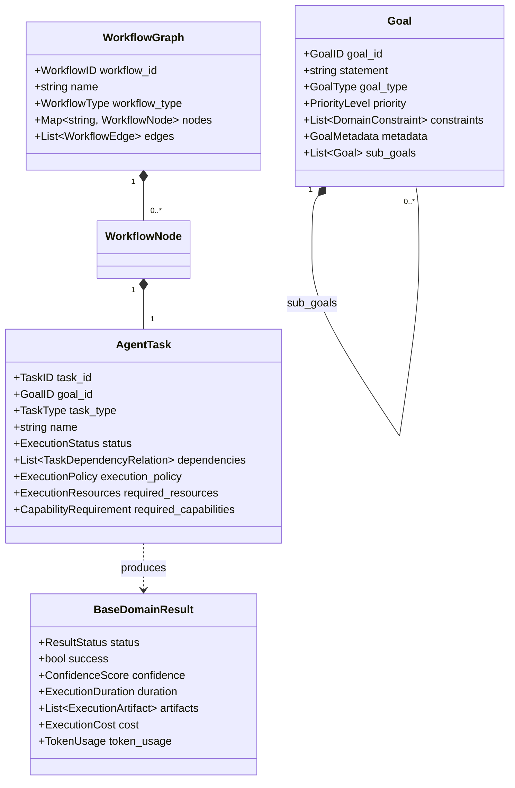
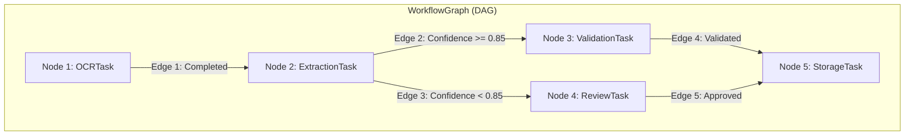
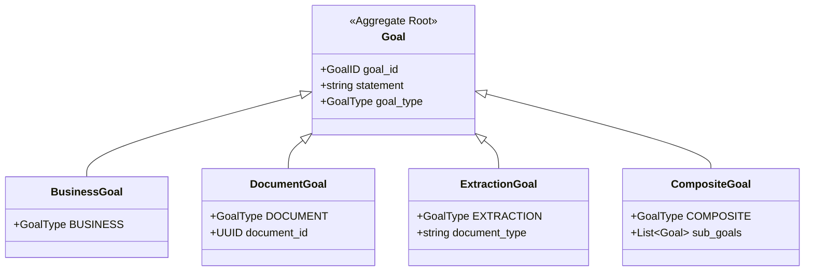
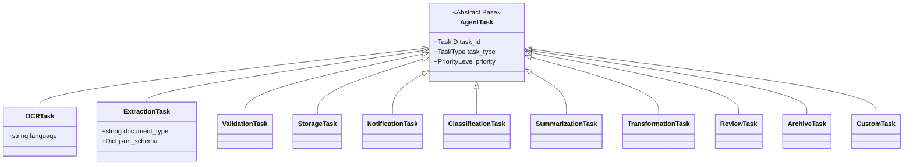
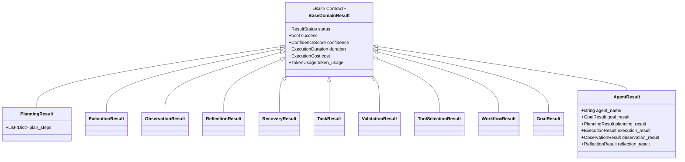
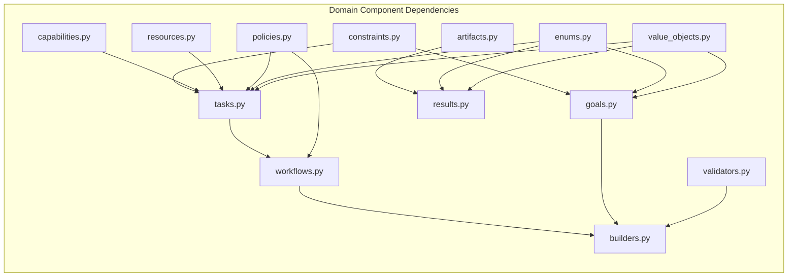

# Enterprise Agent Domain Model — Architecture & Implementation Review Report (Prompt 11.0)

**Target System**: Autonomous Agent Framework Domain Package (`app/agents/domain/`)  
**Target Path**: `C:\Users\User\Desktop\ai_document_processing_platform\app\agents\domain\`  
**Design Standard**: Enterprise Domain-Driven Design (DDD), Clean Architecture, Pydantic v2  
**Hackathon Target**: Google Cloud All Things Agentic Hackathon & Global Enterprise Production  

---

## Executive Summary

The **Enterprise Agent Domain Model (Prompt 11.0)** has been implemented under `app/agents/domain/`. This package establishes strongly typed, serializable domain contracts for every future agentic component (Planner, Executor, Observer, Reflector, Memory Engine, Recovery Engine, Tool Selector, and Multi-Agent Coordinator).

This domain layer completely eliminates raw dictionaries, untyped objects, magic strings, and hardcoded workflow logic from core contracts.

---

## 1. Domain Architectural Mermaid Diagrams

### A. Core Domain Model Aggregate Diagram

### B. Workflow DAG Model Diagram

### C. Goal Hierarchy Diagram

### D. Task Hierarchy Diagram

### E. Result Hierarchy Diagram

### F. Dependency Graph Diagram

---

## 2. DDD Aggregate & Value Object Analysis

1. **Elimination of Primitive Obsession**: Primitive floats and ints are replaced with validated value objects (`ConfidenceScore`, `ExecutionDuration`, `RetryCount`, `TokenUsage`, `ExecutionCost`, `GoalID`, `TaskID`, `WorkflowID`, `ExecutionID`, `CorrelationID`, `ArtifactID`).
2. **Aggregates**:
   - **`Goal` Aggregate**: Encapsulates objectives, deadline, constraints, metadata, and sub-goals.
   - **`WorkflowGraph` Aggregate**: Encapsulates nodes, edges, topology rules, and DAG cycle detection.
3. **Serialization & Integration**:
   - 100% of domain models inherit from Pydantic v2 `BaseModel` supporting JSON schema generation, Pub/Sub payload serialization, and database ORM mapping.

---

## 3. Readiness Assessment for Phase 2 (Planner Implementation)

The domain model is **100% Ready for Phase 2 (Planner Implementation)**:
- `AgentPlanner` interface can take a `Goal` aggregate and produce a `PlanningResult` containing a `WorkflowGraph` or list of `AgentTask` instances.
- `DomainValidator.validate_workflow_graph` guarantees zero circular dependencies in generated DAGs before execution.
