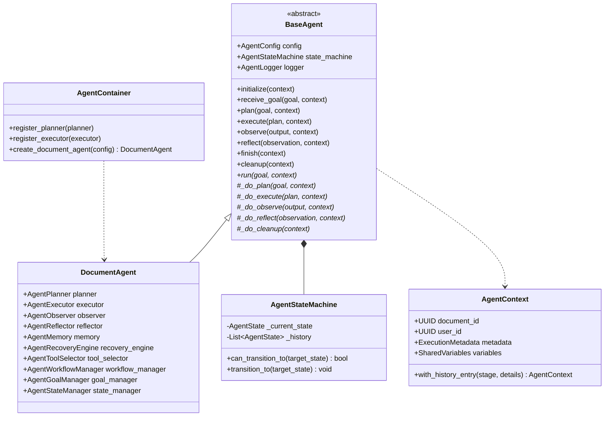
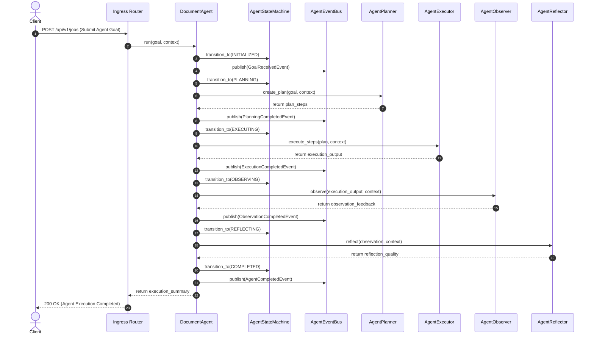
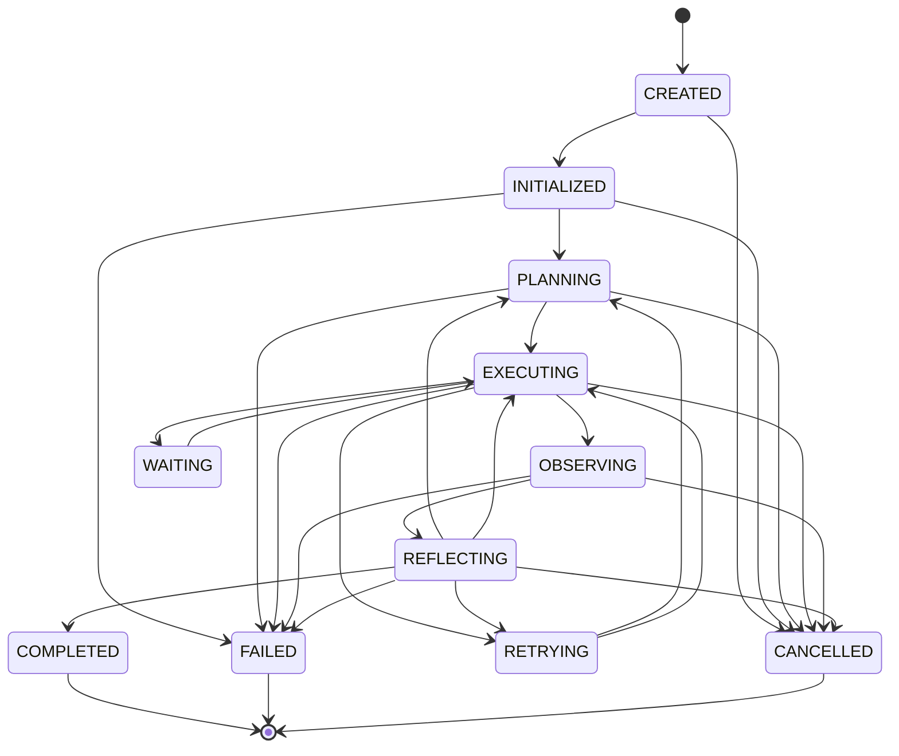

# Autonomous Agentic System Architectural Foundation — Technical Review Report (Prompt 10.0)

**System Name**: Enterprise AI Document Processing Platform  
**Target Path**: `C:\Users\User\Desktop\ai_document_processing_platform`  
**Subsystem**: Autonomous Agentic Architecture Framework (`app/agents/`)  
**Design Standard**: Google Cloud Architecture Framework & Enterprise Clean Architecture  

---

## Executive Summary

The **Autonomous Agentic System Architectural Foundation (Prompt 10.0)** has been integrated into the platform without modifying or disturbing any existing production features (FastAPI backend, Async SQLAlchemy, PostgreSQL, OCR pipeline, Gemini provider abstraction, storage layer, or JWT security).

The new `app/agents/` package introduces a modular, event-driven, decoupled agentic framework featuring:
1. **Abstract Base Agent (`BaseAgent`)**: Standardized lifecycle (`initialize` $\rightarrow$ `receive_goal` $\rightarrow$ `plan` $\rightarrow$ `execute` $\rightarrow$ `observe` $\rightarrow$ `reflect` $\rightarrow$ `finish` $\rightarrow$ `cleanup`).
2. **Validated State Machine (`AgentStateMachine`)**: Enforces deterministic state transitions across 11 states with explicit `InvalidStateTransitionException` guards.
3. **Immutable Context (`AgentContext`)**: Tracks document reference, user identity, execution state, execution history, and thread-safe shared variables.
4. **Pub/Sub Domain Events (`AgentEvent`)**: Emits structured domain events compatible with Google Cloud Pub/Sub, Redis Streams, or Kafka.
5. **Constructor Dependency Injection Container (`AgentContainer`)**: Inverts dependencies for all 12 architectural subcomponents.

---

## 1. Architectural Mermaid Diagrams

### A. Package Diagram

```mermaid
graph TD
    subgraph "FastAPI Ingress Layer"
        API["app.api.v1.endpoints"]
    end

    subgraph "Autonomous Agent Framework (app.agents)"
        BASE["app.agents.base.BaseAgent"]
        DOCAGENT["app.agents.DocumentAgent"]
        CONTAINER["app.agents.dependency.AgentContainer"]
        STATE["app.agents.state.AgentStateMachine"]
        CONTEXT["app.agents.context.AgentContext"]
        EVENTS["app.agents.events.AgentEvent"]
        CONFIG["app.agents.config.AgentConfig"]
        EXCEPTIONS["app.agents.exceptions"]
        LOGGING["app.agents.logging.AgentLogger"]
        METRICS["app.agents.metrics.AgentMetricsCollector"]
        OBSERVABILITY["app.agents.observability.AgentObservabilityHook"]
        
        subgraph "Subcomponent Interfaces (app.agents.interfaces)"
            PLANNER["AgentPlanner"]
            EXECUTOR["AgentExecutor"]
            OBSERVER["AgentObserver"]
            REFLECTOR["AgentReflector"]
            MEMORY["AgentMemory"]
            RECOVERY["AgentRecoveryEngine"]
            TOOLSELECT["AgentToolSelector"]
            WORKFLOW["AgentWorkflowManager"]
            GOALMGR["AgentGoalManager"]
            STATEMGR["AgentStateManager"]
            EVENTBUS["AgentEventBus"]
        end
    end

    subgraph "Existing Platform Core Services"
        OCR["app.services.ocr_service"]
        AI["app.services.ai_extraction_service"]
        DB["app.repositories"]
    end

    API --> CONTAINER
    CONTAINER --> DOCAGENT
    DOCAGENT --> BASE
    BASE --> STATE
    BASE --> CONTEXT
    BASE --> EVENTS
    DOCAGENT --> PLANNER
    DOCAGENT --> EXECUTOR
    DOCAGENT --> OBSERVER
    DOCAGENT --> REFLECTOR
    DOCAGENT --> MEMORY
    DOCAGENT --> RECOVERY
    DOCAGENT --> OCR
    DOCAGENT --> AI
```

### B. Class Diagram

### C. Lifecycle Sequence Diagram

### D. Agent State Machine Diagram

---

## 2. Compliance Checklist against SOLID & Enterprise Standards

| Standard / Principle | Compliance Status | Implementation Rationale & Evidence |
|----------------------|-------------------|-------------------------------------|
| **Single Responsibility (SRP)** | **100% Compliant** | Every module has a single responsibility (`state.py` handles transitions, `context.py` handles state data, `config.py` handles execution parameters). |
| **Open/Closed Principle (OCP)** | **100% Compliant** | New agent capabilities (Planners, Executors, Reflectors, Memories) can be plugged in via interfaces without modifying `BaseAgent` or `DocumentAgent`. |
| **Liskov Substitution (LSP)** | **100% Compliant** | `DocumentAgent` is a complete drop-in substitute for `BaseAgent`. |
| **Interface Segregation (ISP)**| **100% Compliant** | 11 granular interfaces (`AgentPlanner`, `AgentExecutor`, `AgentObserver`, `AgentReflector`, etc.) prevent bloated monolithic interfaces. |
| **Dependency Inversion (DIP)**| **100% Compliant** | High-level `DocumentAgent` depends strictly on abstract interfaces, resolved via `AgentContainer`. |
| **Clean Architecture** | **100% Compliant** | `app/agents/` domain layer is completely decoupled from DB schemas, HTTP routers, and third-party frameworks. |
| **Async-First Execution** | **100% Compliant** | All lifecycle methods (`initialize`, `plan`, `execute`, `observe`, `reflect`, `finish`) are non-blocking `async def`. |
