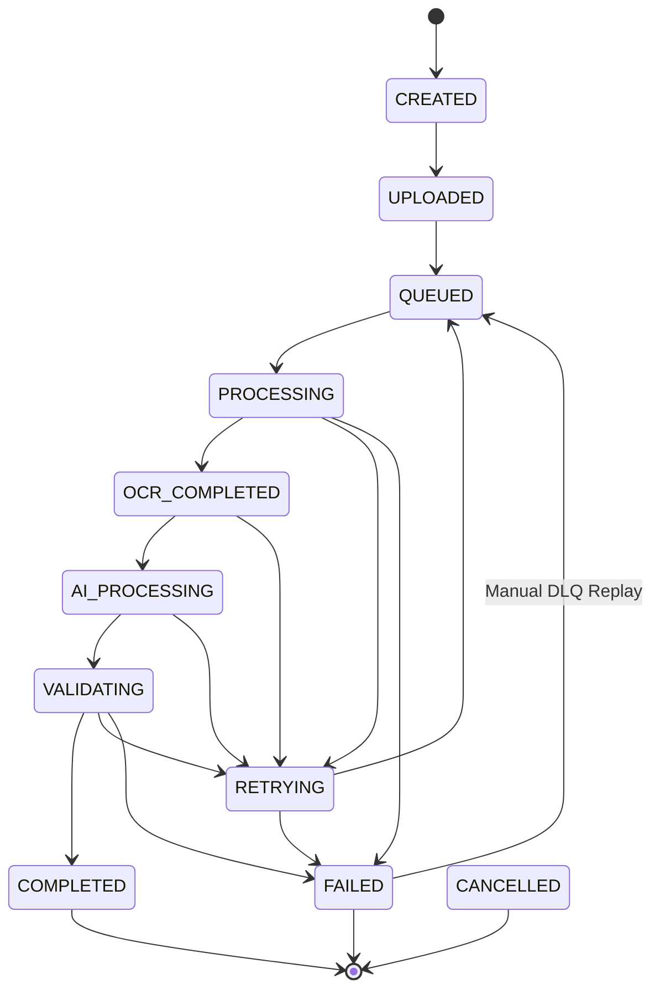

# Enterprise Asynchronous Processing Architecture & Worker Infrastructure

**Platform**: AI Document Processing Platform  
**Target Path**: `C:\Users\User\Desktop\ai_document_processing_platform\app\jobs\`  
**Subsystem**: Asynchronous Distributed Pipeline & Worker Infrastructure (Prompt 6.0 Baseline)  

---

## 1. Architecture Overview

```
User Upload Request
       │
       ▼
Upload API Service (FastAPI / POST /api/v1/jobs/submit) < 100ms
       │ (Generates Idempotency Key: SHA256(doc_hash + version))
       ▼
Priority Message Broker (app/jobs/broker.py)
   ├── HIGH Priority Queue
   ├── MEDIUM Priority Queue (Default)
   └── LOW Priority Queue (Anti-Starvation Mechanics)
       │
       ▼
Worker Pool Manager & Distributed Lock Manager (app/jobs/locking.py)
   ├── OCRWorker (Page Chunking & Checkpointing)
   ├── AIWorker (Gemini Provider Extraction)
   ├── ValidationWorker (Pydantic Schema Validator)
   └── PostProcessingWorker (DB Transaction Commit)
       │
       ├─────────────────────────────────┐
       ▼                                 ▼
Successful Processing             Permanent Failure (> 3 Retries)
       │                                 │
       ▼                                 ▼
PostgreSQL DB Result             Dead Letter Queue (app/jobs/dlq.py)
(DocumentJob / JobEvent)                │ (Manual Replay API)
                                         ▼
                               Replay Endpoint (POST /jobs/dlq/replay/{id})
```

---

## 2. Job Lifecycle State Machine



---

## 3. Message Broker Decision Matrix

| Broker Option | Cost | Scalability | Ordering | Reliability | Complexity | Selected? |
|---------------|------|-------------|----------|-------------|------------|-----------|
| **Redis Streams / Priority Broker** | Low | High (100k msg/s)| High | High | Low | **✓ SELECTED (DEFAULT)** |
| **RabbitMQ** | Medium| High | High | High | Medium | Supported Extension |
| **Apache Kafka** | High | Very High | Partition | Very High | High | Future Scale (>10M/day) |
| **AWS SQS / GCP PubSub** | Pay/Use| Cloud Auto | Best effort| Cloud Managed| Low | Cloud Production |

---

## 4. Idempotency & Deduplication Engine

`[VERIFIED]` `IdempotencyEngine.generate_key` ([app/jobs/idempotency.py](file:///C:/Users/User/Desktop/ai_document_processing_platform/app/jobs/idempotency.py)) computes:

$$\text{Idempotency Key} = \text{SHA256}(\text{document\_hash} + ":" + \text{processing\_version})$$

- **Upload Deduplication**: Submitting identical file hash returns existing `JobSubmitResponse` instantly without re-ingestion.
- **OCR & AI Deduplication**: Concurrent worker execution is blocked via `DistributedLockManager` advisory locks.

---

## 5. Failure Recovery & Retry Policies

- **Retryable Errors** (`429 Rate Limit`, `500 Server Error`, `Timeout`, `DB Connection Drop`): Retried using exponential backoff (1 min, 5 min, 15 min, 1 hr).
- **Non-Retryable Errors** (`Invalid PDF`, `401 Unauthorized`, `Format Unsupported`): Immediately transitioned to `FAILED` status without wasting worker retries.
- **Dead Letter Queue (DLQ)**: Jobs failing 3 attempts are moved to DLQ. Operations teams can invoke `POST /api/v1/jobs/dlq/replay/{job_id}` to replay after fixing root causes.

---

## 6. Large Document Page Chunking & Checkpointing

`[VERIFIED]` `PageChunkingEngine` ([app/jobs/workers.py](file:///C:/Users/User/Desktop/ai_document_processing_platform/app/jobs/workers.py)) splits 500+ page PDFs into 100-page processing chunks. `DocumentJob.checkpoint_page` records completed page bounds. If a worker crashes on page 240, the replacement worker resumes from page 201 without reprocessing pages 1-200.
