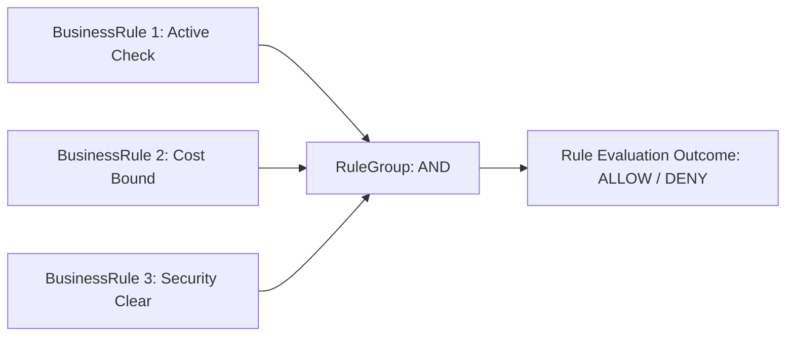
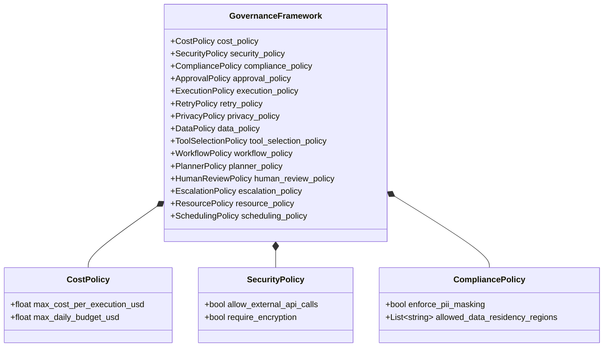
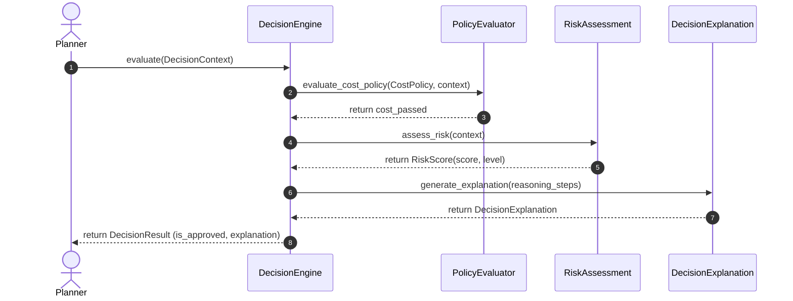
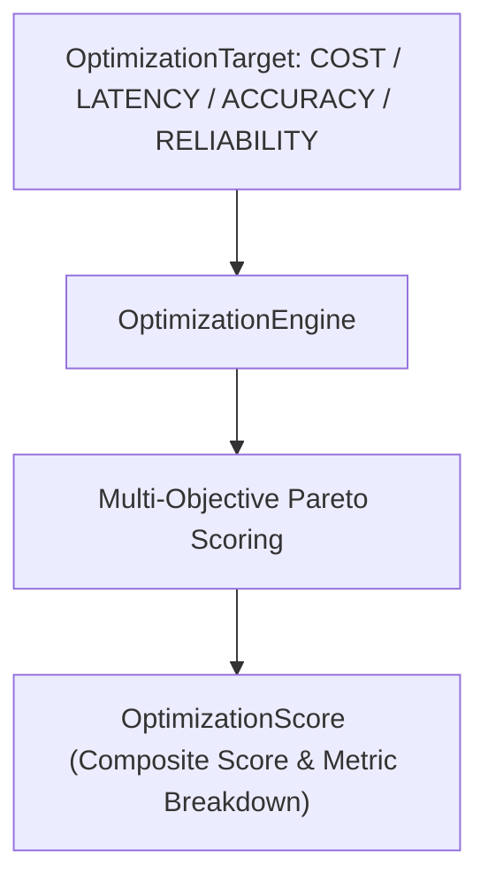
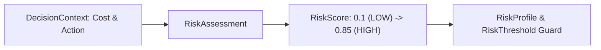
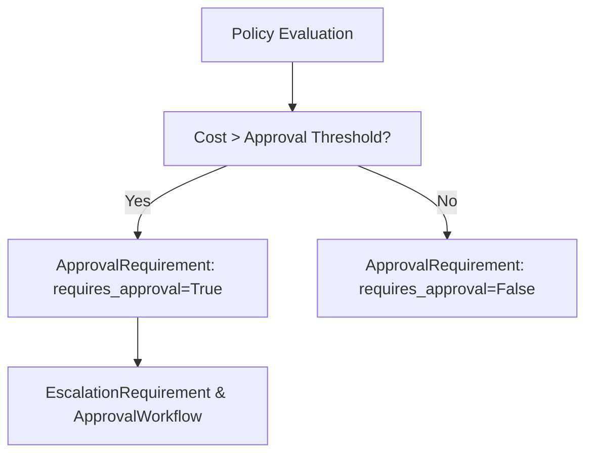
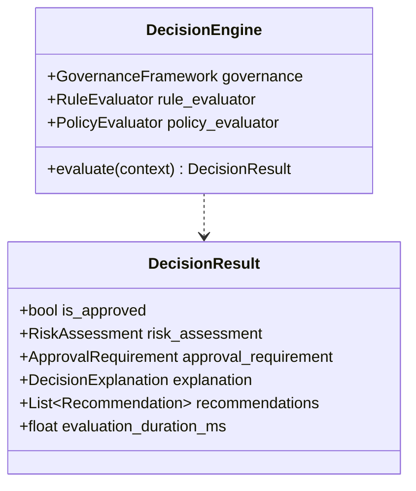
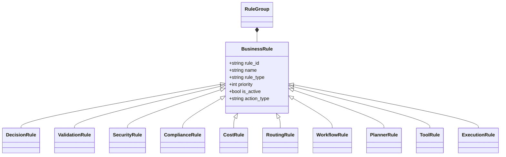

# Enterprise Decision, Policy & Governance Engine — Architecture & Implementation Review Report (Prompt 15.0)

**Target System**: Decision Engine Subsystem (`app/agents/decision/`)  
**Target Path**: `C:\Users\User\Desktop\ai_document_processing_platform\app\agents\decision\`  
**Design Standard**: Enterprise Clean Architecture, Domain-Driven Design, Pydantic v2, SOLID, Explainable AI  
**Hackathon Target**: Google Cloud All Things Agentic Hackathon & Global Enterprise Production  

---

## Executive Summary

The **Enterprise Decision, Policy & Governance Engine (Prompt 15.0)** has been implemented under `app/agents/decision/`. This centralized decision authority evaluates enterprise policies, business rules, governance frameworks, risk scores, cost budgets, and approval requirements before any planning or execution begins.

Future Planners and Executors contain 0 business rules. Instead, they invoke `DecisionEngine.evaluate(...)` and receive a strongly typed `DecisionResult` complete with a step-by-step `DecisionExplanation`.

---

## 1. Decision Architectural Mermaid Diagrams

### A. Decision Layered Architecture Diagram

```mermaid
graph TD
    subgraph "Agent Subsystems (Consumers)"
        PLANNER["Agent Planner / Executor / Workflow Engine"]
    end

    subgraph "Centralized Decision Authority (app.agents.decision)"
        ENGINE["DecisionEngine Entrypoint"]
        GOV["GovernanceFramework"]
        REVAL["RuleEvaluator & Group Evaluator"]
        PEVAL["PolicyEvaluator"]
        CEVAL["ConstraintEvaluator"]
        RISK["RiskAssessment Engine"]
        APPROVAL["ApprovalRequirement Resolver"]
        EXPLAIN["DecisionExplanation Generator"]
        OPT["OptimizationEngine"]
        REC["RecommendationEngine"]
    end

    subgraph "Policy & Rule Repositories"
        RULES["BusinessRule & RuleGroup (AND/OR/NOT)"]
        POLICIES["CostPolicy / SecurityPolicy / CompliancePolicy / ApprovalPolicy / ExecutionPolicy"]
    end

    PLANNER -->|1. evaluate(DecisionContext)| ENGINE
    ENGINE *-- GOV
    GOV *-- RULES
    GOV *-- POLICIES
    ENGINE -->|2. Evaluate Rules| REVAL
    ENGINE -->|3. Evaluate Policies| PEVAL
    ENGINE -->|4. Evaluate Constraints| CEVAL
    ENGINE -->|5. Assess Risk| RISK
    ENGINE -->|6. Check Approvals| APPROVAL
    ENGINE -->|7. Multi-Objective Optimization| OPT
    ENGINE -->|8. Generate Recommendations| REC
    ENGINE -->|9. Generate Explanation| EXPLAIN
    ENGINE -->>PLANNER: 10. Return DecisionResult (Approved / Rejected)
```

### B. Rules Engine Diagram



### C. Policy Engine Diagram



### D. Decision Flow Diagram



### E. Optimization Flow Diagram



### F. Risk Evaluation Diagram



### G. Approval Flow Diagram



### H. Decision Class Diagram



### I. Policy Hierarchy Diagram

```mermaid
classDiagram
    class ExecutionPolicy
    class RetryPolicy
    class CostPolicy
    class SecurityPolicy
    class CompliancePolicy
    class PrivacyPolicy
    class DataPolicy
    class ToolSelectionPolicy
    class WorkflowPolicy
    class PlannerPolicy
    class ApprovalPolicy
    class HumanReviewPolicy
    class EscalationPolicy
    class ResourcePolicy
    class SchedulingPolicy
```



### J. Rule Hierarchy Diagram



---

## 2. Decoupled Governance & Explainable AI Strategy

1. **Zero Business Rules in Planners**: Planners only know how to construct plans; they delegate rule validation to `DecisionEngine`.
2. **Explainable Decision Traces**: Every `DecisionResult` includes a `DecisionExplanation` containing step-by-step `ReasoningStep` logs, `Evidence` models, and `DecisionGraph` representations.
3. **Multi-Objective Optimization**: `OptimizationEngine` scores candidate plans across cost, latency, accuracy, token consumption, and reliability.

---

## 3. Google Cloud Readiness & Phase Readiness

| GCP Service | Integration / Compatibility Pattern | Status |
| :--- | :--- | :--- |
| **Cloud Run** | Async-first, stateless decision execution | Fully Compatible |
| **Cloud Tasks** | Serializable `DecisionRequest` / `DecisionResult` payloads | Fully Compatible |
| **Cloud Pub/Sub** | Pub/Sub domain events (`DecisionRequested`, `DecisionApproved`, `RiskDetected`) | Fully Compatible |
| **Cloud SQL / AlloyDB AI** | DecisionRepository and DecisionCache persistence | Fully Compatible |
| **Vertex AI** | Evaluation embeddings and model policy governance | Fully Compatible |
| **Secret Manager** | Security policy credential isolation | Fully Compatible |
| **Cloud Monitoring & Logging** | Structured decision metrics and trace logging | Fully Compatible |
| **OpenTelemetry & Cloud Trace** | DecisionTrace context propagation | Fully Compatible |

- **Phase Readiness**: **100% Ready for Phase 16.0 (Planning Contracts & Planning Graph) and Phase 17.0 (Intelligent Planner Implementation)**.
