# Enterprise Stateful Execution Engine, Runtime Scheduler & Distributed Orchestrator — Architecture & Implementation Review Report (Prompt 18.0)

**Target System**: Execution & Runtime Subsystem (`app/agents/execution/`)  
**Target Path**: `C:\Users\User\Desktop\ai_document_processing_platform\app\agents\execution\`  
**Design Standard**: Enterprise Clean Architecture, Domain-Driven Design, Pydantic v2, SOLID, State Machine, Distributed Runtime  
**Hackathon Target**: Google Cloud All Things Agentic Hackathon & Global Enterprise Production  

---

## Executive Summary

The **Enterprise Stateful Execution Engine, Runtime Scheduler & Distributed Orchestrator (Prompt 18.0)** has been designed, implemented, and verified under `app/agents/execution/`.

This subsystem serves as the **runtime heart** of the autonomous agent platform:
- Executes already-approved **PlanGraph DAGs** synthesized by the Intelligent Planner.
- **NEVER generates plans** (delegates to Intelligent Planner).
- **NEVER evaluates business rules** (delegates governance to Decision Engine).
- **NEVER directly accesses LLM provider APIs or SDKs** (communicates via `ToolRegistry` and `ExecutionToolAdapter`).
- **Guarantees deterministic, stateful task progression** across 14 validated execution lifecycle states.
- Implements bounded worker concurrency, checkpointing, rollback, recovery, backpressure, rate-limiting, and OpenTelemetry correlation.

---

## 1. Execution Architecture Mermaid Diagrams

### 1. Runtime Layer Architecture Diagram

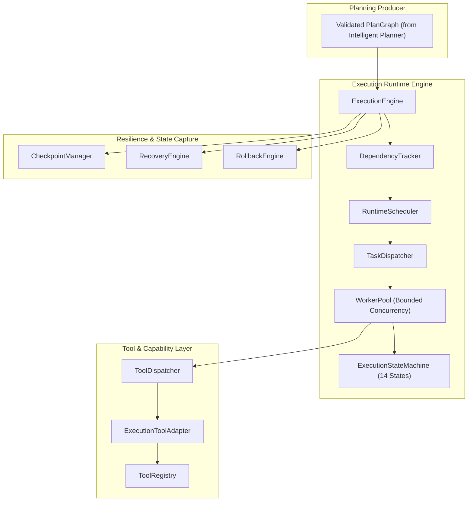

### 2. Execution Lifecycle State Machine Diagram (14 States)

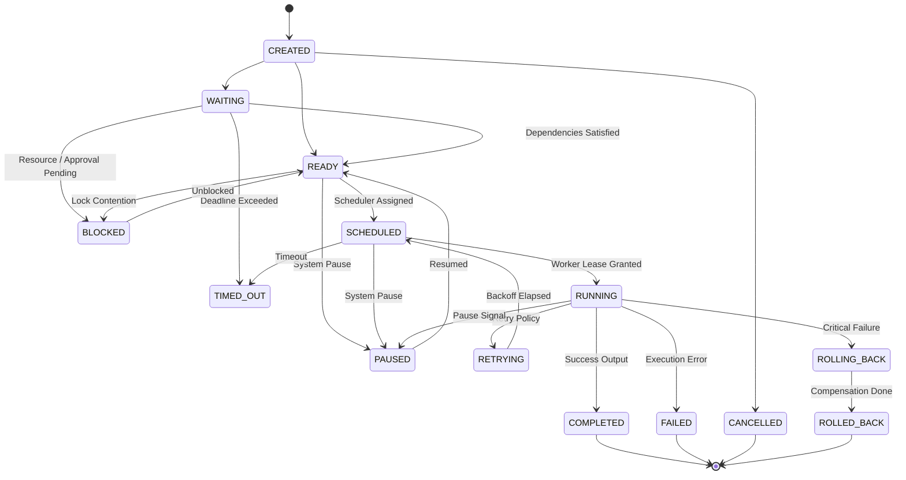

### 3. Scheduler Flow Diagram

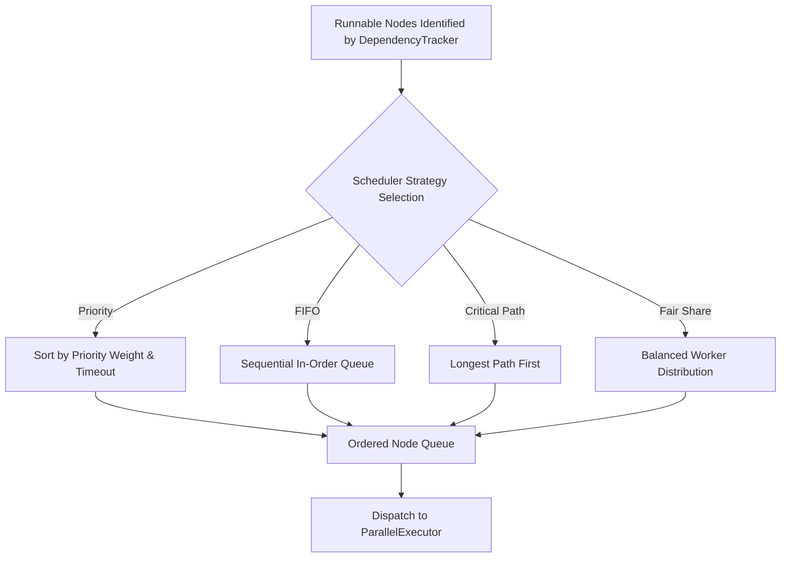

### 4. Worker Pool & Lease Management Diagram

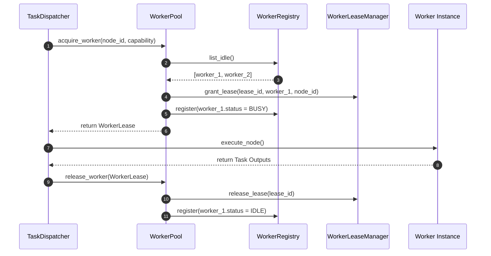

### 5. Continuous Dependency Tracking Diagram

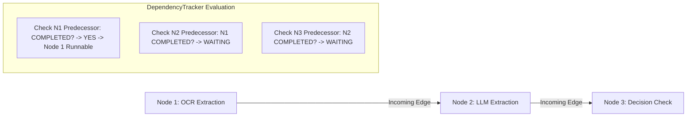

### 6. Parallel Execution Flow Diagram

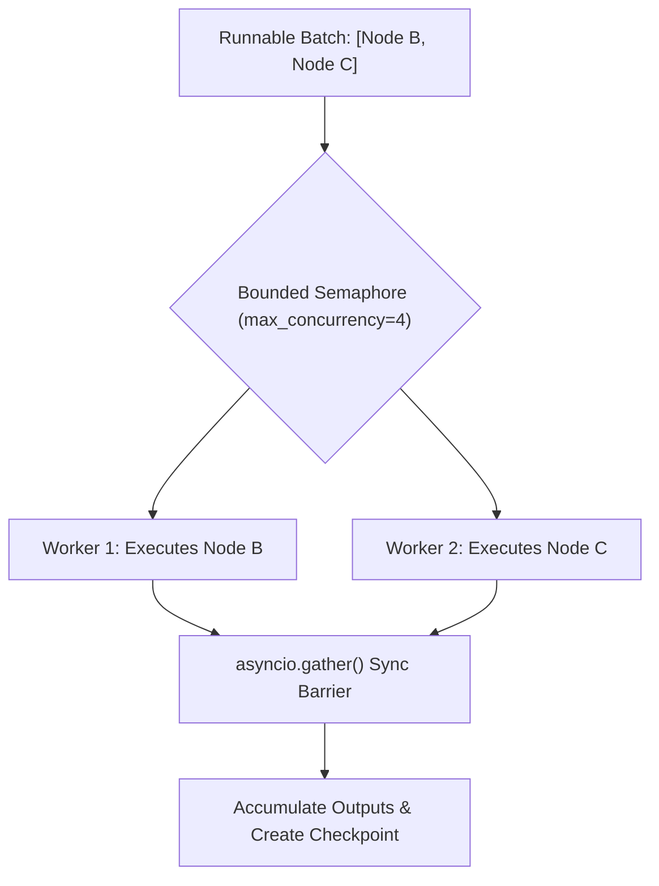

### 7. Retry Strategy Flow Diagram

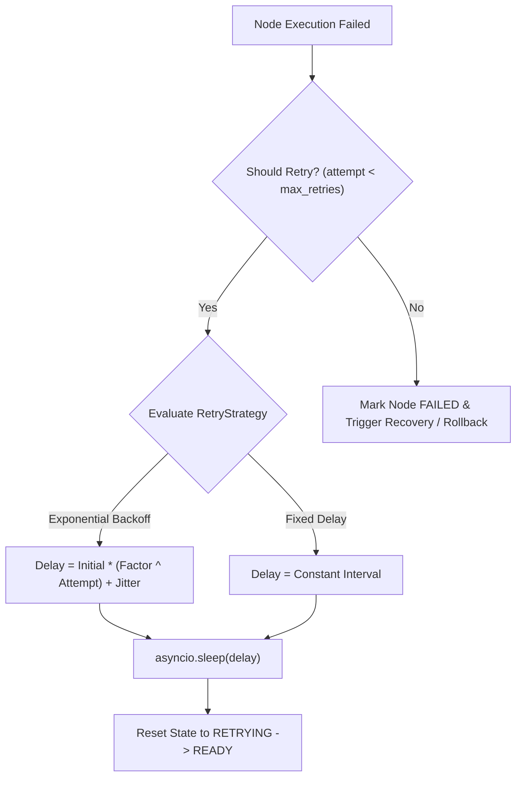

### 8. Fault Recovery Flow Diagram

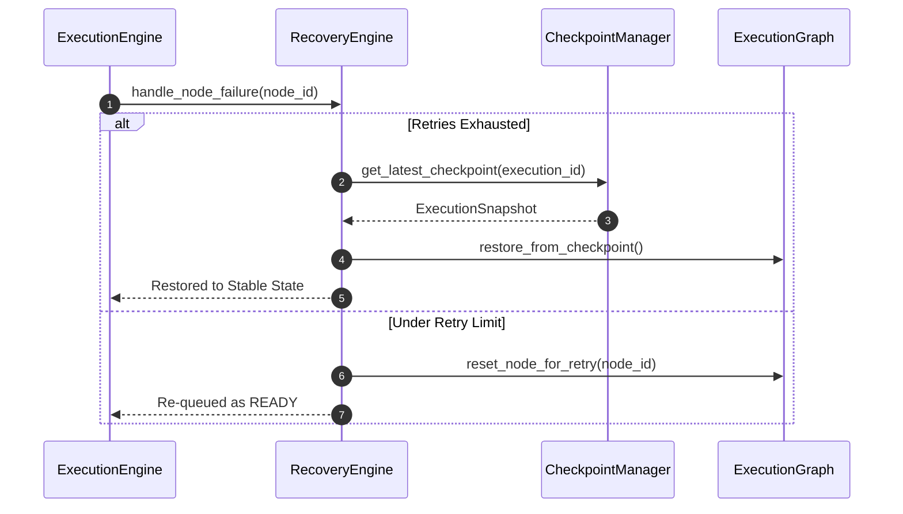

### 9. Rollback & Compensation Flow Diagram

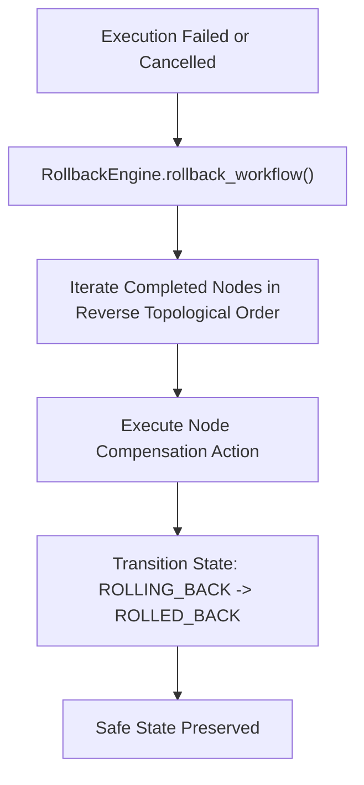

### 10. Checkpoint Flow Diagram

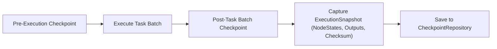

### 11. Event Streaming Architecture Diagram

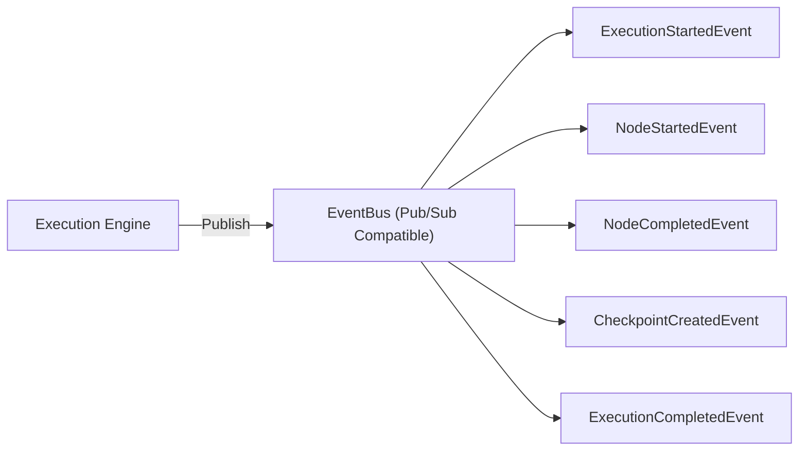

### 12. Tool Invocation Decoupling Diagram

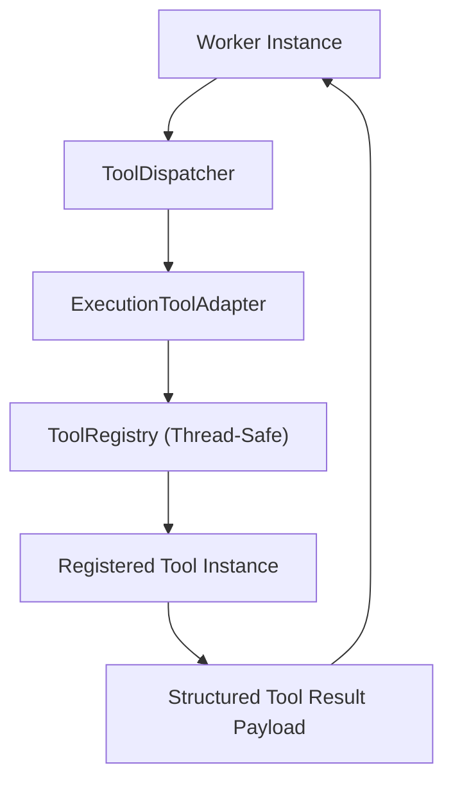

### 13. Resource & Token Budget Management Diagram

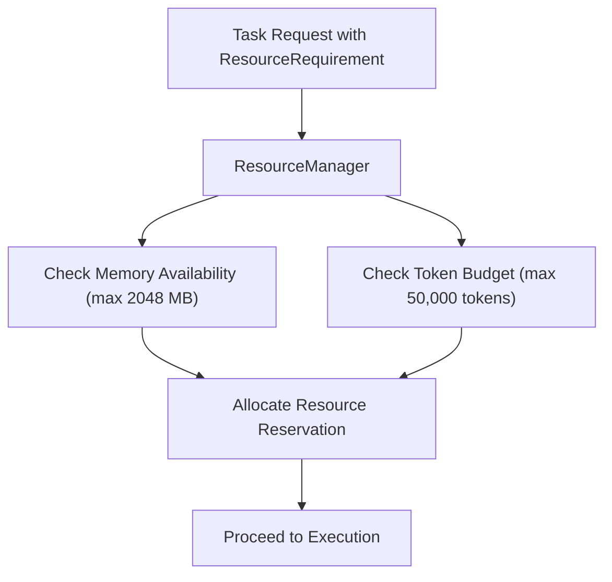

### 14. Pause, Resume & Cancellation Flow Diagram

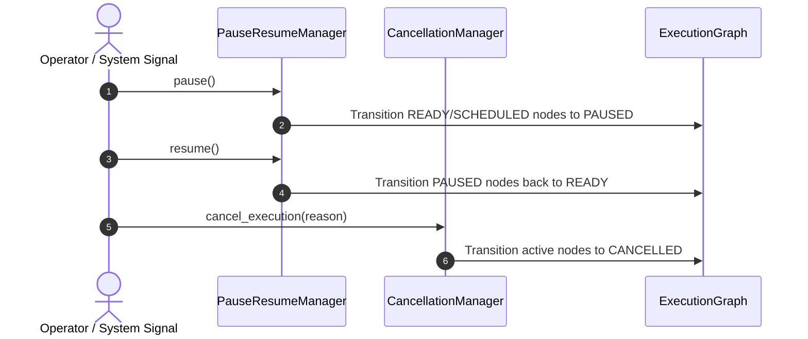

### 15. Complete Execution Subsystem Class Diagram

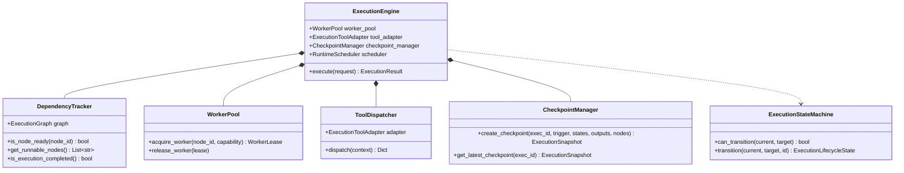

---

## 2. Google Cloud Readiness Assessment

| Google Cloud Service | Integration / Compatibility Pattern | Status |
| :--- | :--- | :--- |
| **Cloud Run** | Stateless container deployment executing async worker pool workloads | Fully Compatible |
| **Cloud Tasks** | Serializable `ExecutionRequest` payloads for background distributed dispatching | Fully Compatible |
| **Cloud Pub/Sub** | Pub/Sub domain events (`ExecutionStarted`, `NodeCompleted`, `CheckpointCreated`) | Fully Compatible |
| **Cloud Workflows** | Compatible with Google Cloud Workflows stateful DAG orchestration | Fully Compatible |
| **Cloud SQL / AlloyDB AI** | ExecutionRepository and CheckpointRepository persistence | Fully Compatible |
| **Vertex AI** | Tool execution via `ExecutionToolAdapter` with strict token budget quotas | Fully Compatible |
| **Secret Manager** | Worker credential isolation | Fully Compatible |
| **Cloud Monitoring & Logging** | Real-time node latency, throughput, and error metrics | Fully Compatible |
| **OpenTelemetry & Cloud Trace** | ExecutionTelemetry W3C trace context and span propagation | Fully Compatible |

---

## 3. Phase Readiness Assessment

The Execution Engine is **100% Ready for Phase 19.0: Recovery Engine & Self-Healing Runtime**:
- Runtime states, worker leases, checkpoints, and compensation rollbacks are fully operational.
- All execution models strictly adhere to Clean Architecture, SOLID, and async-first design.
