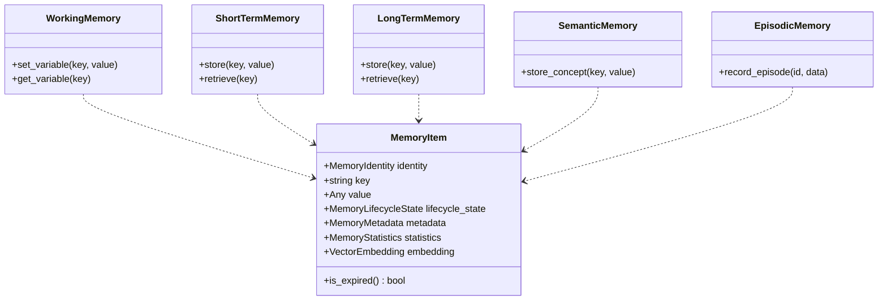
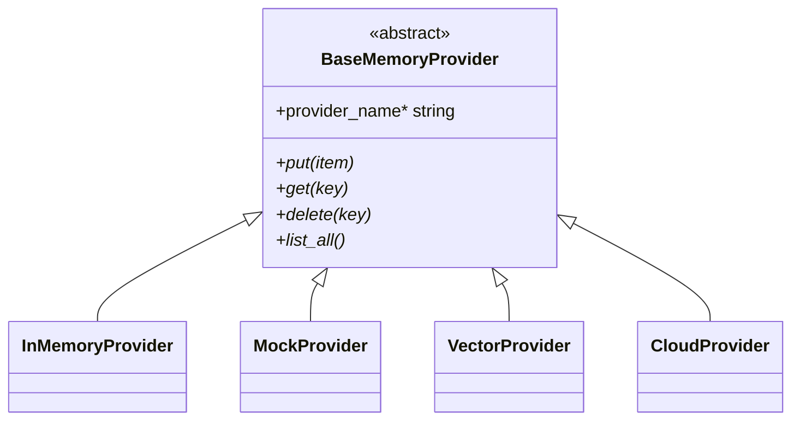
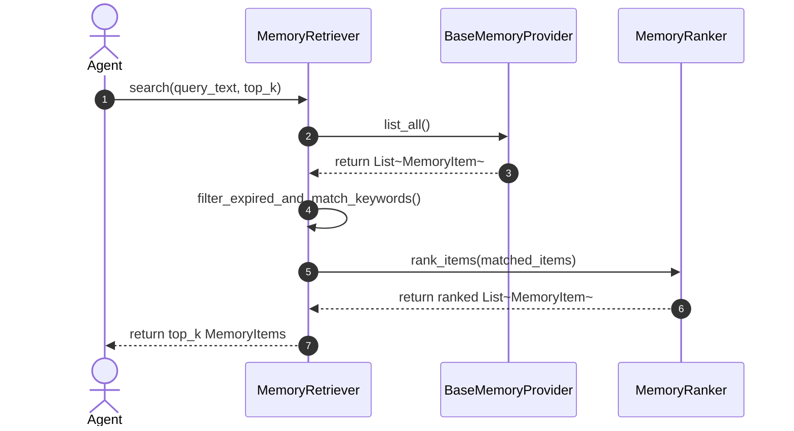
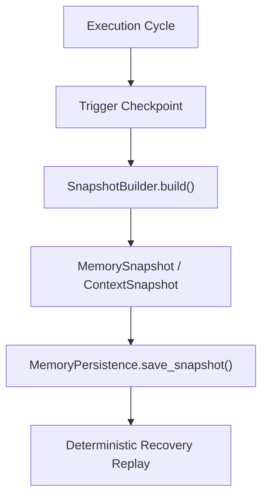
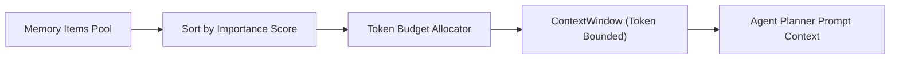
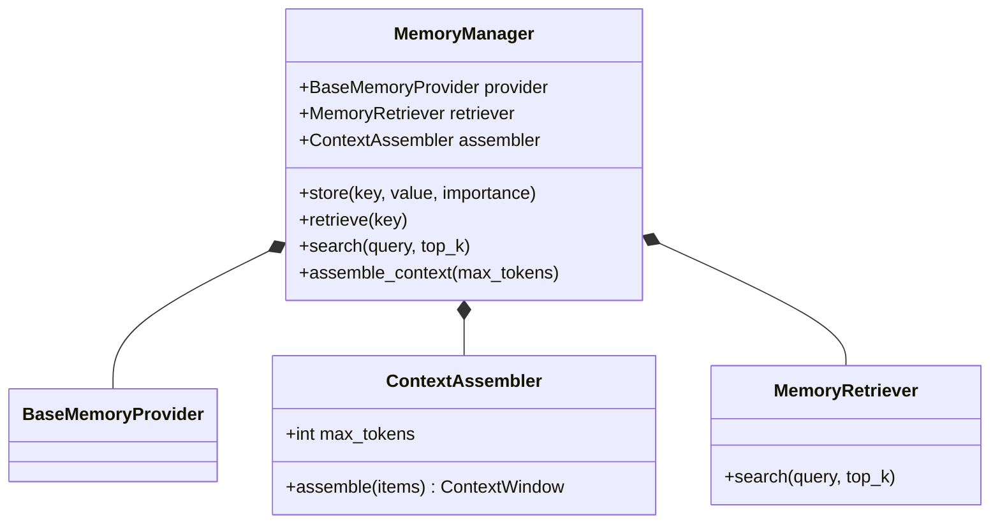

# Enterprise Memory, Knowledge & Context Foundation — Architecture & Implementation Review Report (Prompt 13.0)

**Target System**: Memory Subsystem (`app/agents/memory/`)  
**Target Path**: `C:\Users\User\Desktop\ai_document_processing_platform\app\agents\memory\`  
**Design Standard**: Enterprise Clean Architecture, Domain-Driven Design, Pydantic v2, SOLID  
**Hackathon Target**: Google Cloud All Things Agentic Hackathon & Global Enterprise Production  

---

## Executive Summary

The **Enterprise Memory, Knowledge & Context Foundation (Prompt 13.0)** has been implemented under `app/agents/memory/`. This layer establishes strongly typed memory contracts, sub-tier architectures, knowledge graph representations, context window assemblers, and state snapshot mechanisms.

Future agent components (Planner, Executor, Observer, Reflection Engine, Recovery Engine, Tool Selector, Workflow Engine, and Multi-Agent Coordinator) interact exclusively with these contracts. The memory subsystem completely decouples agent reasoning from underlying storage providers (Redis, PostgreSQL, Supabase, Pinecone, Vertex AI Vector Search, ChromaDB, FAISS, AlloyDB AI, or local storage).

---

## 1. Memory Architectural Mermaid Diagrams

### A. Memory Layered Architecture Diagram

```mermaid
graph TD
    subgraph "Agent Reasoning Layer"
        PLANNER["Agent Planner / Executor / Observer / Reflector"]
    end

    subgraph "Memory Manager & Assembly (app.agents.memory)"
        MM["MemoryManager (Orchestrator)"]
        ASSEMBLER["ContextAssembler (Token Budgeting)"]
        RETRIEVER["MemoryRetriever & MemoryRanker"]
        PERSISTENCE["MemoryPersistence & Snapshots"]
    end

    subgraph "Memory Sub-Tiers"
        WM["Working Memory"]
        STM["Short-Term Memory"]
        LTM["Long-Term Memory"]
        EPI["Episodic Memory"]
        SEM["Semantic Memory"]
        PROC["Procedural Memory"]
        CONV["Conversation Memory"]
    end

    subgraph "Abstract Providers (BaseMemoryProvider)"
        INMEM["InMemoryProvider"]
        MOCK["MockProvider"]
        VECTOR["VectorProvider"]
        CLOUD["CloudProvider (AlloyDB / Cloud SQL / Redis)"]
    end

    PLANNER -->|1. Store / Query| MM
    MM -->|2. Assemble Context| ASSEMBLER
    MM -->|3. Search / Rank| RETRIEVER
    MM -->|4. Persist / Recover| PERSISTENCE
    MM *-- WM
    MM *-- STM
    MM *-- LTM
    MM *-- EPI
    MM *-- SEM
    MM *-- PROC
    MM *-- CONV
    WM --> INMEM
    STM --> INMEM
    LTM --> CLOUD
    SEM --> VECTOR
```

### B. Memory Hierarchy Diagram



### C. Knowledge Architecture Diagram

```mermaid
graph LR
    subgraph "Knowledge Graph Subsystem"
        KI["KnowledgeItem (Facts, Rules, Patterns)"]
        KGN["KnowledgeGraphNode"]
        KE["KnowledgeEdge"]
        KC["KnowledgeCluster"]
    end

    KGN -->|Connected via| KE
    KC *-- KGN
    KC *-- KE
    KI -->|Refers to| KGN
```

### D. Provider Architecture Diagram



### E. Retrieval Flow Diagram



### F. Snapshot & Recovery Flow Diagram



### G. Context Assembly Flow Diagram



### H. Complete Class Diagram



---

## 2. Decoupled Provider Strategy & Token Budgeting

1. **Zero Provider Coupling**: Planners call `MemoryManager.store()` or `MemoryManager.search()` without knowing whether memory resides in RAM, Redis, PostgreSQL, or Vertex AI Vector Search.
2. **Token-Budgeted Context Window**: `ContextAssembler` automatically sorts memory records by importance and packs them into a token-bounded `ContextWindow` (`max_tokens=4000`) for LLM prompt generation.

---

## 3. Phase 2 Readiness Assessment

The Memory Subsystem is **100% Ready for Phase 2 (Intelligent Planner Implementation)**:
- Planners can consume `ContextWindow` objects directly.
- Epistemic and procedural memory stores contain all DAG workflow routines and historical observations necessary for intelligent planning.
