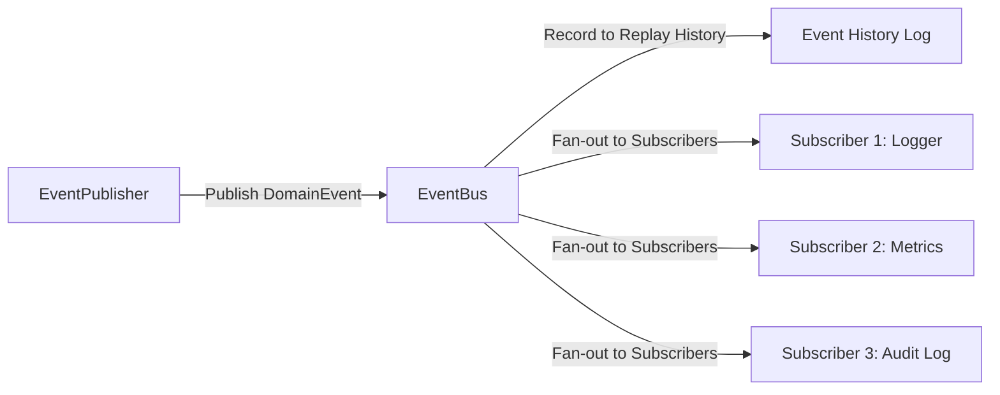
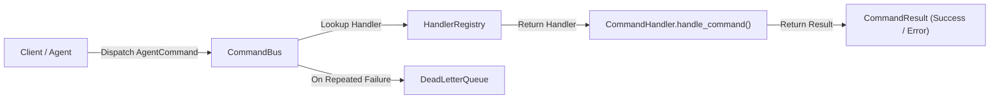
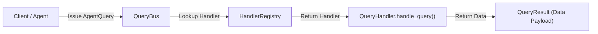
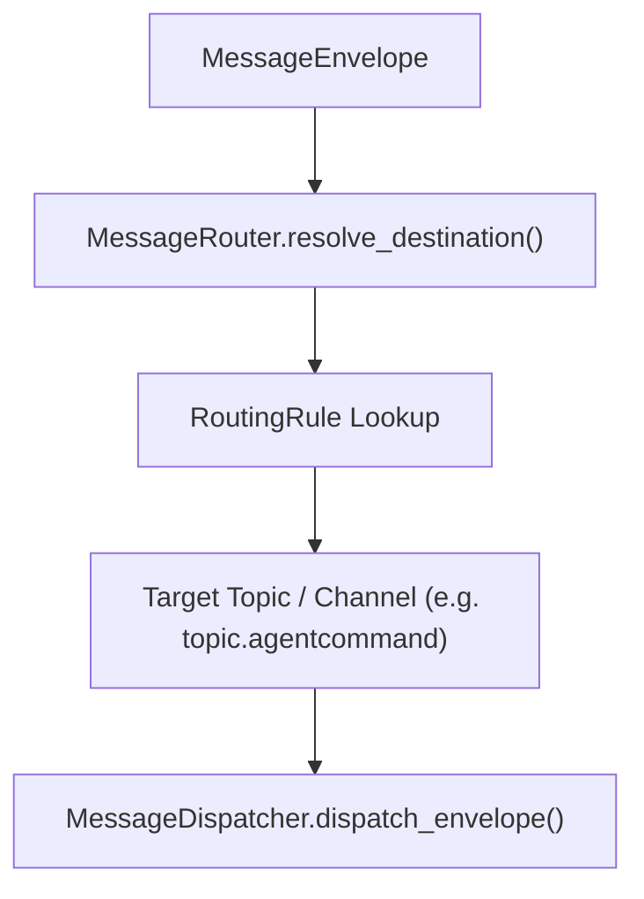
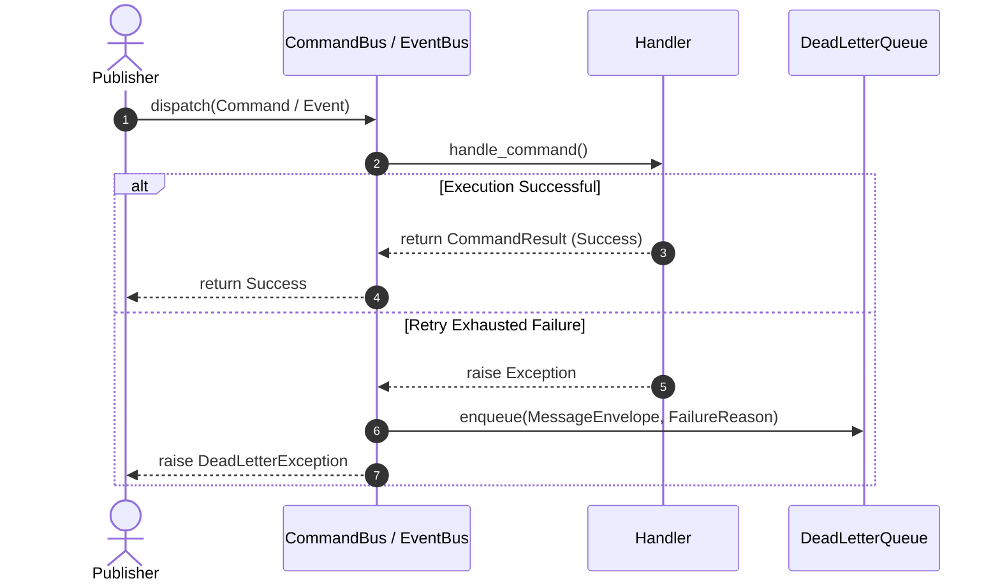
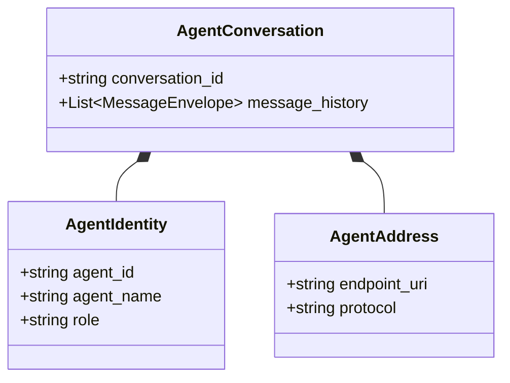
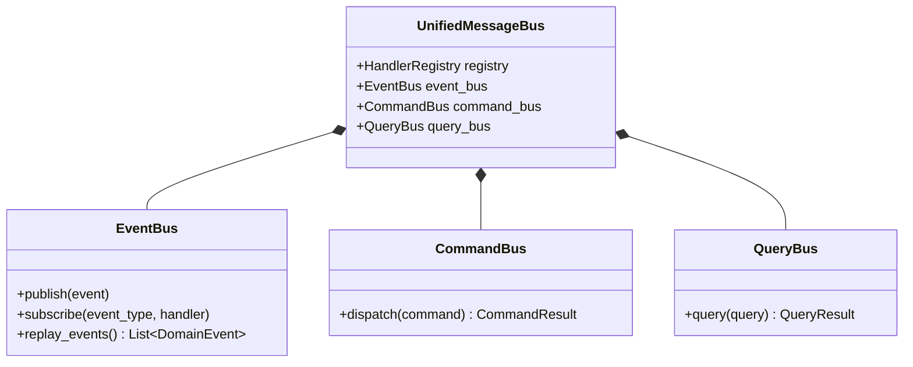

# Enterprise Messaging, Event Bus & Agent Communication Foundation — Architecture & Implementation Review Report (Prompt 14.0)

**Target System**: Messaging Subsystem (`app/agents/messaging/`)  
**Target Path**: `C:\Users\User\Desktop\ai_document_processing_platform\app\agents\messaging\`  
**Design Standard**: Enterprise Clean Architecture, Domain-Driven Design, Pydantic v2, SOLID, Event-Driven Architecture  
**Hackathon Target**: Google Cloud All Things Agentic Hackathon & Global Enterprise Production  

---

## Executive Summary

The **Enterprise Messaging, Event Bus & Agent Communication Foundation (Prompt 14.0)** has been implemented under `app/agents/messaging/`. This layer establishes strongly typed communication contracts, `EventBus` pub/sub, `CommandBus` dispatching, `QueryBus` request/response, `DeadLetterQueue` failure handling, and OpenTelemetry W3C distributed tracing hooks.

Future agent components (Planner, Executor, Observer, Reflection Engine, Recovery Engine, Tool Registry, Memory Foundation, Decision & Policy Engine, and Multi-Agent Coordinator) communicate exclusively through typed message contracts rather than direct method calls or raw dictionaries.

---

## 1. Messaging Architectural Mermaid Diagrams

### A. Messaging Layered Architecture Diagram

```mermaid
graph TD
    subgraph "Agent Subsystems (Consumers & Producers)"
        PLANNER["Agent Planner / Executor / Observer / Reflector"]
    end

    subgraph "Unified Message Bus (app.agents.messaging)"
        BUS["UnifiedMessageBus"]
        EB["EventBus (Pub / Sub & Replay)"]
        CB["CommandBus (Command Dispatch)"]
        QB["QueryBus (Request / Response)"]
        DLQ["DeadLetterQueue (Failure Capture)"]
        REGISTRY["HandlerRegistry"]
    end

    subgraph "Abstract Brokers (BaseMessageBroker)"
        INMEM["InMemoryMessageBroker"]
        PUBSUB["Cloud Pub/Sub Broker Adapter"]
        TASKS["Cloud Tasks Broker Adapter"]
    end

    PLANNER -->|1. Publish Event / Dispatch Command / Query| BUS
    BUS *-- EB
    BUS *-- CB
    BUS *-- QB
    BUS *-- DLQ
    BUS *-- REGISTRY
    EB --> INMEM
    CB --> INMEM
    QB --> INMEM
    INMEM --> PUBSUB
    INMEM --> TASKS
```

### B. Event Bus Architecture Diagram



### C. Command Bus Architecture Diagram



### D. Query Bus Architecture Diagram



### E. Routing Flow Diagram



### F. Delivery Pipeline & DLQ Flow Diagram



### G. Agent Communication Diagram



### H. Complete Class Diagram



---

## 2. Decoupled Messaging & Tracing Strategy

1. **Zero Component Coupling**: Components issue typed messages (`AgentCommand`, `DomainEvent`, `AgentQuery`) wrapped in `MessageEnvelope` objects.
2. **OpenTelemetry Tracing**: `TracingHook` injects and extracts W3C `traceparent` headers (`00-{trace_id}-{span_id}-{flags}`) into message metadata for distributed tracing.
3. **Dead Letter Queue (DLQ)**: `DeadLetterQueue` captures failed message envelopes along with failure reasons and attempt counts for audit inspection and deterministic replay.

---

## 3. Phase Readiness Assessment

The Messaging Foundation is **100% Ready for Prompt 15.0 (Enterprise Decision & Policy Engine)**:
- Policy evaluation requests and decision commands can be dispatched asynchronously or synchronously via `CommandBus` and `QueryBus`.
- Decision events can be broadcasted via `EventBus` pub/sub.
