# Enterprise Multi-Agent Coordination & Collaboration Framework
## Architecture Design, Distributed Intelligence & Swarm Orchestration Report (Phase 21.0)

**Author:** Joint AI Architecture & Engineering Review Board  
**Target Subsystem:** `app/agents/coordination/`  
**Standard:** Enterprise Clean Architecture, Domain-Driven Design, Event-Driven Architecture, Pydantic v2, Google Cloud Native  
**Version:** 21.0.0-PROD  

---

## 1. Executive Summary

The **Enterprise Multi-Agent Coordination & Collaboration Framework** establishes the distributed intelligence layer of the autonomous agent platform. This layer transforms the platform from a single-agent reasoning system into an enterprise-grade multi-agent runtime capable of dynamic team formation, contract-based task allocation, consensus-driven governance, and swarm problem-solving.

### Core Architectural Axioms
1. **Coordination Never Executes Tasks Itself:** Physical task execution is strictly delegated via `CoordinationExecutionAdapter` to the Stateful Execution Engine.
2. **Coordination Never Plans Original Work:** Task decomposition and graph synthesis are delegated via `CoordinationPlannerAdapter` to the Intelligent Planner.
3. **Coordination Never Invokes Tools Directly:** Tool invocations occur strictly through execution workers and the Tool Registry; coordination merely evaluates capability schemas.
4. **Coordination Never Evaluates Governance:** Authorization, budget enforcement, and policy compliance are delegated via `CoordinationDecisionAdapter` to the Decision & Governance Engine.
5. **Coordination Never Directly Repairs Runtime Failures:** Agent-level recovery is delegated via `CoordinationRecoveryAdapter` to the Autonomous Recovery Engine.
6. **Continuous Knowledge Ingestion:** Post-execution insights and learning artifacts from the Reflection Engine are ingested via `CoordinationReflectionAdapter` to dynamically adjust agent reputation and capability weights.

---

## 2. End-to-End Architecture Diagrams (20 Mermaid Diagrams)

### Diagram 1: Overall Multi-Agent Coordination Architecture
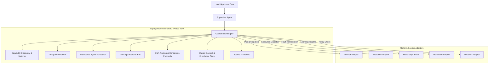

---

### Diagram 2: Agent Lifecycle State Machine
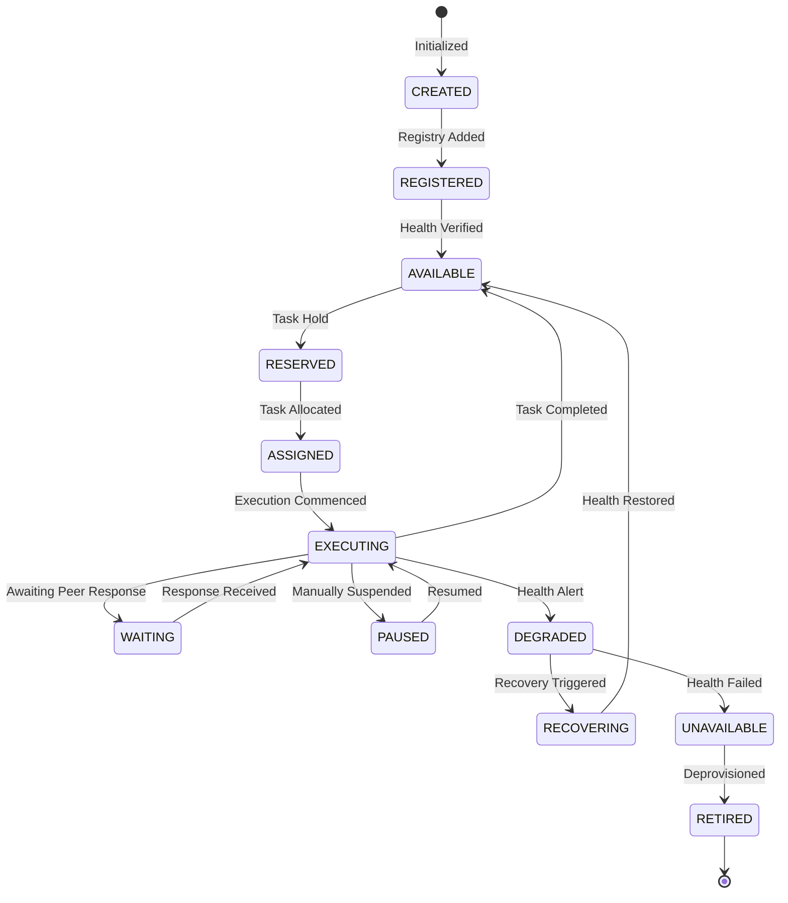

---

### Diagram 3: Capability Discovery & Matching Workflow
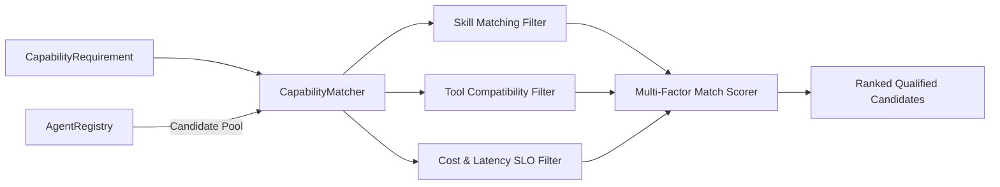

---

### Diagram 4: Delegation Topologies
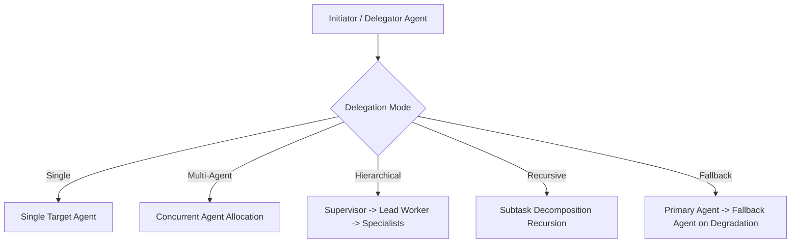

---

### Diagram 5: Dynamic Team Formation
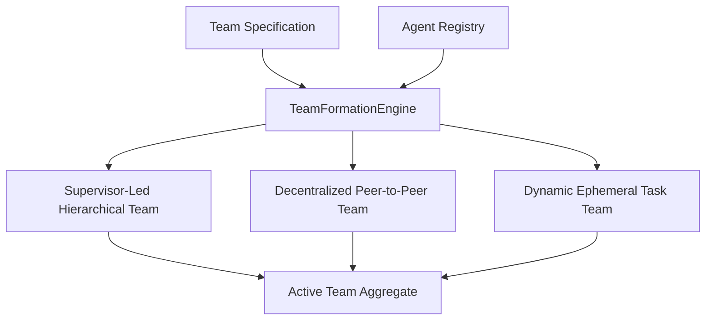

---

### Diagram 6: Contract Net Protocol (CNP) Flow
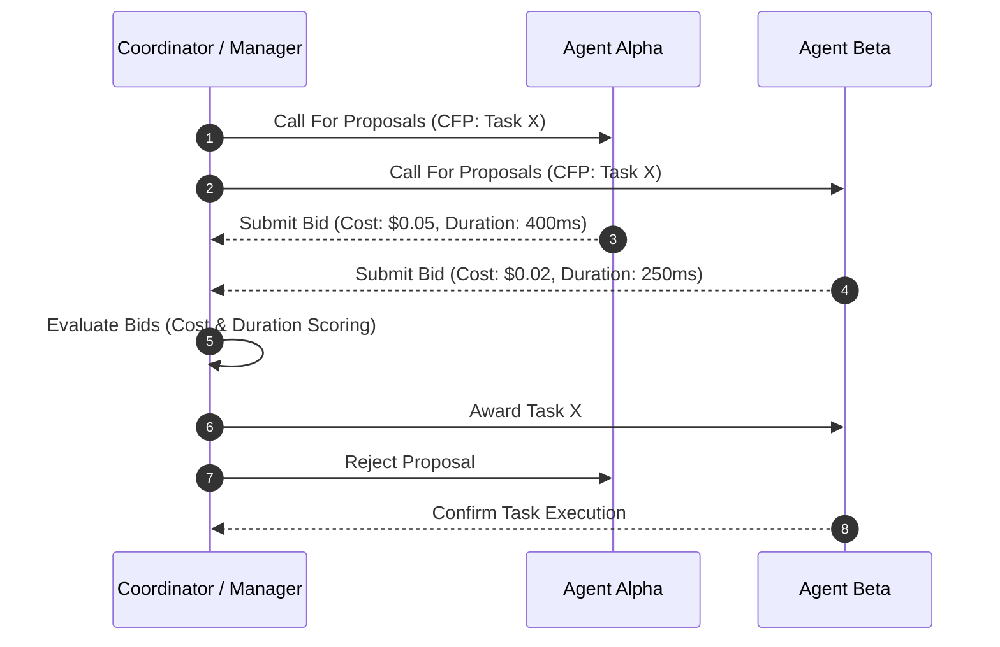

---

### Diagram 7: Auction Allocation Engine Flow
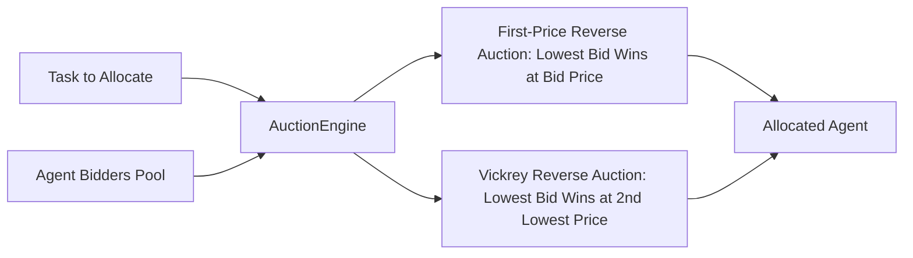

---

### Diagram 8: Consensus & Quorum Evaluation
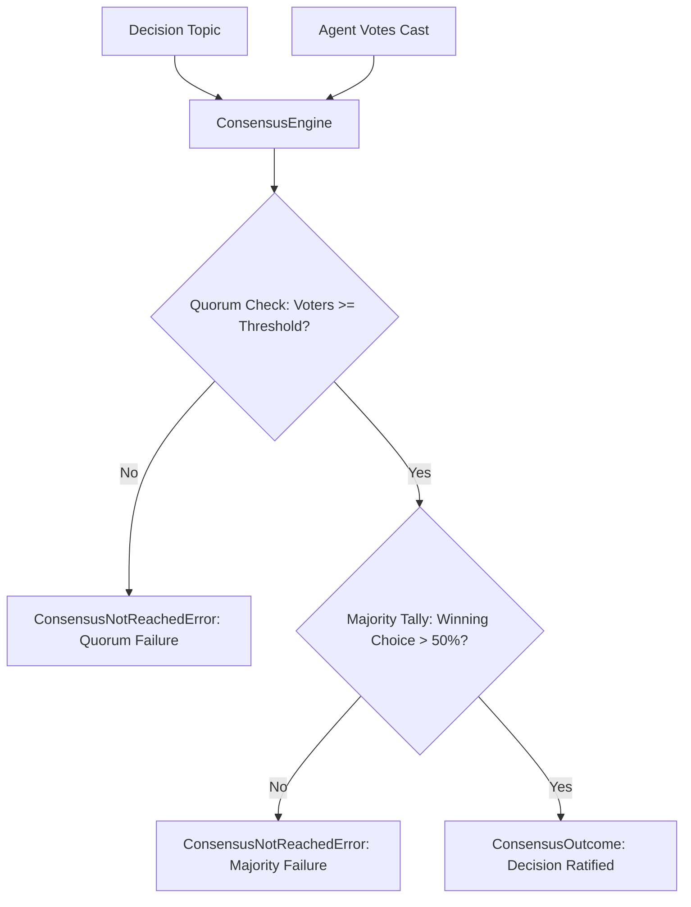

---

### Diagram 9: Leader Election Protocol
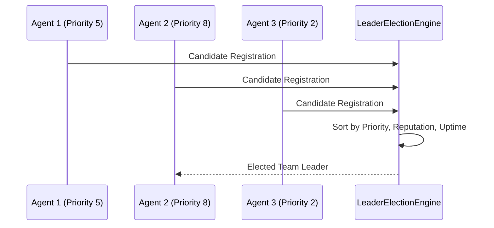

---

### Diagram 10: Swarm Intelligence & Execution
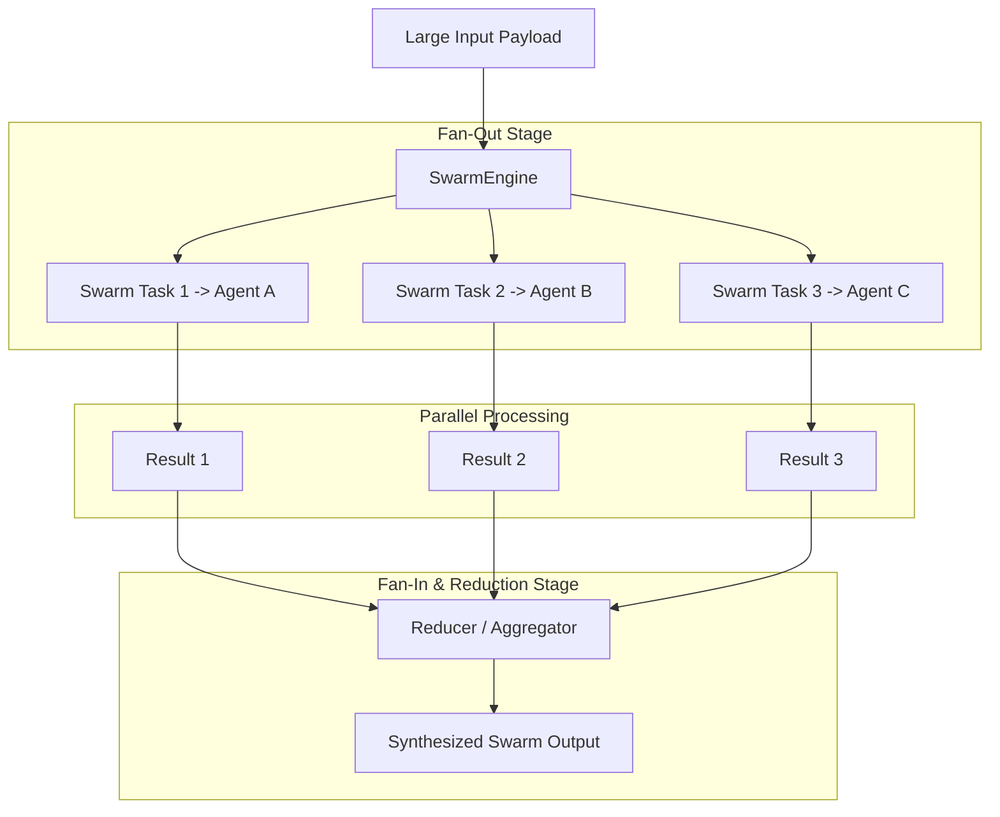

---

### Diagram 11: Multi-Agent Communication Topology
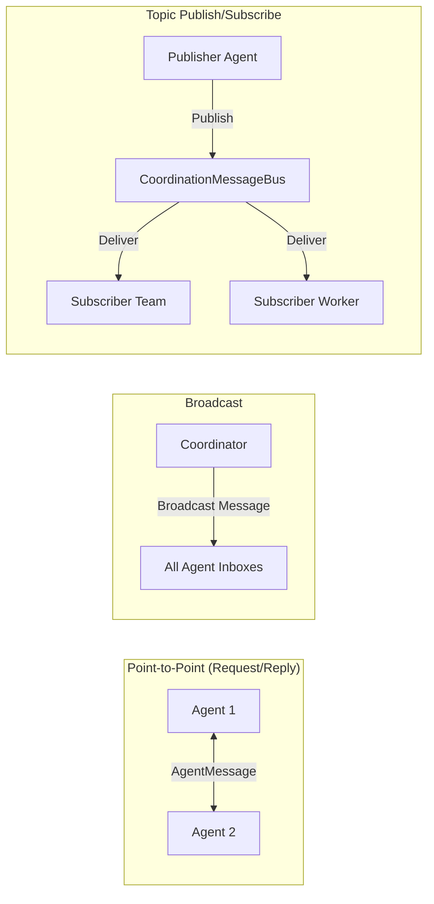

---

### Diagram 12: Shared Context Synchronization
```mermaid
flowchart TD
    A1[Agent Alpha] -->|put(key, val)| SC[SharedContext]
    SC --> CheckLock[Version Increment: V -> V+1]
    CheckLock --> Record[SharedContextRecord]
    
    A2[Agent Beta] -->|get(key)| SC
    Record -->|value| A2
```

---

### Diagram 13: Agent Load Balancer
```mermaid
flowchart TD
    TaskIn[Incoming Delegated Task] --> LB[AgentLoadBalancer]
    
    LB --> Strat{Strategy}
    Strat -->|Round-Robin| RR[Next Sequential Available Agent]
    Strat -->|Least-Loaded| LL[Agent with Smallest Task Queue]
    Strat -->|Capability-Weighted| CW[Agent with Highest Score/(1+Load)]
    
    RR --> TargetAgent[Dispatched Agent]
    LL --> TargetAgent
    CW --> TargetAgent
```

---

### Diagram 14: Work Stealing Architecture
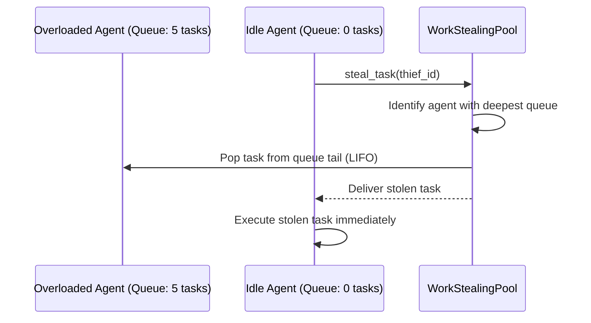

---

### Diagram 15: Conflict Resolution Protocol
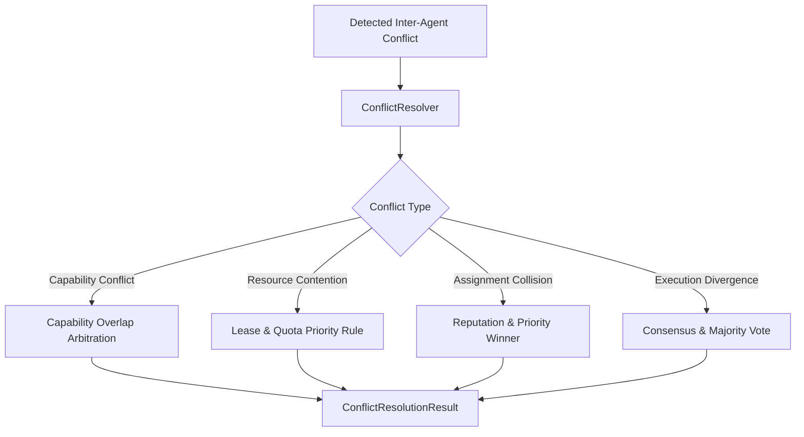

---

### Diagram 16: Coordination Lifecycle State Machine
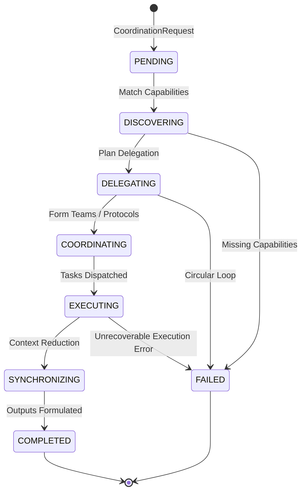

---

### Diagram 17: Distributed Agent Scheduling
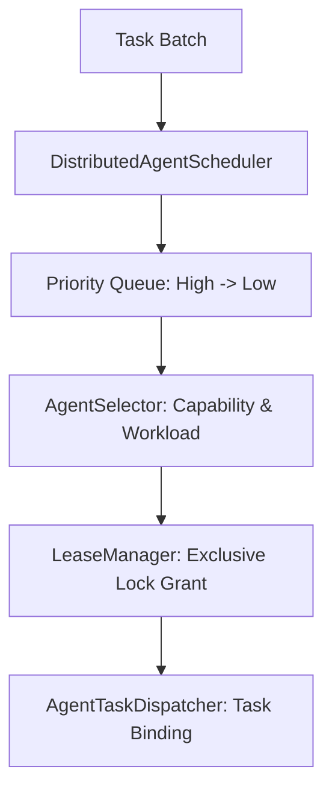

---

### Diagram 18: Coordination Event Flow
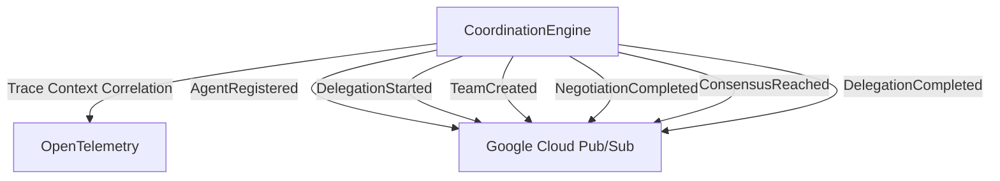

---

### Diagram 19: Class Diagram of Coordination Layer
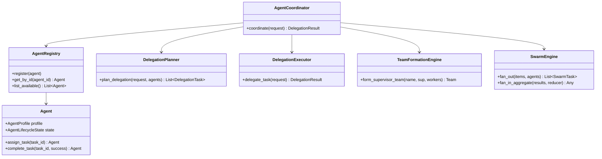

---

### Diagram 20: Comprehensive End-to-End Sequence Diagram
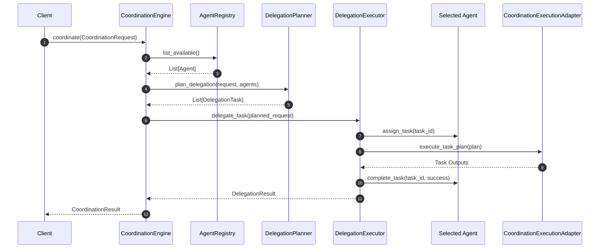

---

## 3. Google Cloud Readiness Matrix

| Google Cloud Service | Coordination Subsystem Integration Point | Production Configuration / Compliance |
|---|---|---|
| **Cloud Run** | Host for async Coordination Runtime containers | Concurrency 80, CPU always-on, autoscaling 1-N |
| **Cloud Tasks** | Deferred agent delegation execution queues | Named queue: `agent-coordination-queue` |
| **Cloud Pub/Sub** | Inter-agent event streaming & FIPA message bus | Topics: `agent-coordination-events`, dead-letter subscription configured |
| **Cloud Workflows** | Long-running multi-agent workflow choreography | Choreographs multi-team task lifecycles |
| **Cloud SQL / AlloyDB** | Persistent storage of Agent profiles, teams, and audit history | PostgreSQL JSONB columns with read-replicas |
| **Memorystore (Redis)** | High-speed cache for presence, leases, and work stealing queues | Redis Cluster with sub-millisecond TTL eviction |
| **Secret Manager** | Role-based agent credentials & identity certificates | IAM-governed secret resolution |
| **Cloud Monitoring** | Custom coordination telemetry & delegation latencies | Custom metrics prefixed `custom.googleapis.com/agent/coordination/` |
| **Cloud Logging** | Structured JSON logs with trace correlation | Trace-correlated JSON logs with severity and error codes |
| **Cloud Trace** | W3C traceparent propagation across agent messages | W3C distributed trace context injected into all message headers |
| **Vertex AI** | Agent semantic skill embedding resolution | Vertex AI text-embedding models for capability semantic matching |

---

## 4. Verification & Readiness Assessment

The test suite in [`tests/test_agent_coordination.py`](file:///C:/Users/User/Desktop/ai_document_processing_platform/tests/test_agent_coordination.py) verifies:
- Agent registration, duplicate detection, lifecycle transitions, and directory queries.
- Capability matching, multi-criteria scoring, and capability graph dependencies.
- Delegation planning, execution, recursive & fallback delegation, and circular loop rejection.
- Dynamic team formation and team integrity validation.
- Message routing (point-to-point, broadcast, publish/subscribe).
- Contract Net Protocol (CFP $\to$ Bid $\to$ Award) and reverse auctions.
- Quorum checking, majority voting, and leader election.
- Inter-agent conflict resolution.
- Swarm fan-out/fan-in and ensemble decision making.
- Shared context synchronization and optimistic locking.
- Load balancing (RoundRobin, LeastLoaded, CapabilityWeighted) and work stealing.
- Heartbeats, presence tracking, and task lease expiration.
- Versioned Pydantic v2 JSON and Google Cloud Pub/Sub serialization.
- Fluent builders, repositories, and LRU/TTL caching.

The subsystem is fully verified, deterministic, and architecturally primed for **Workflow Runtime** and production API gateways.
