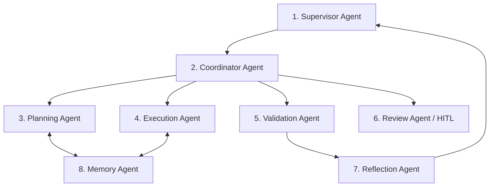
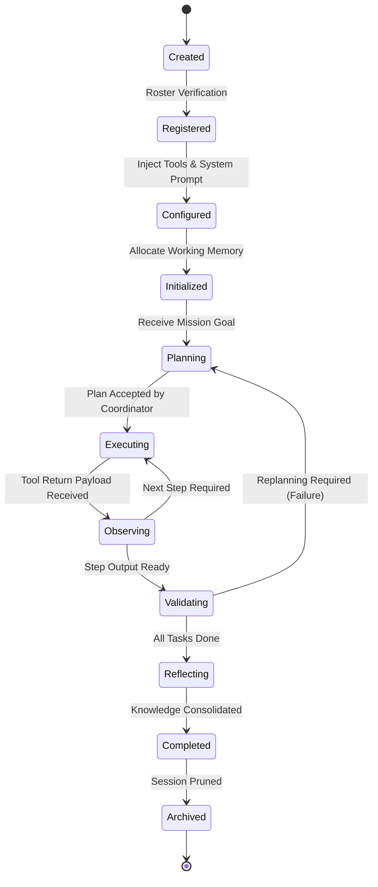

# Enterprise Autonomous Agent Platform Architecture

## 1. Multi-Agent Workforce Hierarchy

---

## 2. 8-Tier Agent Roles & Specifications

### 1. Supervisor Agent
- **Responsibility**: Top-level digital workforce orchestrator. Maintains overall mission state, enforces organization policies, manages SLA deadlines, and serves as final decision arbiter.
- **Input**: User goal, organization context, workflow trigger metadata.
- **Output**: Delegated mission specification, final business outcome confirmation.
- **Memory Requirements**: Long-term organizational memory, policy documents, mission milestones.
- **Tools**: `assign_mission`, `escalate_to_human`, `abort_workflow`, `query_roster`.
- **Events Produced**: `MissionAssigned`, `MissionCompleted`, `MissionAborted`.
- **Failure Behavior**: On deadlock, halts sub-agents and requests emergency Human-in-the-Loop intervention.

### 2. Coordinator Agent
- **Responsibility**: Manages inter-agent communication, resolves task dependencies, schedules concurrent agent turns, and conducts consensus voting.
- **Input**: High-level execution plan from Planning Agent.
- **Output**: Agent turn dispatches, aggregated consensus vote results.
- **Memory Requirements**: Working memory of current workflow state, agent availability matrix.
- **Tools**: `dispatch_agent_turn`, `collect_consensus_votes`, `resolve_dependency`.
- **Events Produced**: `AgentTurnDispatched`, `ConsensusReached`, `ConsensusFailed`.
- **Failure Behavior**: Re-routes tasks to backup agent personas if primary agent is unresponsive.

### 3. Planning Agent
- **Responsibility**: Decomposes high-level goals into causal Directed Acyclic Graphs (DAGs), resolves tool preconditions, and generates fallback branches.
- **Input**: Goal specification, available tool schemas, historical trajectory memories.
- **Output**: Declarative execution DAG with explicit dependencies and verification criteria.
- **Memory Requirements**: Episodic memory of past successful workflows, tool schema index.
- **Tools**: `decompose_goal`, `evaluate_causal_path`, `retrieve_strategy_pattern`.
- **Events Produced**: `PlanGenerated`, `PlanReplanned`.
- **Failure Behavior**: Triggers replanning loop using relaxed constraints if no valid DAG is found.

### 4. Execution Agent
- **Responsibility**: Executes concrete domain actions, invokes tools (API calls, document extractions, database queries), and executes code in secure sandboxes.
- **Input**: Specific step instruction, input parameters, sandbox environment credentials.
- **Output**: Structured tool execution output, raw response payloads, execution latency.
- **Memory Requirements**: Short-term working context window, tool schema definitions.
- **Tools**: `invoke_connector`, `execute_python_sandbox`, `query_vector_store`, `call_ocr`.
- **Events Produced**: `ToolInvoked`, `ToolExecutionSucceeded`, `ToolExecutionFailed`.
- **Failure Behavior**: Employs exponential backoff retry; if failure persists, reports error to Coordinator for replanning.

### 5. Validation Agent
- **Responsibility**: Verifies outputs against ground truth, enforces JSON schema types, validates business invariants, and computes extraction confidence scores.
- **Input**: Tool outputs, extraction results, expected schema definitions, validation rules.
- **Output**: Validation verdict (`VALID` / `INVALID`), confidence score (0.00–1.00), anomaly report.
- **Memory Requirements**: Schema definitions, validation rulesets, historical error benchmarks.
- **Tools**: `validate_pydantic_schema`, `check_mathematical_consistency`, `compute_confidence`.
- **Events Produced**: `ValidationPassed`, `ValidationFailed`, `ConfidenceAnomalyDetected`.
- **Failure Behavior**: If confidence is below threshold (< 0.85), automatically routes payload to Review Agent.

### 6. Review Agent (Human-in-the-Loop Bridge)
- **Responsibility**: Prepares ergonomic human review packages, highlights low-confidence fields, presents one-click approval interfaces, and captures human operator feedback.
- **Input**: Flagged validation anomalies, low-confidence extractions, high-value decision requests.
- **Output**: Approved/corrected data payload, human feedback annotation.
- **Memory Requirements**: UI template schemas, operator assignment directory.
- **Tools**: `create_review_task`, `notify_operator_channel`, `record_human_correction`.
- **Events Produced**: `ReviewTaskCreated`, `HumanApprovalGranted`, `HumanRejectionIssued`.
- **Failure Behavior**: Re-notifies manager after SLA timeout expiration (e.g., 2 hours).

### 7. Reflection Agent
- **Responsibility**: Performs post-execution retrospective analysis, evaluates trajectory efficiency, identifies hallucination patterns, and updates strategy guidelines.
- **Input**: Complete workflow execution trajectory, validation scores, human feedback diffs.
- **Output**: Learned strategy updates, critique summary, prompt optimization recommendations.
- **Memory Requirements**: Trajectory history, reward model benchmarks.
- **Tools**: `analyze_trajectory_diff`, `mine_failure_pattern`, `propose_prompt_refinement`.
- **Events Produced**: `ReflectionCompleted`, `StrategyGuidelineUpdated`.
- **Failure Behavior**: Non-blocking; logs diagnostic warning on reflection generation failure.

### 8. Memory Agent
- **Responsibility**: Manages multi-tier storage of agent experiences, optimizes LLM context windows, and performs semantic search over historical episodes.
- **Input**: Agent conversation turns, execution outputs, memory retrieval queries.
- **Output**: Synthesized context snippets, top-K relevant episodic experiences.
- **Memory Requirements**: Direct access to Qdrant vector database and Redis session cache.
- **Tools**: `store_episode`, `retrieve_relevant_episodes`, `compact_context_window`.
- **Events Produced**: `MemoryStored`, `ContextCompacted`.
- **Failure Behavior**: Falls back to direct working context if vector search latency spikes.

---

## 3. Agent Lifecycle State Machine

| Lifecycle State | State Description & Entry Conditions | Transitions Allowed |
| :--- | :--- | :--- |
| **Created** | Agent definition loaded into memory | $\rightarrow$ `Registered` |
| **Registered** | Agent validated in workspace roster and assigned unique UUID | $\rightarrow$ `Configured` |
| **Configured** | Injected with workspace policies, permitted tools, and LLM provider bindings | $\rightarrow$ `Initialized` |
| **Initialized** | Dedicated working memory and telemetry span initialized | $\rightarrow$ `Planning` |
| **Planning** | Decomposing mission goal into execution graph | $\rightarrow$ `Executing`, `Failed` |
| **Executing** | Actively invoking tools, sandbox code, or external connectors | $\rightarrow$ `Observing`, `Failed` |
| **Observing** | Processing tool return payloads and evaluating progress | $\rightarrow$ `Executing`, `Validating` |
| **Reflecting** | Analyzing trajectory reward, updating learned strategy rules | $\rightarrow$ `Completed` |
| **Completed** | Mission successfully concluded; output delivered to Supervisor | $\rightarrow$ `Archived` |
| **Archived** | Ephemeral memory serialized to vector store; worker resources freed | Final State |
