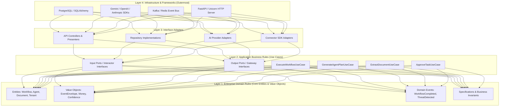

# Clean Architecture & Layer Boundary Specification

## 1. Architectural Concentric Layers (Hexagonal / Ports & Adapters)



---

## 2. Inviolable Dependency Rules

The Fundamental Rule of Clean Architecture:
> **Source code dependencies must point ONLY inward, toward higher-level policies.**
> Nothing in an inner circle can know anything at all about something in an outer circle.

### Rule 1: The Domain Layer is Pure and Framework-Agnostic
- The Domain Layer contains zero imports of SQLAlchemy, FastAPI, Pydantic (runtime dependencies), Redis, Celery, or external HTTP clients.
- Domain Entities encapsulate business invariants and pure state transitions.
- All domain entity IDs use strongly typed Value Objects or UUIDs.

### Rule 2: Application Use Cases Depend Only on Domain and Interfaces (Ports)
- Use Cases orchestrate domain entities and interact with external systems exclusively through **Output Ports** (Interfaces/Abstract Base Classes).
- Database persistence is expressed as `IWorkflowRepository`, `IDocumentRepository`.
- LLM interaction is expressed as `IAIProviderMesh`, not concrete vendor SDKs.

### Rule 3: AI Provider Mesh Decouples AI Models from Business Logic
- The business layer never imports `google.genai`, `openai`, or `anthropic`.
- AI capabilities are exposed through standard input/output DTOs (e.g., `CompletionRequest`, `StructuredOutputSchema`, `EmbeddingVector`).
- Vendor-specific exceptions (e.g., OpenAI RateLimitError, Gemini QuotaExceeded) are caught in the adapter layer and re-mapped to Domain Exceptions (`AIQuotaExceededException`, `ModelTemporarilyUnavailableException`).

### Rule 4: External Integrations Require Typed Connectors and Adapters
- External enterprise systems (Salesforce, SAP, Workday, Slack) are wrapped in adapter implementations conforming to `IConnector` interfaces.
- Network serialization and deserialization happen at the boundary adapter; domain entities never contain raw JSON payloads from third-party APIs.

### Rule 5: Presentation and API Gateways Depend on Application Ports
- FastAPI route handlers act strictly as thin HTTP controllers:
  1. Deserialize HTTP request into an Application Request DTO.
  2. Invoke the corresponding Use Case Interactor.
  3. Map the Use Case Response DTO to an HTTP Response / JSON Schema.
- Controllers contain zero database queries or direct LLM invocations.

---

## 3. Code & Interface Boundary Blueprint

### 3.1 Domain Layer: Entity & Port Definition
```python
# app/domain/workflows/entities.py (Pure Domain - Zero Framework Imports)
from dataclasses import dataclass, field
from datetime import datetime, timezone
from typing import List, Optional
from enum import Enum


class WorkflowStatus(str, Enum):
    DRAFT = "DRAFT"
    ACTIVE = "ACTIVE"
    PAUSED = "PAUSED"
    FAILED = "FAILED"
    COMPLETED = "COMPLETED"


@dataclass
class WorkflowExecution:
    execution_id: str
    workflow_id: str
    organization_id: str
    status: WorkflowStatus = WorkflowStatus.DRAFT
    current_step_index: int = 0
    created_at: datetime = field(default_factory=lambda: datetime.now(timezone.utc))

    def advance_step(self) -> None:
        """Domain invariant: Cannot advance step if workflow is not active."""
        if self.status != WorkflowStatus.ACTIVE:
            raise ValueError(f"Cannot advance workflow in state {self.status}")
        self.current_step_index += 1

    def mark_completed(self) -> None:
        self.status = WorkflowStatus.COMPLETED
```

### 3.2 Application Layer: Use Case & Output Port
```python
# app/application/workflows/ports/repository.py (Output Port)
from abc import ABC, abstractmethod
from typing import Optional
from app.domain.workflows.entities import WorkflowExecution


class IWorkflowExecutionRepository(ABC):
    @abstractmethod
    async def get_by_id(self, execution_id: str, org_id: str) -> Optional[WorkflowExecution]:
        pass

    @abstractmethod
    async def save(self, execution: WorkflowExecution) -> None:
        pass


# app/application/workflows/use_cases/advance_workflow.py (Use Case Interactor)
class AdvanceWorkflowUseCase:
    def __init__(self, repo: IWorkflowExecutionRepository, event_bus: "IEventBus"):
        self.repo = repo
        self.event_bus = event_bus

    async def execute(self, execution_id: str, org_id: str) -> WorkflowExecution:
        execution = await self.repo.get_by_id(execution_id, org_id)
        if not execution:
            raise KeyError(f"Execution {execution_id} not found in org {org_id}")

        execution.advance_step()
        await self.repo.save(execution)
        await self.event_bus.publish("WorkflowStepAdvanced", {"execution_id": execution_id})
        return execution
```

### 3.3 Infrastructure Layer: SQLAlchemy Adapter
```python
# app/infrastructure/persistence/sql_workflow_repository.py (Infrastructure Adapter)
from typing import Optional
from sqlalchemy.ext.asyncio import AsyncSession
from app.application.workflows.ports.repository import IWorkflowExecutionRepository
from app.domain.workflows.entities import WorkflowExecution


class SqlWorkflowExecutionRepository(IWorkflowExecutionRepository):
    def __init__(self, session: AsyncSession):
        self.session = session

    async def get_by_id(self, execution_id: str, org_id: str) -> Optional[WorkflowExecution]:
        # Maps database row to pure Domain Entity
        pass

    async def save(self, execution: WorkflowExecution) -> None:
        # Maps pure Domain Entity to database state
        pass
```
