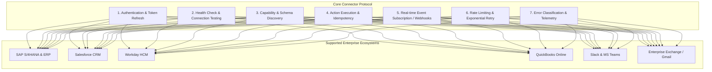

# Enterprise Connector Framework & SDK Specification

## 1. Connector SDK Architecture Overview



---

## 2. Universal Connector Interface (`IConnector`)

```python
# app/domain/connectors/interface.py
from abc import ABC, abstractmethod
from typing import Dict, Any, List, Optional, AsyncGenerator
from dataclasses import dataclass
from enum import Enum


class ConnectorHealthStatus(str, Enum):
    HEALTHY = "HEALTHY"
    DEGRADED = "DEGRADED"
    UNREACHABLE = "UNREACHABLE"
    AUTH_EXPIRED = "AUTH_EXPIRED"


@dataclass
class ConnectorCapability:
    name: str
    description: str
    input_schema: Dict[str, Any]
    output_schema: Dict[str, Any]
    is_idempotent: bool = True


@dataclass
class ConnectorResponse:
    success: bool
    data: Dict[str, Any]
    status_code: int
    idempotency_key: str
    retry_after: Optional[int] = None
    error_code: Optional[str] = None
    error_message: Optional[str] = None


class IConnector(ABC):
    """Universal interface required for all enterprise integrations."""

    @abstractmethod
    async def authenticate(self, credentials: Dict[str, Any]) -> bool:
        """Authenticates against the third-party endpoint (OAuth2, mTLS, API Key)."""
        pass

    @abstractmethod
    async def health_check(self) -> ConnectorHealthStatus:
        """Pings the target service and returns current availability status."""
        pass

    @abstractmethod
    def capabilities(self) -> List[ConnectorCapability]:
        """Discovers and returns all typed actions supported by this connector."""
        pass

    @abstractmethod
    async def execute(
        self,
        action_name: str,
        parameters: Dict[str, Any],
        idempotency_key: str,
    ) -> ConnectorResponse:
        """Executes a discrete action with strict idempotency and rate limit handling."""
        pass

    @abstractmethod
    async def subscribe(self, event_types: List[str]) -> AsyncGenerator[Dict[str, Any], None]:
        """Listens for real-time webhooks or polling events from the target application."""
        pass

    @abstractmethod
    async def shutdown(self) -> None:
        """Gracefully disconnects and terminates active connection sessions."""
        pass
```

---

## 3. Mandatory Enterprise Connector Capabilities

| Feature | Architectural Requirement & Implementation Detail |
| :--- | :--- |
| **Authentication Lifecycle** | Automatic OAuth2 token refresh 5 minutes prior to expiration; secure token vault storage |
| **Idempotency Keys** | Every mutation passes a unique `Idempotency-Key` header (UUIDv5 of workflow execution + step ID) |
| **Adaptive Rate Limiting** | Token-bucket rate limiter observing HTTP 429 `Retry-After` headers with jittered exponential backoff |
| **Error Classification** | Categorizes errors into `TRANSIENT` (retryable), `AUTH_ERROR` (re-auth required), `FATAL` (data invalid) |
| **Connection Pooling** | HTTP/2 keep-alive connection pooling with circuit breakers opening after 5 consecutive 5xx failures |
| **Telemetry & Auditing** | OpenTelemetry child spans recorded for every outbound HTTP call with payload masking of secrets |
