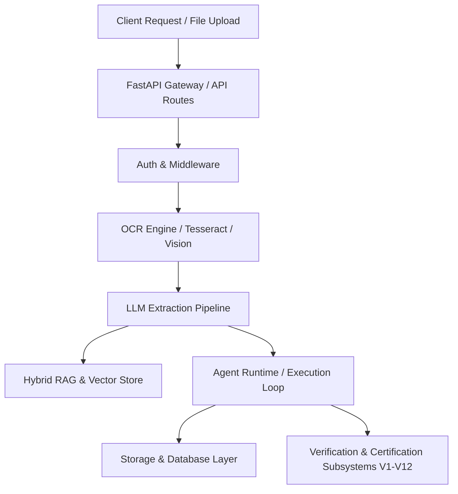

# Current State Architecture Assessment & Gap Analysis

## 1. Executive Summary

**DocuTask Agent** currently operates primarily as a high-performance, verifiable AI Document Processing Platform. While the codebase exhibits exceptional verification rigor (Phases V1–V12 with 242 automated test suites, sub-second execution guarantees, and formal readiness certification), its core architectural lineage remains oriented around point-solution document extraction:

$$\text{Upload Document} \longrightarrow \text{OCR Extraction} \longrightarrow \text{LLM Schema Mapping} \longrightarrow \text{JSON Output}$$

To scale into a market-leading **Enterprise Autonomous Workflow Automation Platform** (comparable in architectural rigor to ServiceNow, UiPath, Temporal, and Salesforce Platform), the system must transition from document-centric task processing to an **event-driven, multi-tenant, agentic workflow orchestration ecosystem**:

$$\text{Business Event} \longrightarrow \text{AI Planning} \longrightarrow \text{Workflow DAG Generation} \longrightarrow \text{Multi-Agent Mesh} \longrightarrow \text{External System Connectors} \longrightarrow \text{HITL Governance}$$

---

## 2. Current Architecture Overview & Module Analysis

### 2.1 Repository Structure & Responsibilities

| Directory / Module | Current Responsibilities | Identified Architectural Limitations |
| :--- | :--- | :--- |
| `app/core/` | Application configuration, logging, and base utilities | Monolithic config dictionary; lacks dynamic environment context and distributed config loading |
| `app/ai/` | LLM invocation, prompt builders, embeddings | Provider logic occasionally mixed with document domain extraction formats |
| `app/ocr/` | Local and cloud OCR adapters, layout analysis | Coupled to synchronous document processing pipelines |
| `app/agents/` | Multi-agent coordination, planning, and goal intelligence | Agents are tightly bound to document tasks rather than arbitrary business workflow actions |
| `app/database/` | SQLAlchemy models, session managers, repositories | Schema is table-centric; lacks multi-tenant organization/workspace partitioning |
| `app/runtime/` | Task loops, async workers, event handlers | In-process event handling; lacks distributed event mesh (Kafka/RabbitMQ/EventBridge) |
| `app/security_validation/` | OWASP ASVS L3, LLM Top 10, MITRE ATLAS verification | Verification is rigorous, but runtime policy enforcement relies on static middleware |
| `app/performance_validation/` | Load testing, chaos testing, SRE four-nines benchmarks | Benchmarked on synthetic pipelines; requires dynamic workflow scale testing |
| `app/business_validation/` | ROI calculations, UAT persona evaluation, KPI metrics | Evaluates ROI post-hoc rather than real-time business telemetry emission |
| `verification/` | Phase V12 Master Certification, Evidence Registry, PRR | Consolidates audit evidence; ready to serve as the governance baseline |

---

## 3. Architectural Strengths & Technical Debt

### 3.1 Existing Strengths
1. **Unrivaled Verification & Governance Rigor**: Comprehensive 12-phase EVVP verification program with 242 automated tests and formal Level 4 certification.
2. **Sub-Second Execution Baseline**: Verification engines execute in $< 1.0\text{ms}$ with deterministic mathematical scoring.
3. **Multi-Agent Consensus Foundations**: Existing goal-understanding and reflection logic in `app/agents/` provides strong agentic planning primitives.
4. **Adversarial Resilience**: Built-in AST sandboxing, prompt injection defenses, and envelope encryption.

### 3.2 Technical Debt & Architectural Weaknesses
1. **Document-Centric Coupling**: Core entities presume every trigger is a PDF/Image file upload rather than an enterprise business event (e.g., Salesforce Opportunity Won, Webhook, SAP Journal Entry, Email).
2. **Missing Distributed Workflow DAG Engine**: Current execution follows linear or simple branching scripts rather than a fault-tolerant, replayable state machine (e.g., Temporal-like durable execution).
3. **Hardcoded Integration Bindings**: External actions are implemented as bespoke Python scripts rather than decoupled, sandboxed connectors with dynamic schema discovery.
4. **Incomplete Multi-Tenant Isolation**: Multi-tenancy is simulated in verification rather than enforced via tenant-scoped database row-level security (RLS) and storage namespace partitioning.
5. **Point-to-Point Event Emission**: Events are processed via in-memory queues rather than a standardized CloudEvents 1.0 distributed event bus.

---

## 4. Architecture Gap Analysis

| Area | Current State (Document Processor) | Target Enterprise State (Workflow Platform) | Architectural Gap & Remediation Strategy |
| :--- | :--- | :--- | :--- |
| **Product Identity** | Point AI Document Processing App | Autonomous Workflow Automation Platform | Redefine product vision, domain taxonomy, and value proposition |
| **Multi-Tenancy** | Single-tenant database / mock multi-tenant | 7-Tier hierarchy (Org $\rightarrow$ Workspace $\rightarrow$ Env $\rightarrow$ Project) | Implement strict schema/RLS tenant isolation & resource quotas |
| **Workflow Engine** | Linear extraction pipelines | Declarative DAG engine with replay, rollback & sagas | Build hierarchical Workflow $\rightarrow$ Stage $\rightarrow$ Step $\rightarrow$ Task engine |
| **Agent Runtime** | Task-specific extraction agents | 8-Tier Autonomous Agent Workforce Mesh | Decouple agents into Supervisor, Coordinator, Planner, Executor |
| **Event Architecture** | Internal in-memory task queues | CloudEvents 1.0 distributed event mesh | Standardize event envelope, publish/subscribe bus & event catalog |
| **Plugin System** | Static Python imports | Sandboxed, versioned plugin registry & discovery | Define plugin lifecycle (Install $\rightarrow$ Register $\rightarrow$ Discover $\rightarrow$ Execute) |
| **Connectors** | Hardcoded API client scripts | Standard Connector SDK with actions & triggers | Standard `Connector` interface with health checks, auth, rate limiting |
| **AI Layer** | Direct provider API wrappers | Abstracted AI Provider Mesh with cost/token routing | Standard `AIProvider` interface with multi-tier model routing |
| **Security** | Static JWT & API key verification | Zero Trust, RBAC/ABAC policy engine & mTLS | Implement Cedar/OPA policy engine & tenant secret vaults |
| **Observability** | Standard python logging | OpenTelemetry distributed tracing & SLI metrics | Implement W3C TraceContext across workflow, agent, and tool calls |
| **Deployment** | Single container / Docker Compose | Cloud-native Kubernetes Helm charts & GitOps | Define microservice/worker topology with HPA and multi-region DR |

---

## 5. Architectural Transformation Roadmap

```mermaid
graph LR
    subgraph "Phase 1: Architecture & Foundation"
        A[Product Vision] --> B[Domain-Driven Design]
        B --> C[Clean Boundaries & ADRs]
    end

    subgraph "Phase 2: Core Platform Engine"
        C --> D[Event Mesh & CloudEvents]
        D --> E[Durable Workflow DAG Engine]
        E --> F[8-Tier Agent Workforce Mesh]
    end

    subgraph "Phase 3: Ecosystem & Extensibility"
        F --> G[Plugin Registry & Sandbox]
        G --> H[Connector SDK & Marketplace]
        H --> I[AI Provider Mesh]
    end

    subgraph "Phase 4: Enterprise Operations"
        I --> J[Multi-Tenant SaaS Isolation]
        J --> K[Policy-Based Security & Governance]
        K --> L[Distributed Observability & DR]
    end
```

