# Domain-Driven Design (DDD) & Bounded Contexts Specification

## 1. Domain Map & Strategic Context Boundaries

```mermaid
graph TD
    subgraph "Core Enterprise & Tenant Domains"
        ACC[Accounts] --- ORG[Organizations]
        ORG --- WRK[Workspaces]
        WRK --- IDN[Identity & Security]
        IDN --- POL[Policies & Governance]
    end

    subgraph "Workflow & Agent Orchestration Domains"
        WF[Workflows] --- RT[Runtime]
        RT --- AGT[Agents]
        AGT --- PLN[Planner]
        PLN --- EXE[Execution]
        EXE --- MEM[Memory]
        MEM --- REF[Reflection]
    end

    subgraph "Intelligence & Data Domains"
        DOC[Documents] --- KNO[Knowledge]
        KNO --- EVAL[Evaluation]
        EVAL --- STO[Storage]
    end

    subgraph "Ecosystem & Integration Domains"
        EVT[Events] --- CONN[Connectors]
        CONN --- PLUG[Plugins]
        PLUG --- INT[Integrations]
        INT --- SCH[Scheduler]
        SCH --- NOT[Notifications]
    end

    subgraph "Governance, Audit & Finance Domains"
        AUD[Audit] --- BIL[Billing]
        BIL --- ANL[Analytics]
        ANL --- OBS[Observability]
    end
```

---

## 2. Detailed Bounded Context Catalog (28 Domains)

### 1. Accounts Domain
- **Purpose**: Manage individual user profile identities, personal credentials, preferences, and session tokens.
- **Owned Data**: User profiles, password hashes, multi-factor auth secrets, notification preferences.
- **Entities**: `Account`, `UserCredential`, `UserProfile`, `AccountSession`.
- **Services**: `AccountService`, `PasswordPolicyService`, `MFAService`.
- **Repositories**: `AccountRepository`, `SessionRepository`.
- **Events Produced**: `AccountCreated`, `AccountUpdated`, `PasswordResetRequested`, `AccountLocked`.
- **Events Consumed**: `OrganizationMemberInvited`.
- **External Dependencies**: SendGrid / Twilio (MFA OTP).

### 2. Organizations Domain
- **Purpose**: Manage enterprise organizational entities, corporate tenancy, custom domains, and subscription tiers.
- **Owned Data**: Organization metadata, tenant settings, enterprise SSO configs, domains.
- **Entities**: `Organization`, `TenantSetting`, `OrganizationDomain`, `SubscriptionTier`.
- **Services**: `OrganizationService`, `DomainVerificationService`, `TenantProvisioningService`.
- **Repositories**: `OrganizationRepository`, `TenantSettingRepository`.
- **Events Produced**: `OrganizationCreated`, `OrganizationUpdated`, `OrganizationSuspended`.
- **Events Consumed**: `BillingPlanUpgraded`, `PaymentFailed`.
- **External Dependencies**: DNS Resolver.

### 3. Workspaces Domain
- **Purpose**: Partition organization resources into isolated collaborative spaces (e.g., Finance Workspace, Legal Workspace).
- **Owned Data**: Workspace configurations, member roles, workspace-level resource quotas.
- **Entities**: `Workspace`, `WorkspaceMember`, `WorkspaceQuota`, `EnvironmentConfig`.
- **Services**: `WorkspaceService`, `QuotaEnforcementService`.
- **Repositories**: `WorkspaceRepository`, `WorkspaceMemberRepository`.
- **Events Produced**: `WorkspaceCreated`, `WorkspaceMemberAdded`, `WorkspaceQuotaExceeded`.
- **Events Consumed**: `OrganizationCreated`, `AccountDeleted`.
- **External Dependencies**: None.

### 4. Identity Domain
- **Purpose**: Handle enterprise identity federation, OAuth 2.0 / OIDC / SAML 2.0 authentication, and token issuance.
- **Owned Data**: Federated identity links, OAuth clients, session tokens, SAML metadata.
- **Entities**: `FederatedIdentity`, `OAuthClient`, `AuthToken`, `SAMLProvider`.
- **Services**: `AuthenticationService`, `TokenProviderService`, `SAMLAssertionService`.
- **Repositories**: `FederatedIdentityRepository`, `OAuthClientRepository`.
- **Events Produced**: `UserAuthenticated`, `TokenIssued`, `SessionRevoked`.
- **Events Consumed**: `AccountLocked`, `OrganizationSuspended`.
- **External Dependencies**: Okta, Azure Active Directory, Google Identity.

### 5. Security Domain
- **Purpose**: Enforce zero-trust security boundaries, mTLS mesh certificates, encryption key lifecycle, and threat detection.
- **Owned Data**: Encryption keys (KMS references), security audit logs, threat incident records.
- **Entities**: `SecurityKeyMetadata`, `SecurityIncident`, `IPBlockRule`, `CertificateRecord`.
- **Services**: `EnvelopeEncryptionService`, `ThreatDetectionService`, `CertificateAuthorityService`.
- **Repositories**: `SecurityKeyRepository`, `SecurityIncidentRepository`.
- **Events Produced**: `ThreatDetected`, `SecurityKeyRotated`, `AccessBlocked`.
- **Events Consumed**: `PolicyViolationDetected`, `UserAuthenticationFailed`.
- **External Dependencies**: HashiCorp Vault / AWS KMS.

### 6. Workflows Domain
- **Purpose**: Define, version, validate, and publish declarative business workflow Directed Acyclic Graphs (DAGs).
- **Owned Data**: Workflow definitions (YAML/JSON schemas), version history, trigger rules, stage definitions.
- **Entities**: `WorkflowDefinition`, `WorkflowVersion`, `WorkflowStage`, `WorkflowStep`.
- **Services**: `WorkflowSchemaValidator`, `WorkflowPublishingService`, `WorkflowTemplateService`.
- **Repositories**: `WorkflowDefinitionRepository`, `WorkflowVersionRepository`.
- **Events Produced**: `WorkflowPublished`, `WorkflowDeprecated`, `WorkflowUpdated`.
- **Events Consumed**: `ConnectorSchemaUpdated`.
- **External Dependencies**: None.

### 7. Runtime Domain
- **Purpose**: Orchestrate the physical execution of workflows, manage task queues, handle step pauses, and coordinate sagas.
- **Owned Data**: Workflow execution instances, execution state snapshots, step run logs, compensation history.
- **Entities**: `WorkflowExecution`, `StepExecution`, `ExecutionSnapshot`, `CompensationTask`.
- **Services**: `RuntimeOrchestrator`, `SagaCoordinatorService`, `StateSnapshotService`.
- **Repositories**: `WorkflowExecutionRepository`, `StepExecutionRepository`.
- **Events Produced**: `WorkflowStarted`, `WorkflowStepCompleted`, `WorkflowFailed`, `WorkflowCompleted`.
- **Events Consumed**: `BusinessTriggerFired`, `HumanApprovalGranted`.
- **External Dependencies**: Redis (Worker Queues), PostgreSQL (State).

### 8. Agents Domain
- **Purpose**: Manage digital AI worker personas, capabilities, role assignments, and organizational agent rosters.
- **Owned Data**: Agent definitions, skills, capabilities, system instructions, active assignments.
- **Entities**: `AgentProfile`, `AgentCapability`, `AgentAssignment`, `AgentRoster`.
- **Services**: `AgentRosterService`, `AgentLifecycleService`, `AgentCapabilityResolver`.
- **Repositories**: `AgentProfileRepository`, `AgentAssignmentRepository`.
- **Events Produced**: `AgentInitialized`, `AgentStateChanged`, `AgentTerminated`.
- **Events Consumed**: `TaskDelegated`, `WorkflowFailed`.
- **External Dependencies**: None.

### 9. Planner Domain
- **Purpose**: Perform autonomous goal decomposition, dynamic workflow generation, and causal dependency planning.
- **Owned Data**: Planning graphs, task decompositions, causal DAG trees, candidate plans.
- **Entities**: `GoalSpecification`, `ExecutionPlan`, `PlanNode`, `PlanConstraint`.
- **Services**: `GoalDecompositionService`, `CausalPlannerService`, `PlanOptimizerService`.
- **Repositories**: `ExecutionPlanRepository`.
- **Events Produced**: `PlanGenerated`, `PlanOptimized`, `PlanReplanned`.
- **Events Consumed**: `WorkflowStarted`, `AgentExecutionFailed`.
- **External Dependencies**: LLM Provider Mesh.

### 10. Execution Domain
- **Purpose**: Execute concrete agent actions, dispatch tools, sandbox code execution, and handle tool return payloads.
- **Owned Data**: Tool dispatch records, sandbox execution logs, tool invocation outputs.
- **Entities**: `ToolInvocation`, `ActionPayload`, `SandboxContext`, `ExecutionResult`.
- **Services**: `ToolDispatcherService`, `SandboxExecutionService`, `RateLimiterService`.
- **Repositories**: `ToolInvocationRepository`.
- **Events Produced**: `ToolInvoked`, `ToolExecutionSucceeded`, `ToolExecutionFailed`.
- **Events Consumed**: `PlanNodeScheduled`.
- **External Dependencies**: Sandboxed Docker / gVisor Runtime.

### 11. Memory Domain
- **Purpose**: Maintain multi-tier memory for agents including short-term context, working memory, and episodic semantic memory.
- **Owned Data**: Episodic memory vectors, conversation sessions, working memory state.
- **Entities**: `MemoryRecord`, `EpisodicVector`, `WorkingContext`, `MemoryAssociation`.
- **Services**: `MemoryConsolidationService`, `EpisodicRetrievalService`, `ContextWindowOptimizer`.
- **Repositories**: `MemoryRecordRepository`, `VectorMemoryRepository`.
- **Events Produced**: `MemoryConsolidated`, `MemoryPruned`.
- **Events Consumed**: `AgentStepCompleted`, `WorkflowCompleted`.
- **External Dependencies**: Qdrant / pgvector.

### 12. Reflection Domain
- **Purpose**: Analyze past execution trajectories, compute outcome rewards, extract learnings, and refine agent strategy prompts.
- **Owned Data**: Trajectory audits, error patterns, reflection critiques, strategy recommendations.
- **Entities**: `TrajectoryAudit`, `ReflectionCritique`, `LearnedStrategy`, `PerformanceFeedback`.
- **Services**: `TrajectoryEvaluatorService`, `StrategyMiningService`, `PromptSelfImprovementService`.
- **Repositories**: `ReflectionCritiqueRepository`, `LearnedStrategyRepository`.
- **Events Produced**: `StrategyLearned`, `ReflectionCompleted`.
- **Events Consumed**: `WorkflowCompleted`, `WorkflowFailed`.
- **External Dependencies**: LLM Provider Mesh.

### 13. Events Domain
- **Purpose**: Standardize enterprise event ingestion, schema routing, correlation tracking, and CloudEvents 1.0 distribution.
- **Owned Data**: Event envelopes, topic subscriptions, dead letter queues (DLQs), event delivery logs.
- **Entities**: `CloudEventRecord`, `EventTopic`, `EventSubscription`, `DeadLetterRecord`.
- **Services**: `EventMeshRouterService`, `EventValidationService`, `DeadLetterManager`.
- **Repositories**: `CloudEventRepository`, `EventSubscriptionRepository`.
- **Events Produced**: `EventDelivered`, `EventRouted`, `EventDLQEmitted`.
- **Events Consumed**: *All Domain Events*.
- **External Dependencies**: Apache Kafka / RabbitMQ.

### 14. Connectors Domain
- **Purpose**: Manage third-party SaaS connectors (SAP, Salesforce, Workday, QuickBooks) with schema discovery and bidirectional sync.
- **Owned Data**: Connector configurations, credential references, schema metadata, webhooks.
- **Entities**: `ConnectorInstance`, `ConnectorCredential`, `ActionSchema`, `TriggerSchema`.
- **Services**: `ConnectorLifecycleService`, `SchemaDiscoveryService`, `WebhookReceiverService`.
- **Repositories**: `ConnectorInstanceRepository`, `ConnectorCredentialRepository`.
- **Events Produced**: `ConnectorRegistered`, `ConnectorSyncCompleted`, `ConnectorRateLimited`.
- **Events Consumed**: `OrganizationDeleted`, `CredentialExpired`.
- **External Dependencies**: Third-Party SaaS APIs.

### 15. Documents Domain
- **Purpose**: Ingest, preprocess, analyze layout, and extract structured business records from raw documents (PDF, TIFF, Word, Scans).
- **Owned Data**: Document files, page layouts, OCR bounding boxes, extracted key-value pairs, tables.
- **Entities**: `DocumentPackage`, `DocumentPage`, `OCRResult`, `ExtractedRecord`.
- **Services**: `DocumentIngestionService`, `LayoutAnalysisService`, `ExtractionParserService`.
- **Repositories**: `DocumentPackageRepository`, `ExtractedRecordRepository`.
- **Events Produced**: `DocumentUploaded`, `OCRCompleted`, `ExtractionCompleted`.
- **Events Consumed**: `StorageUploaded`.
- **External Dependencies**: Vision OCR / Tesseract / LayoutLM.

### 16. Knowledge Domain
- **Purpose**: Ingest organizational knowledge bases, index enterprise documents, build hybrid RAG vector indices, and provide cited answers.
- **Owned Data**: Knowledge collections, chunk embeddings, sparse BM25 indices, citation mappings.
- **Entities**: `KnowledgeCollection`, `DocumentChunk`, `VectorEmbedding`, `CitationProvenance`.
- **Services**: `KnowledgeIngestionService`, `HybridRetrievalService`, `GroundingEvaluationService`.
- **Repositories**: `KnowledgeCollectionRepository`, `DocumentChunkRepository`.
- **Events Produced**: `KnowledgeIndexed`, `KnowledgeQueryServed`.
- **Events Consumed**: `DocumentUploaded`, `DocumentDeleted`.
- **External Dependencies**: Vector Database (Qdrant), Sparse Index (Elasticsearch).

### 17. Scheduler Domain
- **Purpose**: Manage cron schedules, delayed task timers, recurring batch triggers, and SLA deadline monitors.
- **Owned Data**: Cron triggers, one-shot schedule timers, SLA monitors, recurrence rules.
- **Entities**: `ScheduledJob`, `TimerTrigger`, `SLAMonitor`, `ExecutionSchedule`.
- **Services**: `JobSchedulerService`, `TimerDispatchService`, `SLABreachDetectorService`.
- **Repositories**: `ScheduledJobRepository`, `TimerTriggerRepository`.
- **Events Produced**: `ScheduleTriggerFired`, `SLABreached`, `TimerExpired`.
- **Events Consumed**: `WorkflowStarted`, `WorkflowCompleted`.
- **External Dependencies**: Distributed Cron / Celery Beat.

### 18. Notifications Domain
- **Purpose**: Deliver multi-channel notifications (Email, Slack, Microsoft Teams, SMS, Webhooks) to human operators and stakeholders.
- **Owned Data**: Notification templates, delivery logs, channel configurations, recipient preferences.
- **Entities**: `NotificationMessage`, `NotificationTemplate`, `DeliveryChannelConfig`, `DeliveryStatus`.
- **Services**: `NotificationDispatcherService`, `TemplateRenderingService`.
- **Repositories**: `NotificationMessageRepository`, `TemplateRepository`.
- **Events Produced**: `NotificationSent`, `NotificationFailed`, `NotificationRead`.
- **Events Consumed**: `ApprovalRequested`, `ThreatDetected`, `WorkflowFailed`.
- **External Dependencies**: SendGrid, Slack Webhooks, Microsoft Teams Bot Framework.

### 19. Integrations Domain
- **Purpose**: Manage end-to-end integration workflows, webhook endpoints, API key mappings, and bidirectional data transformation pipelines.
- **Owned Data**: Integration pipelines, field transformation maps, webhook registrations.
- **Entities**: `IntegrationPipeline`, `FieldMappingRule`, `WebhookEndpoint`, `DataTransformation`.
- **Services**: `IntegrationOrchestrator`, `DataMappingService`, `WebhookDispatcher`.
- **Repositories**: `IntegrationPipelineRepository`, `FieldMappingRepository`.
- **Events Produced**: `IntegrationTriggered`, `DataTransformed`.
- **Events Consumed**: `ConnectorSyncCompleted`, `WorkflowCompleted`.
- **External Dependencies**: External Enterprise Webhooks.

### 20. Audit Domain
- **Purpose**: Record immutable, tamper-evident cryptographic audit records of all user, agent, workflow, and system actions.
- **Owned Data**: Immutable audit logs, SHA-256 block chains, compliance export packages.
- **Entities**: `AuditTrailEntry`, `CryptographicSeal`, `ComplianceAuditSession`.
- **Services**: `AuditLoggingService`, `TamperVerificationService`, `ComplianceReportService`.
- **Repositories**: `AuditTrailRepository`, `CryptographicSealRepository`.
- **Events Produced**: `AuditEntryRecorded`, `AuditSealGenerated`.
- **Events Consumed**: *All Domain Events*.
- **External Dependencies**: Append-Only WORM Storage.

### 21. Billing Domain
- **Purpose**: Track platform usage metrics (documents processed, tokens consumed, active agents), generate invoices, and enforce subscription plans.
- **Owned Data**: Usage ledgers, subscription tiers, Stripe customer references, billing invoices.
- **Entities**: `UsageLedgerEntry`, `SubscriptionPlan`, `BillingInvoice`, `PaymentMethodRecord`.
- **Services**: `UsageAggregationService`, `InvoiceGenerationService`, `SubscriptionEnforcementService`.
- **Repositories**: `UsageLedgerRepository`, `SubscriptionPlanRepository`.
- **Events Produced**: `UsageRecorded`, `InvoiceGenerated`, `BillingPlanExceeded`.
- **Events Consumed**: `ToolInvoked`, `DocumentUploaded`, `AgentStepCompleted`.
- **External Dependencies**: Stripe / Recurly Billing API.

### 22. Governance Domain
- **Purpose**: Enforce AI safety policies, bias checks, human oversight gates, and compliance certifications (NIST AI RMF, ISO 42001).
- **Owned Data**: Governance policies, risk registers, compliance scores, model registry metadata.
- **Entities**: `GovernancePolicy`, `RiskRegisterRecord`, `ComplianceAudit`, `ModelCard`.
- **Services**: `GovernanceValidationService`, `RiskAssessmentService`, `ModelAuditService`.
- **Repositories**: `GovernancePolicyRepository`, `RiskRegisterRepository`.
- **Events Produced**: `GovernanceViolationFlagged`, `ComplianceAuditPassed`.
- **Events Consumed**: `PlanGenerated`, `ToolExecutionSucceeded`, `ModelOutputGenerated`.
- **External Dependencies**: None.

### 23. Policies Domain
- **Purpose**: Author, evaluate, and enforce dynamic Attribute-Based Access Control (ABAC) and fine-grained authorization policies.
- **Owned Data**: Policy definitions (Cedar / Rego format), attribute schemas, evaluation caches.
- **Entities**: `AccessPolicy`, `PolicyRule`, `PolicyEvaluationResult`.
- **Services**: `PolicyAuthoringService`, `PolicyEvaluationEngine`.
- **Repositories**: `AccessPolicyRepository`.
- **Events Produced**: `PolicyCreated`, `PolicyEvaluationFailed`.
- **Events Consumed**: `TokenIssued`.
- **External Dependencies**: OPA (Open Policy Agent) / Cedar Engine.

### 24. Evaluation Domain
- **Purpose**: Continuously benchmark and evaluate extraction accuracy, RAG grounding, agent planning quality, and system drift.
- **Owned Data**: Benchmark datasets, ground truth assertions, evaluation run results, regression metrics.
- **Entities**: `BenchmarkDataset`, `GroundTruthSample`, `EvaluationRun`, `MetricScore`.
- **Services**: `EvaluationRunnerService`, `DriftDetectionService`, `AccuracyBenchmarkService`.
- **Repositories**: `BenchmarkDatasetRepository`, `EvaluationRunRepository`.
- **Events Produced**: `EvaluationCompleted`, `QualityDriftDetected`.
- **Events Consumed**: `WorkflowCompleted`, `ContinuousVerificationScheduled`.
- **External Dependencies**: None.

### 25. Analytics Domain
- **Purpose**: Aggregate business KPIs, throughput velocities, cost savings, ROI metrics, and executive value realization.
- **Owned Data**: Aggregated KPI tables, ROI calculations, time-series operational metrics.
- **Entities**: `KPISnapshot`, `ROICalculationRecord`, `ThroughputMetric`, `ExecutiveSummary`.
- **Services**: `KPIAggregationService`, `ROICalculationService`, `AnalyticsQueryService`.
- **Repositories**: `KPISnapshotRepository`, `ROICalculationRepository`.
- **Events Produced**: `KPISnapshotGenerated`, `ROIUpdated`.
- **Events Consumed**: `WorkflowCompleted`, `UsageRecorded`.
- **External Dependencies**: ClickHouse / StarRocks / DuckDB.

### 26. Observability Domain
- **Purpose**: Collect, process, and visualize OpenTelemetry distributed traces, Prometheus metrics, structured logs, and alerts.
- **Owned Data**: Distributed trace spans, metric series, health check statuses, alert incidents.
- **Entities**: `TraceSpanRecord`, `MetricSample`, `ServiceHealthStatus`, `AlertIncident`.
- **Services**: `TelemetryCollectorService`, `AlertEvaluationService`, `SLOTrackerService`.
- **Repositories**: `TraceRepository`, `AlertRepository`.
- **Events Produced**: `AlertTriggered`, `SLOBreached`.
- **Events Consumed**: *All Platform Events*.
- **External Dependencies**: OpenTelemetry Collector, Prometheus, Grafana.

### 27. Storage Domain
- **Purpose**: Manage binary document storage, artifact versioning, presigned URL generation, and lifecycle retention policies.
- **Owned Data**: Object metadata, storage bucket configurations, retention rules, multipart uploads.
- **Entities**: `StorageObject`, `BucketConfig`, `RetentionPolicy`, `UploadSession`.
- **Services**: `StorageService`, `PresignedURLService`, `RetentionPruningService`.
- **Repositories**: `StorageObjectRepository`.
- **Events Produced**: `StorageUploaded`, `StorageDeleted`, `StorageRetentionPruned`.
- **Events Consumed**: `OrganizationDeleted`, `DocumentDeleted`.
- **External Dependencies**: AWS S3 / MinIO / Google Cloud Storage.

### 28. Plugins Domain
- **Purpose**: Discover, validate, install, sandbox, and manage the execution lifecycle of community and enterprise plugins.
- **Owned Data**: Plugin manifests, capability registrations, sandbox permissions, version history.
- **Entities**: `PluginManifest`, `PluginCapability`, `PluginInstallation`, `SandboxPermission`.
- **Services**: `PluginRegistryService`, `PluginSandboxManager`, `CapabilityDiscoveryService`.
- **Repositories**: `PluginManifestRepository`, `PluginInstallationRepository`.
- **Events Produced**: `PluginInstalled`, `PluginValidated`, `PluginDisabled`.
- **Events Consumed**: `OrganizationCreated`.
- **External Dependencies**: WebAssembly (Wasmtime) / MicroVM Sandbox.
