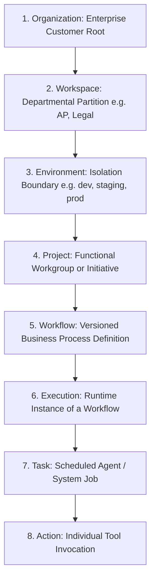
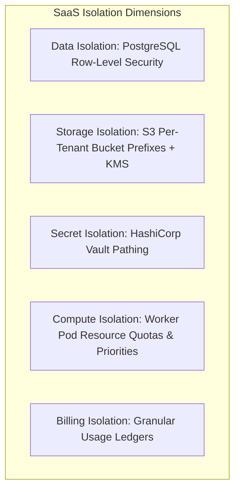

# Enterprise Multi-Tenant SaaS Architecture

## 1. Multi-Tenant Organizational Hierarchy



---

## 2. Invariable Multi-Tenant Resource Attributes

Every database table, object storage path, event envelope, and log record in DocuTask Agent **MUST** contain the standard tenant scoping triplet:

```python
class TenantScopedResource:
    organization_id: str  # e.g., "org-acme-corp"
    workspace_id: str     # e.g., "wrk-finance-accounts-payable"
    environment_id: str   # e.g., "production" | "staging" | "dev"
```

Any query, mutation, or API request missing these three parameters is rejected at the API Gateway before reaching business logic.

---

## 3. Multi-Tenant Isolation Strategies



### 3.1 Database Isolation Strategy: Hybrid Row-Level Security (RLS) & Schema Partitioning
- **Standard Tier**: Shared database with PostgreSQL Row-Level Security (RLS). Every SQL query automatically injects `SET LOCAL app.current_tenant = 'org-acme-corp'` in the connection transaction context.
- **Enterprise Dedicated Tier**: Dedicated schema or dedicated isolated PostgreSQL database instance connected via dynamic connection pooling (PgBouncer).

#### PostgreSQL RLS Policy Blueprint:
```sql
-- Enable RLS on all tables
ALTER TABLE workflow_executions ENABLE ROW LEVEL SECURITY;

-- Enforce tenant boundary
CREATE POLICY tenant_isolation_policy ON workflow_executions
    FOR ALL
    USING (organization_id = CURRENT_SETTING('app.current_organization_id', true))
    WITH CHECK (organization_id = CURRENT_SETTING('app.current_organization_id', true));
```

### 3.2 Storage Isolation Strategy
- Object storage (S3 / MinIO) uses deterministic, isolated namespace pathing:
  `s3://docutask-enterprise-vault/{organization_id}/{workspace_id}/{environment_id}/{document_id}.pdf`
- Every Organization can optionally bind their own Customer Managed Encryption Key (CMEK) via AWS KMS / Google Cloud KMS.

### 3.3 Secret Isolation Strategy
- Third-party API keys (SAP, Salesforce, Stripe) and OAuth tokens are stored in HashiCorp Vault with strict per-tenant pathing:
  `/v1/secret/data/{organization_id}/{workspace_id}/{environment_id}/connectors/{connector_id}`
- Vault AppRole authentication ensures worker nodes can only access secrets matching the active execution's tenant context.

### 3.4 Compute & Queue Isolation
- RabbitMQ / Redis message queues employ fair-share tenant scheduling (weighted round-robin) to prevent a single high-volume tenant from starving noisy-neighbor tenants.
- Heavy background workers (OCR, vision ML, batch parsing) run in dedicated tenant Kubernetes namespaces for Tier-1 enterprise accounts.

### 3.5 Billing & Metering Isolation
- Every LLM inference call, OCR page parsed, and tool invocation records an immutable ledger entry:
  `UsageLedger(org_id, workspace_id, env_id, metric_name, quantity, cost_usd, timestamp)`
- Real-time rate limits and hard token spend caps prevent runaway billing overruns.
