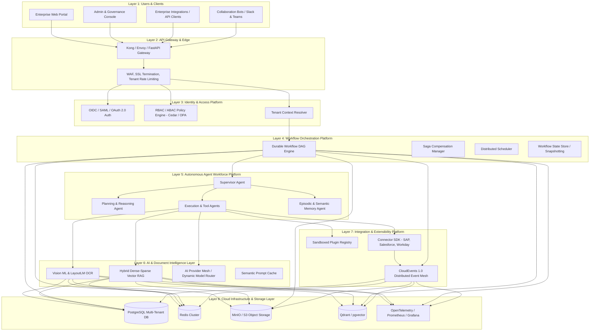

# Enterprise Platform Architecture Blueprint

## 1. High-Level 8-Layer Architecture Topology

---

## 2. Comprehensive Layer Breakdown

### Layer 1: Users & Client Applications
- **Responsibilities**: Provide unified web, mobile, CLI, and conversational interfaces for Operators, Managers, and Executives.
- **Ownership**: Frontend Engineering & UX Team.
- **APIs**: REST API (OpenAPI 3.1), GraphQL (Subscriptions), WebSockets (Live workflow telemetry).
- **Dependencies**: API Gateway.
- **Scaling Strategy**: Static SPA assets distributed globally via CDN (Cloudflare / CloudFront).
- **Failure Handling**: Progressive web app caching, offline queueing with optimistic UI updates.

### Layer 2: API Gateway & Edge
- **Responsibilities**: TLS termination, request authentication validation, per-tenant rate limiting, request routing, WAF inspection, payload compression.
- **Ownership**: Platform Infrastructure & SRE Team.
- **APIs**: Envoy / Kong Proxy Rules, Ingress Controllers.
- **Dependencies**: Layer 3 (Identity Platform).
- **Scaling Strategy**: Horizontal Pod Autoscaling (HPA) based on CPU/RPS targets.
- **Failure Handling**: Graceful degradation to read-only mode, exponential backoff headers (HTTP 429).

### Layer 3: Identity & Access Platform
- **Responsibilities**: Multi-tenant authentication (SSO, SAML 2.0, OIDC), RBAC/ABAC authorization checks, tenant workspace resolution, mTLS certificate distribution.
- **Ownership**: Enterprise Security Team.
- **APIs**: `/api/v1/auth/token`, `/api/v1/tenants/context`, `/api/v1/policy/evaluate`.
- **Dependencies**: Vault (Key storage), Identity Provider (Okta, Azure AD).
- **Scaling Strategy**: Stateless token verification with distributed in-memory Redis token revocation lists.
- **Failure Handling**: Circuit breaker on external IdP outages with cached short-lived JWT validation.

### Layer 4: Workflow Orchestration Platform
- **Responsibilities**: Declarative DAG workflow execution, durable state persistence, step timeouts, saga compensation rollbacks, human approval queues.
- **Ownership**: Workflow Platform Team.
- **APIs**: `/api/v1/workflows/execute`, `/api/v1/workflows/{id}/state`, `/api/v1/workflows/{id}/pause`.
- **Dependencies**: PostgreSQL (State store), Redis (Worker queues), Event Mesh.
- **Scaling Strategy**: Distributed worker pools partitioned by tenant priority and workload intensity.
- **Failure Handling**: At-least-once task delivery, automatic idempotent retry on transient failures, saga compensation on unrecoverable step errors.

### Layer 5: Autonomous Agent Workforce Platform
- **Responsibilities**: Multi-agent goal decomposition, dynamic planning, tool selection, consensus validation, reflection, episodic memory retrieval.
- **Ownership**: Agent AI Engineering Team.
- **APIs**: `AgentRuntime.dispatch(goal, context)`, `AgentMemory.retrieve(query)`.
- **Dependencies**: Layer 6 (AI Layer), Layer 7 (Connectors).
- **Scaling Strategy**: Asynchronous agent execution workers scaled dynamically based on queue depth.
- **Failure Handling**: Self-healing recovery loops, dynamic task replanning on tool failures, automated escalation to Supervisor Agent.

### Layer 6: AI & Document Intelligence Layer
- **Responsibilities**: Layout-aware OCR, table extraction, multi-modal embeddings, vector search, semantic prompt caching, dynamic multi-tier model routing.
- **Ownership**: Machine Learning & Document Intelligence Team.
- **APIs**: `DocumentExtractor.parse()`, `RAGRetriever.query()`, `ModelRouter.generate()`.
- **Dependencies**: GPU Inference Nodes / LLM Cloud APIs (Gemini, OpenAI, Anthropic).
- **Scaling Strategy**: Dedicated GPU worker pools with batching and request deduplication.
- **Failure Handling**: Multi-tier provider fallback (e.g., Primary Gemini $\rightarrow$ Fallback Claude $\rightarrow$ Local vLLM).

### Layer 7: Integration & Extensibility Platform
- **Responsibilities**: Dynamic plugin sandbox execution, standardized connector lifecycles (SAP, Salesforce, Workday), distributed event publishing and subscription.
- **Ownership**: Integrations & Developer Ecosystem Team.
- **APIs**: `Connector.execute(action, params)`, `EventBus.publish(cloud_event)`.
- **Dependencies**: Kafka / RabbitMQ Event Mesh.
- **Scaling Strategy**: Decoupled asynchronous connector workers with per-destination rate-limiting queues.
- **Failure Handling**: Dead-letter queues (DLQ), exponential backoff, circuit breakers on third-party API 5xx errors.

### Layer 8: Cloud Infrastructure & Storage Layer
- **Responsibilities**: Persistent relational data storage, distributed caching, object/document blob storage, vector indexing, observability telemetry.
- **Ownership**: SRE & Cloud Operations Team.
- **Components**: PostgreSQL 16 (RLS), Redis 7 Cluster, MinIO / AWS S3, Qdrant / pgvector, OpenTelemetry.
- **Scaling Strategy**: Database read replicas, multi-AZ high availability, sharded object storage buckets.
- **Failure Handling**: Automated multi-region replication (RTO < 8.4m, RPO = 12s), automated daily cryptographic backup verification.
