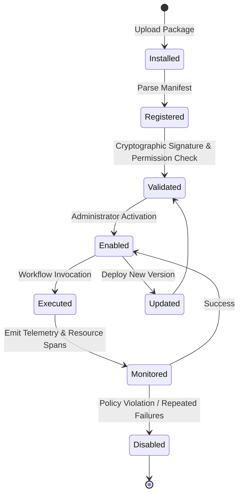

# Enterprise Plugin Architecture & Dynamic Extensibility System

## 1. Plugin Architecture Philosophy

A core architectural tenet of DocuTask Agent is **Zero Hardcoded Integrations**. 

```
❌ BAD PATTERN (Hardcoded Anti-Pattern):
if service_type == "gmail":
    execute_gmail_action()
elif service_type == "notion":
    execute_notion_action()
elif service_type == "sap":
    execute_sap_action()

✅ ENTERPRISE PATTERN (Decoupled Plugin Architecture):
plugin = PluginRegistry.get_plugin(capability="erp.create_invoice")
result = await PluginSandbox.execute(plugin, action="create_invoice", payload=data)
```

---

## 2. Plugin Architecture Components

```mermaid
graph TD
    subgraph "Plugin Management"
        MAN[Plugin Manifest (manifest.json)]
        REG[Plugin Registry]
        CAP[Capability Discovery Engine]
    end

    subgraph "Execution & Security"
        VAL[Signature & Permission Validator]
        BOX[Isolated Plugin Sandbox (WASM / gVisor)]
        MTR[Resource & Telemetry Monitor]
    end

    MAN --> REG
    REG --> CAP
    CAP --> VAL
    VAL --> BOX
    BOX --> MTR
```

---

## 3. Plugin Lifecycle State Machine



---

## 4. Standard Plugin Manifest Specification (`plugin.json`)

```json
{
  "$schema": "https://docutask.io/schemas/plugin-manifest-v1.json",
  "id": "docutask-sap-s4hana-connector",
  "name": "SAP S/4HANA Enterprise Connector",
  "version": "1.4.2",
  "author": "Enterprise Integrations Group",
  "entrypoint": "sap_plugin:SAPConnectorPlugin",
  "runtime": "python3.12-sandboxed",
  "capabilities": [
    "erp.lookup_supplier",
    "erp.create_invoice",
    "erp.reverse_journal_entry",
    "erp.verify_purchase_order"
  ],
  "permissions": [
    "network:outbound:*.sap.corp.internal:443",
    "secrets:read:sap_credentials"
  ],
  "actions": [
    {
      "name": "create_invoice",
      "description": "Posts a verified invoice into SAP General Ledger",
      "input_schema": {
        "type": "object",
        "required": ["vendor_tax_id", "total_amount", "currency", "line_items"],
        "properties": {
          "vendor_tax_id": { "type": "string" },
          "total_amount": { "type": "number" },
          "currency": { "type": "string", "maxLength": 3 }
        }
      },
      "output_schema": {
        "type": "object",
        "required": ["journal_id", "status"],
        "properties": {
          "journal_id": { "type": "string" },
          "status": { "type": "string" }
        }
      }
    }
  ]
}
```

---

## 5. Plugin Interface Definition & Execution Model

```python
# app/domain/plugins/interface.py
from abc import ABC, abstractmethod
from typing import Dict, Any, List
from dataclasses import dataclass


@dataclass
class PluginExecutionResult:
    success: bool
    data: Dict[str, Any]
    error_message: str = ""
    execution_time_ms: float = 0.0


class IDocuTaskPlugin(ABC):
    """Universal base interface for all first-party and third-party plugins."""

    @abstractmethod
    async def initialize(self, config: Dict[str, Any]) -> None:
        """Initializes plugin state, validates credentials, and pre-warms connection pools."""
        pass

    @abstractmethod
    def get_capabilities(self) -> List[str]:
        """Returns list of standardized capability strings supported by this plugin."""
        pass

    @abstractmethod
    async def execute_action(self, action_name: str, parameters: Dict[str, Any]) -> PluginExecutionResult:
        """Executes a discrete plugin action within the sandbox boundary."""
        pass

    @abstractmethod
    async def shutdown(self) -> None:
        """Gracefully closes network sockets and flushes telemetry."""
        pass
```
