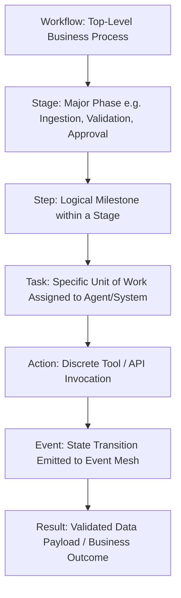
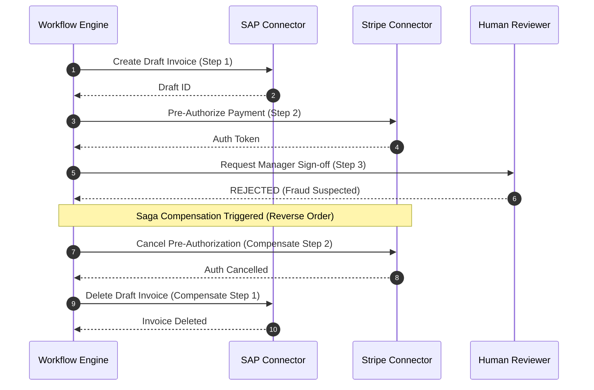

# Enterprise Workflow Platform & Orchestration Engine

## 1. Workflow Structural Hierarchy



---

## 2. Core Workflow Engine Capabilities

### 2.1 Durable Execution & State Persistence
- Every workflow execution is modeled as a persistent, deterministic state machine.
- Execution state is snapshotted to PostgreSQL upon every Step transition, ensuring zero work is lost if worker nodes restart or crash.

### 2.2 Versioning & Immutable Publishing
- Workflows are authored in draft mode and published as immutable semantically versioned releases (`v1.0.0`, `v1.1.0`).
- In-flight executions continue executing against their pinned definition version; new triggers execute against the active production release.

### 2.3 Saga Pattern & Compensation Rollbacks
- For non-idempotent external actions (e.g., charge credit card, reserve inventory, create ERP draft), every Action specifies a corresponding **Compensation Action** (e.g., refund charge, release inventory, delete ERP draft).
- If a subsequent step permanently fails, the Saga Coordinator executes compensation actions in reverse order to restore global system consistency.



### 2.4 Human Approval Queues & Asynchronous Pauses
- Workflows can suspend execution indefinitely waiting for human approval, webhook callbacks, or external timer events with zero resource consumption while waiting.

### 2.5 Time-Travel Replay & Debugging
- Historical executions can be replayed in dry-run or debug environments using exact stored input payloads and recorded intermediate step outputs.

---

## 3. Declarative Workflow Specification (YAML Schema)

```yaml
version: "2.0"
workflow:
  id: "wf-enterprise-invoice-settlement"
  name: "Enterprise Multi-Department Invoice Settlement"
  description: "End-to-end autonomous accounts payable pipeline with 3-way matching and ERP integration"
  organization_id: "org-acme-corp"
  workspace_id: "wrk-finance-ops"
  
  trigger:
    type: "event"
    event_type: "document.uploaded"
    filter:
      file_extension: ["pdf", "tiff", "png"]
      document_type_hint: "invoice"

  timeout_seconds: 3600
  retry_policy:
    max_attempts: 3
    initial_interval_seconds: 5
    backoff_coefficient: 2.0

  stages:
    # STAGE 1: INGESTION & DOCUMENT EXTRACTION
    - stage_id: "stage-01-extraction"
      name: "Document Ingestion & OCR Intelligence"
      steps:
        - step_id: "step-extract-fields"
          name: "Extract Key Invoice Line Items & Metadata"
          agent: "ExecutionAgent"
          tool: "docutask_vision_ocr"
          parameters:
            document_id: "${trigger.payload.document_id}"
            schema_type: "invoice_v2"
          outputs:
            invoice_data: "${step.output.extracted_json}"
            confidence_score: "${step.output.confidence}"

    # STAGE 2: 3-WAY MATCHING & VERIFICATION
    - stage_id: "stage-02-verification"
      name: "3-Way Purchase Order & Supplier Verification"
      steps:
        - step_id: "step-verify-supplier"
          name: "Verify Supplier Tax ID in SAP ERP"
          agent: "ExecutionAgent"
          tool: "sap_erp_connector"
          action: "lookup_supplier"
          parameters:
            vendor_tax_id: "${stage-01-extraction.step-extract-fields.outputs.invoice_data.vendor_tax_id}"
          compensation:
            action: "log_supplier_audit"

        - step_id: "step-validate-line-items"
          name: "Mathematical & Confidence Validation"
          agent: "ValidationAgent"
          parameters:
            data: "${stage-01-extraction.step-extract-fields.outputs.invoice_data}"
            confidence_threshold: 0.85
          conditions:
            on_low_confidence:
              route_to: "stage-03-approval"

    # STAGE 3: GOVERNANCE & APPROVAL
    - stage_id: "stage-03-approval"
      name: "Human-in-the-Loop Approval & Governance"
      steps:
        - step_id: "step-manager-approval"
          name: "Request AP Manager Approval"
          type: "human_approval"
          timeout_seconds: 86400 # 24 hours
          parameters:
            assigned_role: "ap_manager"
            escalation_role: "finance_director"
            summary_payload: "${stage-01-extraction.step-extract-fields.outputs.invoice_data}"
          conditions:
            skip_if: "${stage-01-extraction.step-extract-fields.outputs.confidence_score >= 0.95 and stage-01-extraction.step-extract-fields.outputs.invoice_data.total_amount <= 5000.0}"

    # STAGE 4: SETTLEMENT & NOTIFICATION
    - stage_id: "stage-04-settlement"
      name: "ERP Post & Multi-Channel Notification"
      steps:
        - step_id: "step-post-sap-journal"
          name: "Post AP Journal Entry to SAP"
          agent: "ExecutionAgent"
          tool: "sap_erp_connector"
          action: "create_journal_entry"
          parameters:
            invoice: "${stage-01-extraction.step-extract-fields.outputs.invoice_data}"
          compensation:
            action: "reverse_journal_entry"
            journal_id: "${step.output.journal_id}"

        - step_id: "step-notify-slack"
          name: "Notify Finance Team Slack Channel"
          agent: "ExecutionAgent"
          tool: "slack_connector"
          action: "send_message"
          parameters:
            channel: "#finance-settlements"
            message: "Invoice ${stage-01-extraction.step-extract-fields.outputs.invoice_data.invoice_number} successfully posted to SAP. Amount: $${stage-01-extraction.step-extract-fields.outputs.invoice_data.total_amount}"
```
