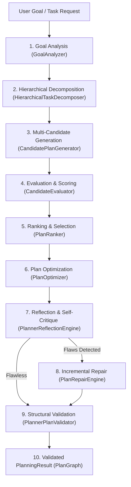
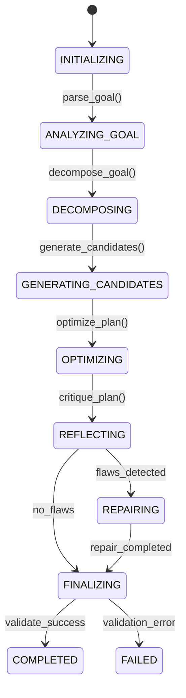
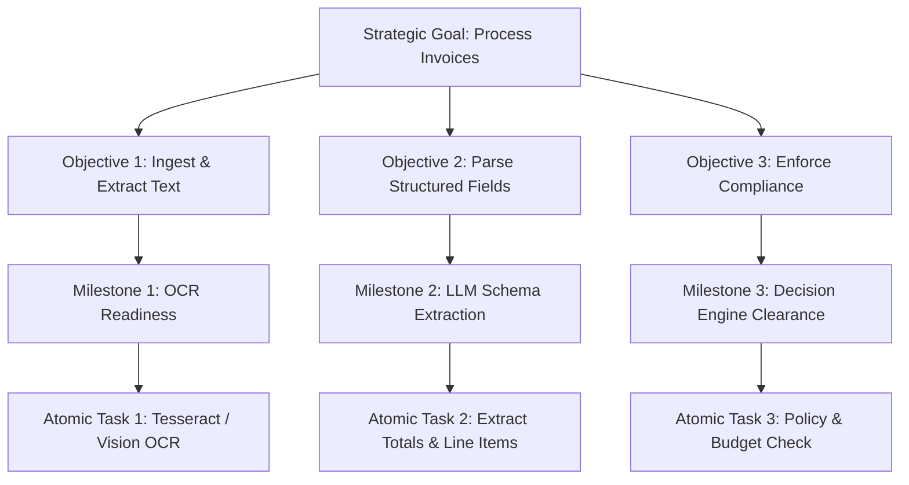
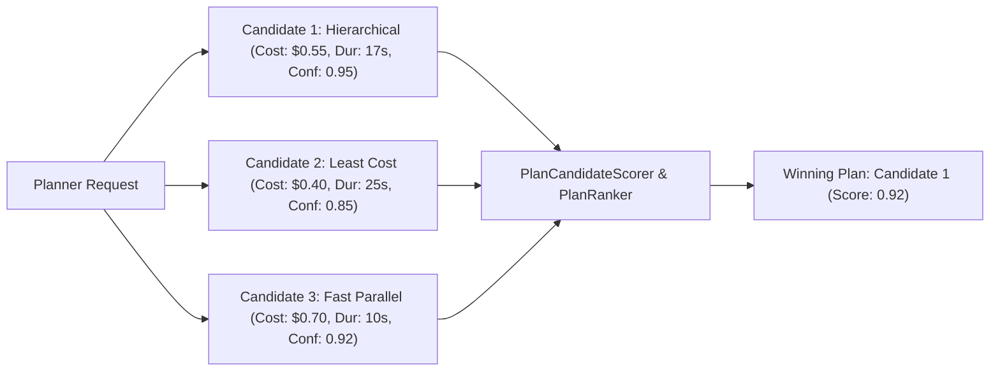
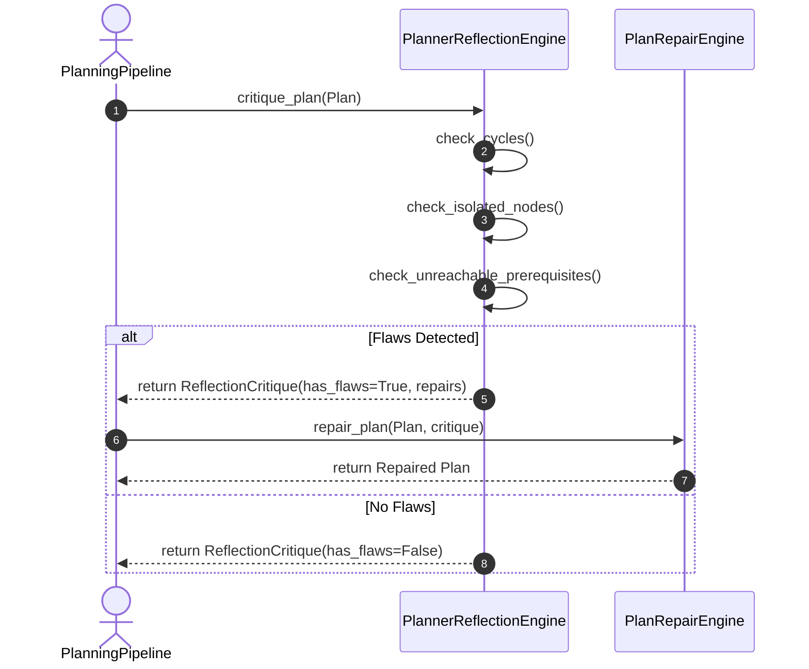
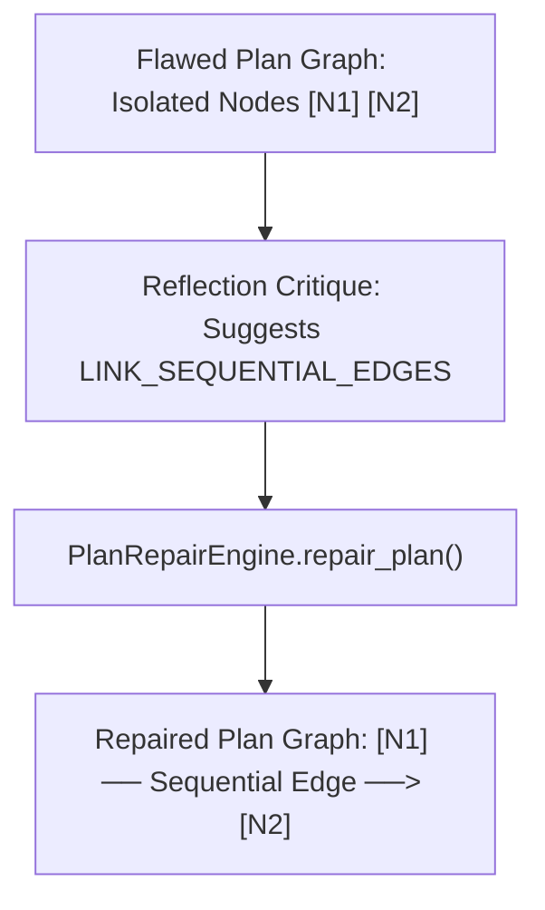
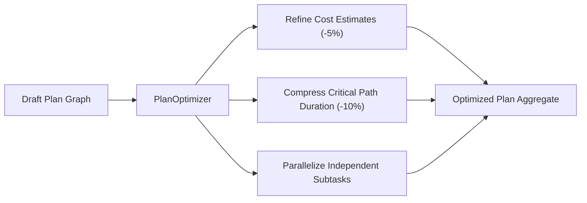
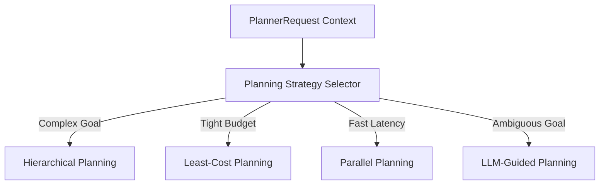
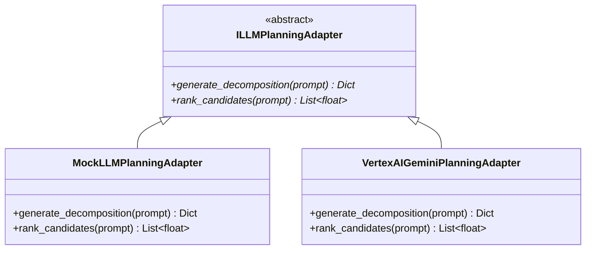
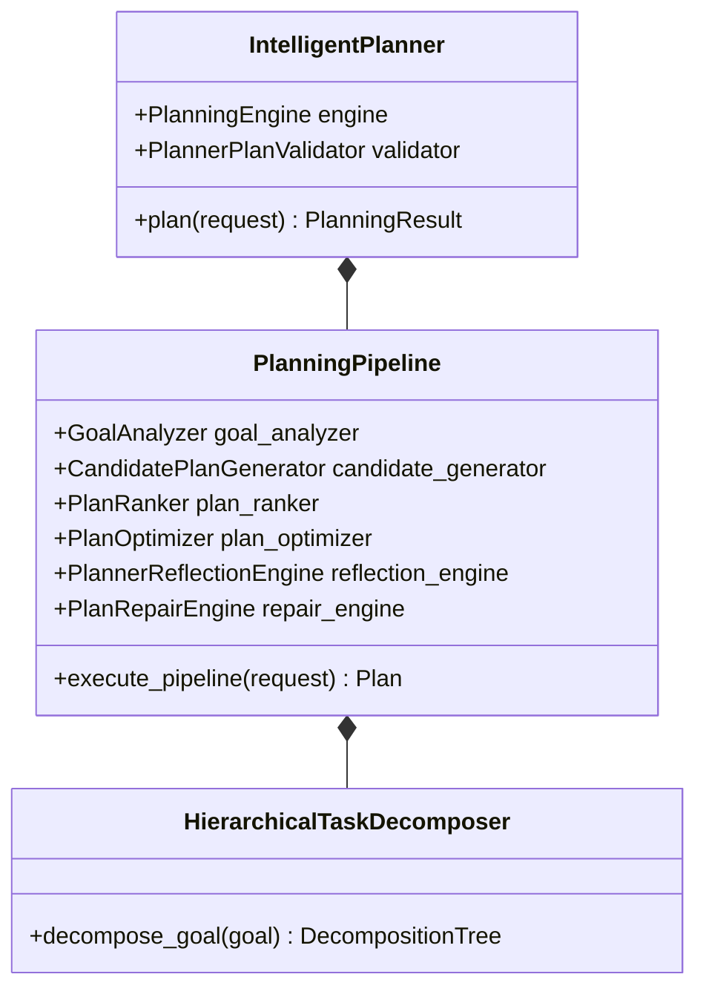

# Enterprise Intelligent Planner & Hierarchical Task Decomposition Engine — Architecture & Implementation Review Report (Prompt 17.0)

**Target System**: Cognitive Planning Subsystem (`app/agents/planner/`)  
**Target Path**: `C:\Users\User\Desktop\ai_document_processing_platform\app\agents\planner\`  
**Design Standard**: Enterprise Clean Architecture, Domain-Driven Design, Pydantic v2, SOLID, Cognitive AI Planning  
**Hackathon Target**: Google Cloud All Things Agentic Hackathon & Global Enterprise Production  

---

## Executive Summary

The **Enterprise Intelligent Planner & Hierarchical Task Decomposition Engine (Prompt 17.0)** has been implemented under `app/agents/planner/`.

This subsystem serves as the **cognitive brain** of the autonomous agent platform:
- Converts high-level **Goals** into optimized, validated, executable **PlanGraphs**.
- **NEVER executes tasks** (delegates to Execution Engine).
- **NEVER contains hardcoded business rules** (delegates governance to Decision Engine).
- **NEVER directly accesses LLM provider APIs or concrete SDKs** (communicates via `ILLMPlanningAdapter`).
- **NEVER mutates memory** (consumes historical plans in read-only mode via `PlannerMemoryAdapter`).

---

## 1. Planner Architectural Mermaid Diagrams

### 1. Planning Pipeline Diagram



### 2. Planner Lifecycle State Machine Diagram



### 3. Hierarchical Decomposition Tree Diagram



### 4. Candidate Plan Ranking & Beam Search Diagram



### 5. Self-Reflection & Critique Flow Diagram



### 6. Incremental Plan Repair Diagram



### 7. Multi-Objective Plan Optimization Diagram



### 8. Strategy Selection Matrix Diagram



### 9. LLM Adapter Provider Decoupling Diagram



### 10. Read-Only Memory Integration Diagram

```mermaid
graph LR
    PLANNER["Intelligent Planner"] -->|1. search(historical_goal)| MEM_ADAPTER["PlannerMemoryAdapter"]
    MEM_ADAPTER -->|2. search(query, top_k)| MEM_MGR["MemoryManager (Read-Only)"]
    MEM_MGR -->>PLANNER: 3. Return Past Successful Workflows & Statistics
```

### 11. Decision Engine Governance Integration Diagram

```mermaid
graph LR
    PLANNER["Intelligent Planner"] -->|1. evaluate_plan_feasibility(estimated_cost)| DEC_ADAPTER["PlannerDecisionAdapter"]
    DEC_ADAPTER -->|2. evaluate(DecisionContext)| DEC_ENG["DecisionEngine (Authority)"]
    DEC_ENG -->>PLANNER: 3. Return DecisionResult (Approval & Risk Score)
```

### 12. Complete Class Diagram



---

## 2. Google Cloud Readiness Assessment

| Google Cloud Service | Integration / Compatibility Pattern | Status |
| :--- | :--- | :--- |
| **Cloud Run** | Stateless cognitive planning execution | Fully Compatible |
| **Vertex AI / Gemini** | Decoupled via `ILLMPlanningAdapter` without direct SDK imports | Fully Compatible |
| **Cloud Tasks** | Serializable `PlannerRequest` and `PlanningResult` payloads | Fully Compatible |
| **Cloud Pub/Sub** | Pub/Sub domain events (`PlanningStarted`, `PlanGenerated`, `PlanRepaired`) | Fully Compatible |
| **Cloud SQL / AlloyDB AI** | PlannerRepository and candidate plan caching | Fully Compatible |
| **Secret Manager** | Security credential isolation | Fully Compatible |
| **Cloud Monitoring & Logging** | Structured planning metrics and trace logs | Fully Compatible |
| **OpenTelemetry & Cloud Trace** | PlanningTrace W3C trace context propagation | Fully Compatible |

---

## 3. Phase Readiness Assessment

The Intelligent Planner is **100% Ready for Phase 18.0 (Execution Engine & Stateful Task Dispatcher)**:
- Output plans strictly conform to the `Plan` aggregate and `PlanGraph` DAG contracts.
- The Execution Engine can consume `Plan` objects without needing to understand how they were cognitively synthesized.
