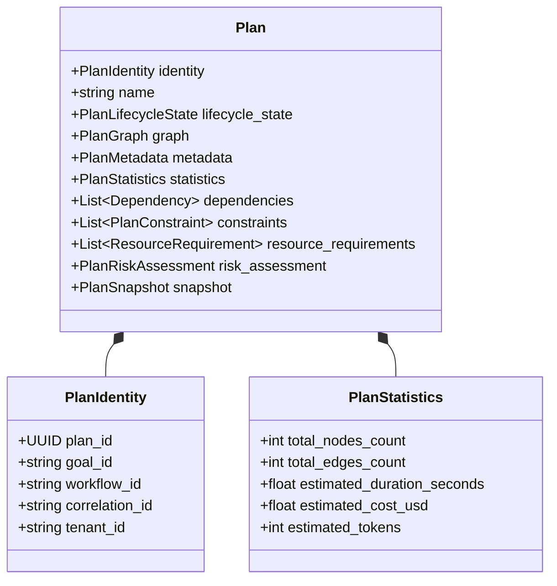
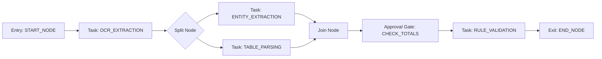
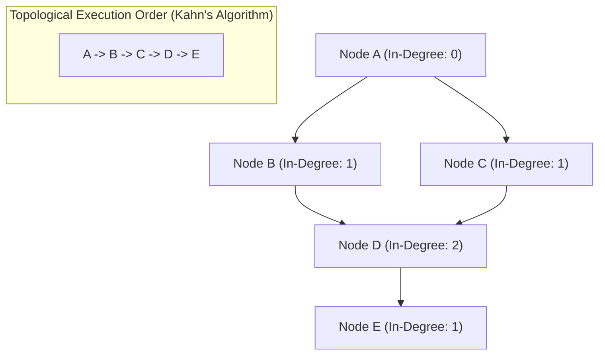
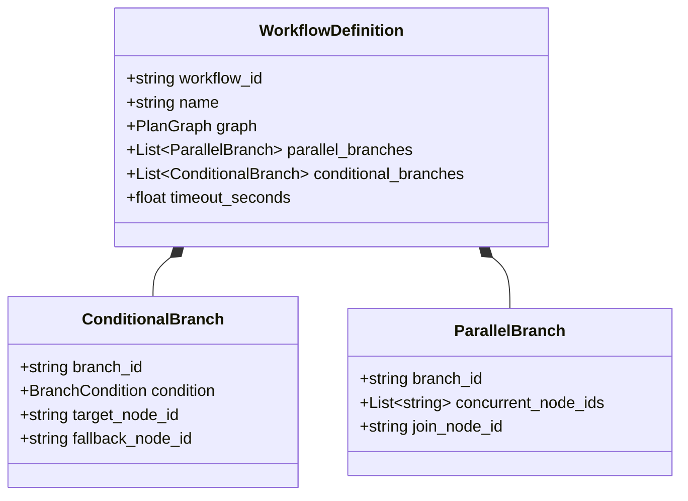
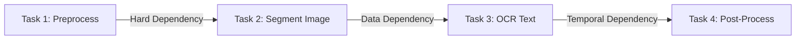
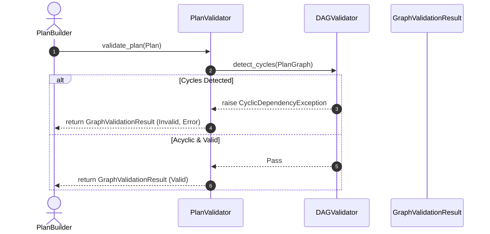
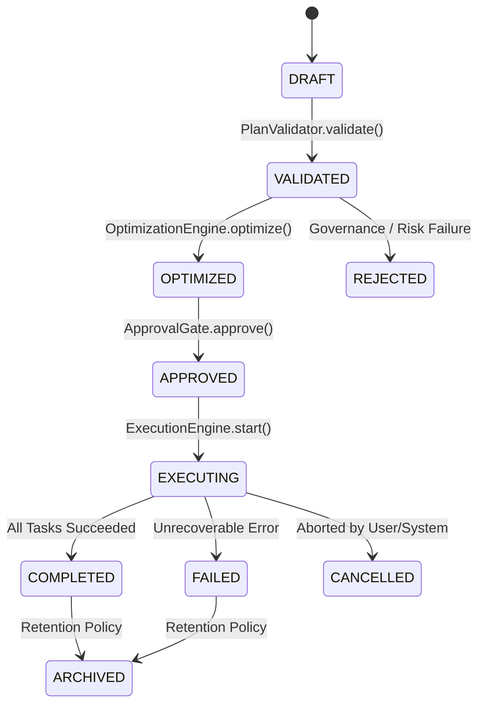
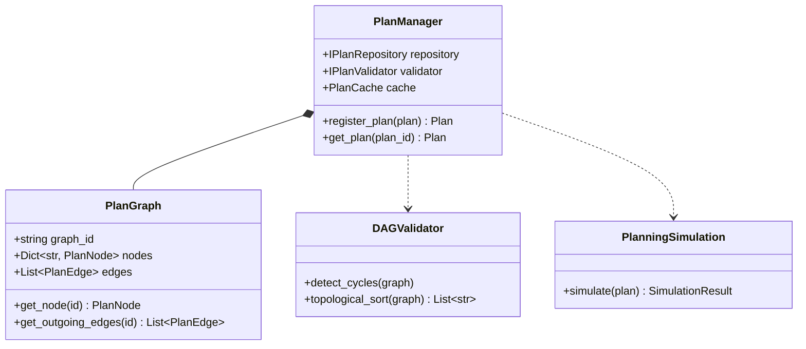

# Enterprise Planning Contracts & Graph Representation — Architecture & Implementation Review Report (Prompt 16.0)

**Target System**: Planning Subsystem (`app/agents/planning/`)  
**Target Path**: `C:\Users\User\Desktop\ai_document_processing_platform\app\agents\planning\`  
**Design Standard**: Enterprise Clean Architecture, Domain-Driven Design, Pydantic v2, SOLID, DAG Theory  
**Hackathon Target**: Google Cloud All Things Agentic Hackathon & Global Enterprise Production  

---

## Executive Summary

The **Enterprise Planning Contracts & Graph Representation Foundation (Prompt 16.0)** has been designed and implemented under `app/agents/planning/`. This subsystem defines the canonical planning representation consumed by Executors, Workflow Engines, Observers, Reflection Engines, Recovery Engines, and Multi-Agent Coordinators.

This phase strictly defines **what a plan is**—establishing a provider-independent planning model, DAG graph topology, cycle detection, topological sorting, workflow execution branching, dry-run simulation, and deterministic state snapshots.

---

## 1. Planning Architectural Mermaid Diagrams

### 1. Planning Layer Architecture Diagram

```mermaid
graph TD
    subgraph "Reasoning Producers"
        INTELLIGENT_PLANNER["Intelligent Planner / LLM Decomposition (Prompt 17.0)"]
    end

    subgraph "Canonical Planning Model (app.agents.planning)"
        PLAN["Plan Aggregate (Domain Entity)"]
        GRAPH["PlanGraph (DAG Topology)"]
        NODES["PlanNodes (Task, Join, Split, Merge, Barrier, Checkpoint, Approval)"]
        EDGES["PlanEdges (Sequential, Conditional, Dependency, Fallback, Rollback)"]
        STATS["PlanStatistics & Cost Estimates"]
    end

    subgraph "Runtime Consumers"
        EXECUTOR["Execution Engine"]
        WORKFLOW["Workflow Engine"]
        OBSERVER["Observation & Monitoring Engine"]
        RECOVERY["Recovery & Compensation Engine"]
        REFLECTION["Reflection & Learning Engine"]
    end

    INTELLIGENT_PLANNER -->|Generates| PLAN
    PLAN *-- GRAPH
    PLAN *-- STATS
    GRAPH *-- NODES
    GRAPH *-- EDGES
    PLAN -->|Consumed by| EXECUTOR
    PLAN -->|Orchestrated by| WORKFLOW
    PLAN -->|Monitored by| OBSERVER
    PLAN -->|Replayed by| RECOVERY
    PLAN -->|Inspected by| REFLECTION
```

### 2. Plan Hierarchy Diagram



### 3. Task Graph Diagram



### 4. DAG Structure & Topological Sorting Diagram



### 5. Workflow Model Diagram



### 6. Dependency Graph Diagram



### 7. Scheduling & Timeline Flow Diagram

```mermaid
gantt
    title Plan Execution Timeline & Schedule Windows
    dateFormat  X
    axisFormat %s sec

    section Pipeline Tasks
    OCR Extraction (Node 1)       :active, 0, 10
    LLM Schema Extraction (Node 2): 10, 25
    Rule & Policy Validation (Node 3): 25, 30
```



### 8. Validation Flow Diagram



### 9. Planning Lifecycle State Machine Diagram



### 10. Complete Class Diagram



---

## 2. Google Cloud Readiness Assessment

| Google Cloud Service | Integration / Compatibility Pattern | Status |
| :--- | :--- | :--- |
| **Cloud Run** | Stateless DAG execution and plan validation APIs | Fully Compatible |
| **Cloud Tasks** | Serializable `Plan` payloads for distributed asynchronous task execution | Fully Compatible |
| **Cloud Pub/Sub** | Pub/Sub domain events (`PlanCreatedEvent`, `PlanApprovedEvent`, `PlanExecutedEvent`) | Fully Compatible |
| **Cloud SQL / AlloyDB AI** | PlanRepository and PlanSnapshot persistence | Fully Compatible |
| **Vertex AI** | Embedding vectors and future LLM decomposition integration | Fully Compatible |
| **Cloud Monitoring & Logging** | Structured plan metrics and execution timeline traces | Fully Compatible |
| **OpenTelemetry & Cloud Trace** | PlanCorrelation and W3C trace context propagation | Fully Compatible |

---

## 3. Phase Readiness Assessment

The Planning Foundation is **100% Ready for Prompt 17.0 (Intelligent Planner Implementation)**:
- Graph models, cycle detection, topological sorting, and serialization contracts are completely established.
- The future Intelligent Planner can generate `Plan` objects without needing to define graph or validation infrastructure.
