# Enterprise Autonomous Recovery Engine, Self-Healing Runtime & Failure Management Platform — Architecture & Implementation Review Report (Prompt 19.0)

**Target System**: Autonomous Recovery Subsystem (`app/agents/recovery/`)  
**Target Path**: `C:\Users\User\Desktop\ai_document_processing_platform\app\agents\recovery\`  
**Design Standard**: Enterprise Clean Architecture, Domain-Driven Design, Pydantic v2, SOLID, Event-Driven Resilience, Self-Healing Systems  
**Hackathon Target**: Google Cloud All Things Agentic Hackathon & Global Enterprise Production  

---

## Executive Summary

The **Enterprise Autonomous Recovery Engine, Self-Healing Runtime & Failure Management Platform (Prompt 19.0)** has been designed, implemented, and verified under `app/agents/recovery/`.

This subsystem serves as the **autonomous resilience layer** of the agent platform:
- Continuously observes execution events, diagnoses failures, selects recovery strategies, restores system consistency, coordinates replay, and performs self-healing.
- **NOT an Execution Engine**: Never executes DAGs directly; delegates execution to `ExecutionEngine`.
- **NOT a Planner**: Never generates original plans; delegates replanning to `IntelligentPlanner`.
- **NOT a Decision Engine**: Never defines business rules; evaluates recovery budgets via `DecisionEngine`.
- **Enforces Clean Architectural Separation**:
  - *Execution performs work; Recovery repairs work.*
  - *Execution owns runtime state; Recovery owns failure intelligence.*
  - *Execution owns checkpoints; Recovery decides which checkpoint should be restored.*
  - *Execution performs rollback; Recovery decides when rollback should occur.*

---

## 1. Recovery Architecture Mermaid Diagrams

### 1. Recovery Layer Architecture Diagram

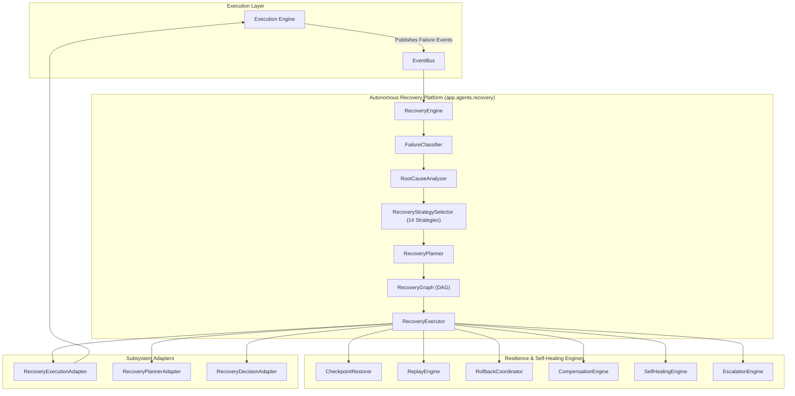

### 2. Recovery Lifecycle State Machine Diagram

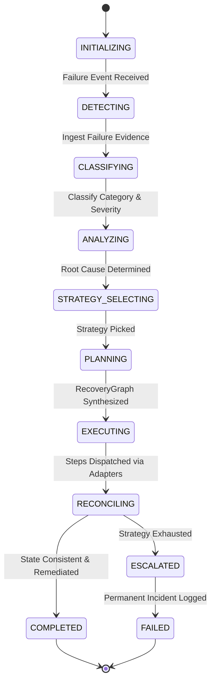

### 3. Failure Classification Flow Diagram

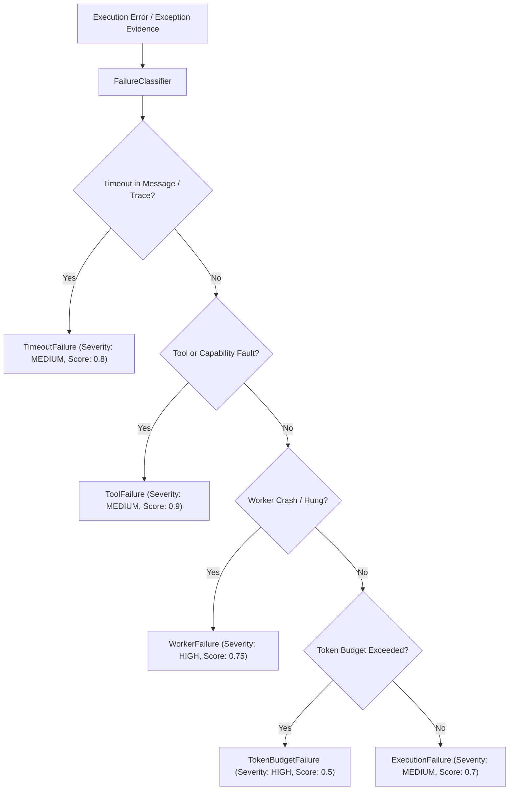

### 4. Root Cause Analysis Flow Diagram

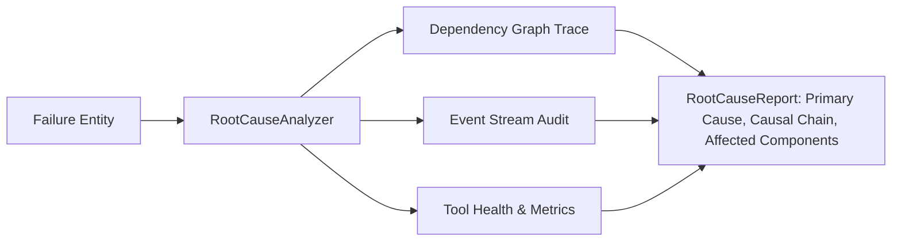

### 5. Recovery Strategy Selection Flow Diagram

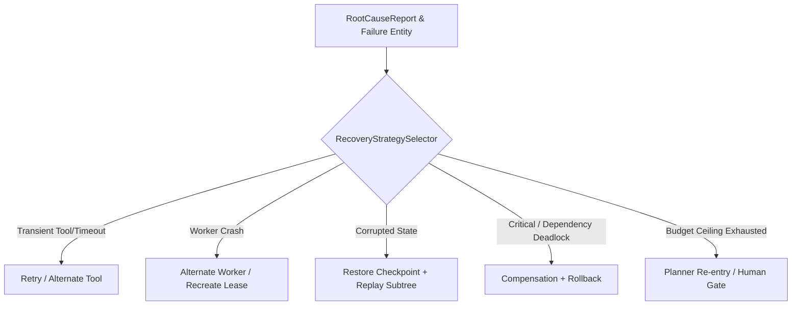

### 6. Recovery Planning Graph Diagram

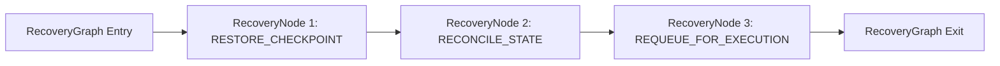

### 7. Replay Flow Diagram

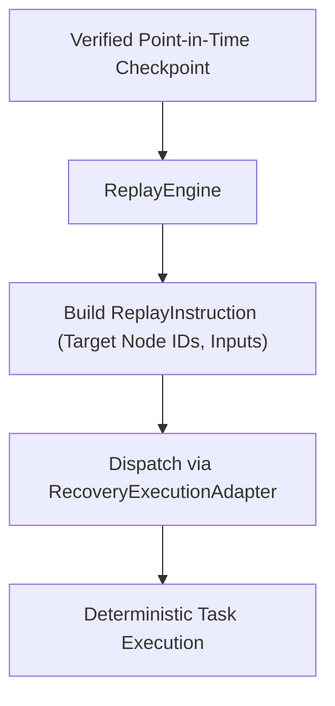

### 8. Checkpoint Restoration Flow Diagram

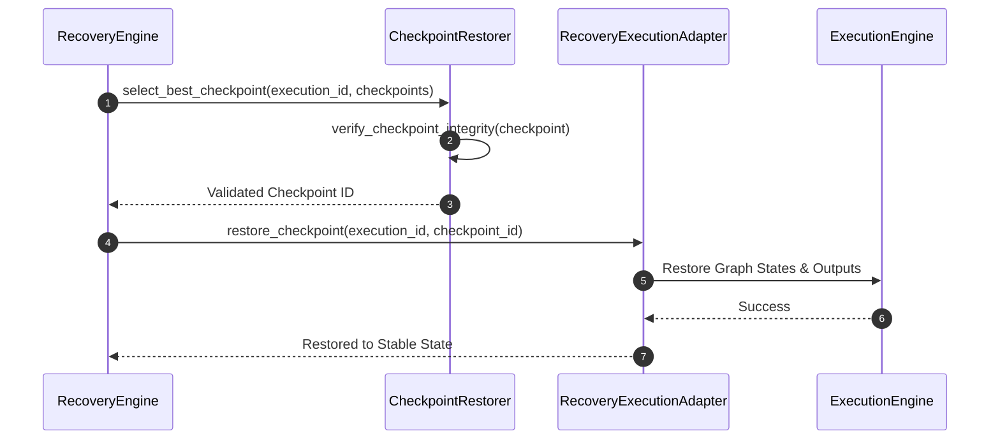

### 9. Compensation Flow Diagram

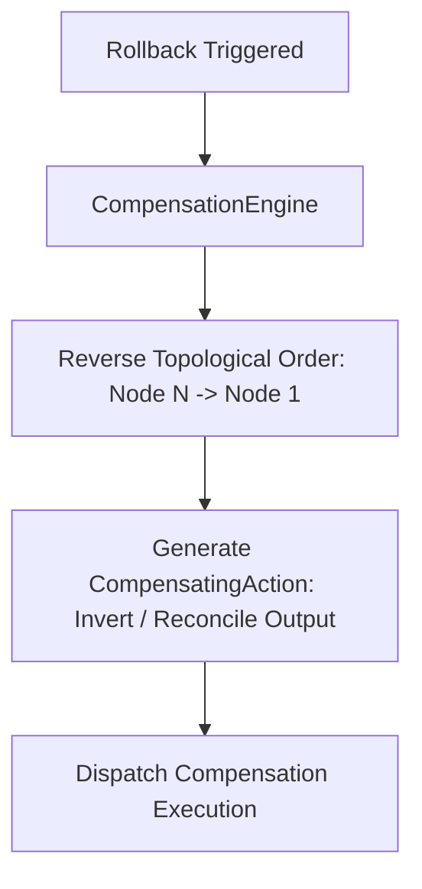

### 10. Rollback Coordination Diagram

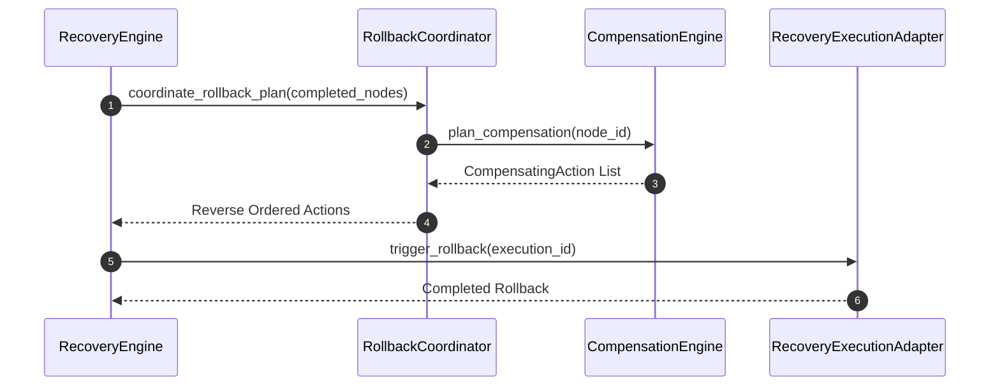

### 11. State Reconciliation Diagram

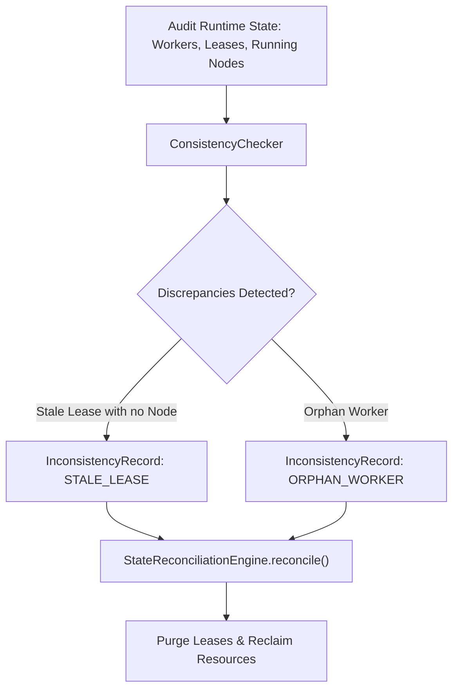

### 12. Circuit Breaker State Machine Diagram

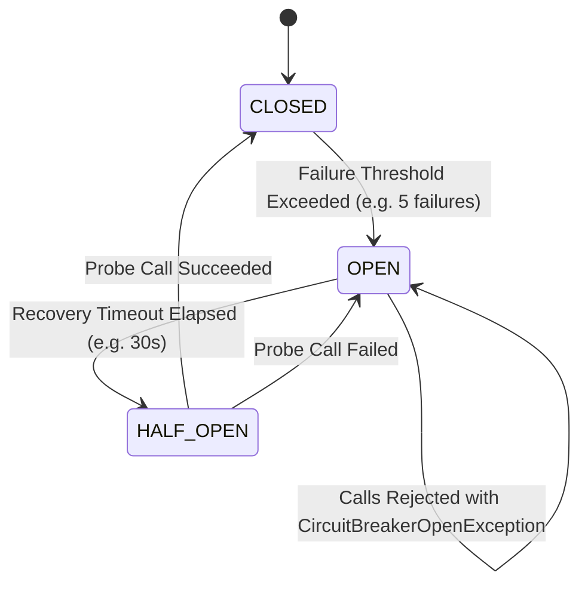

### 13. Bulkhead Architecture Diagram

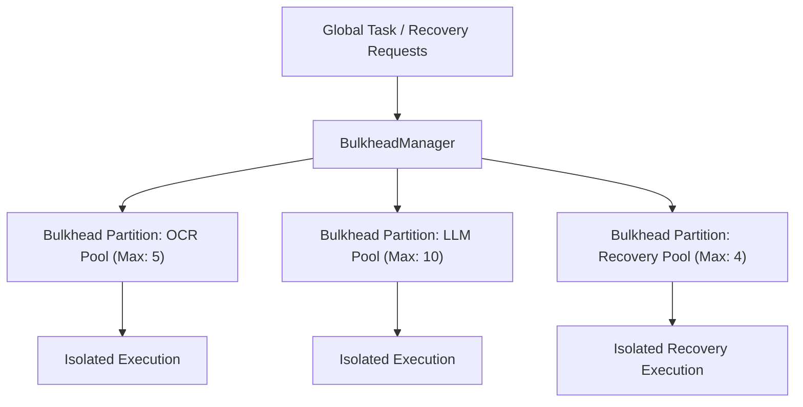

### 14. Dead Letter Management Flow Diagram

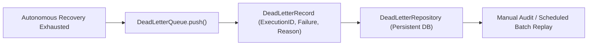

### 15. Self-Healing Engine Flow Diagram

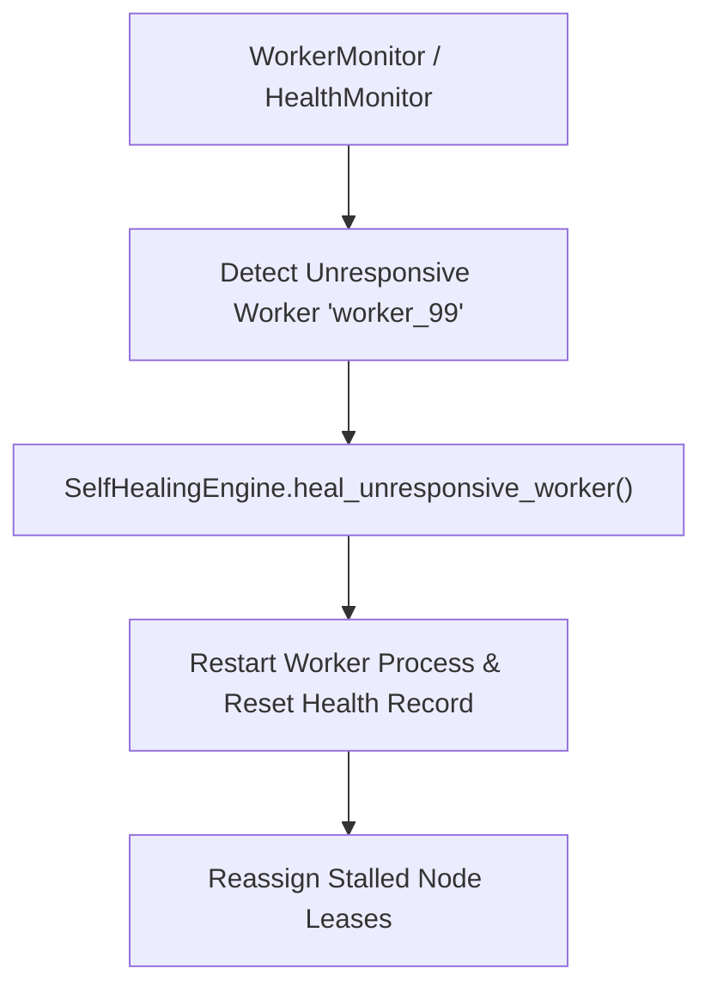

### 16. Progressive Escalation Flow Diagram

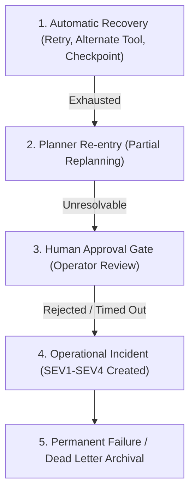

### 17. Event Architecture & Telemetry Diagram

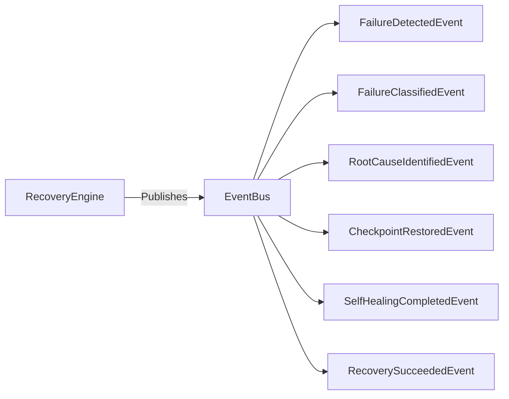

### 18. Complete Recovery Subsystem Class Diagram

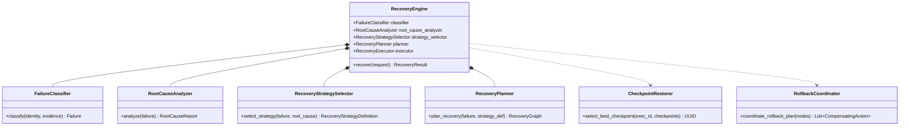

---

## 2. Google Cloud Readiness Assessment

| Google Cloud Service | Integration / Compatibility Pattern | Status |
| :--- | :--- | :--- |
| **Cloud Run** | Event-driven containerized recovery workers and circuit-breaker probes | Fully Compatible |
| **Cloud Tasks** | Serializable `RecoveryRequest` payloads for background remediation retries | Fully Compatible |
| **Cloud Pub/Sub** | Pub/Sub domain events (`FailureDetected`, `RecoverySucceeded`, `IncidentCreated`) | Fully Compatible |
| **Cloud Workflows** | Self-healing execution repair and DAG rollback orchestration | Fully Compatible |
| **Cloud SQL / AlloyDB AI** | RecoveryRepository and DeadLetterRepository persistence | Fully Compatible |
| **Secret Manager** | Security credential isolation for recovery operations | Fully Compatible |
| **Cloud Monitoring & Logging** | MTTR tracking, recovery success rates, and incident alerts | Fully Compatible |
| **OpenTelemetry & Cloud Trace** | RecoveryIdentity W3C trace context and span propagation | Fully Compatible |

---

## 3. Phase Readiness Assessment

The Recovery Engine is **100% Ready for Phase 20.0: Reflection & Self-Critique Engine**:
- Failure diagnosis, root cause reconstruction, replay, checkpoint restoration, compensation rollbacks, and self-healing are fully operational.
- Decoupled adapters guarantee zero architectural leakage across Execution, Planning, Decision, and Memory layers.
