# Enterprise Reflection, Self-Critique, Evaluation & Continuous Adaptation Engine
## Architecture Design, Cognitive Introspection & Continuous Learning Report (Phase 20.0)

**Author:** Joint AI Architecture & Engineering Review Board  
**Target Subsystem:** `app/agents/reflection/`  
**Standard:** Enterprise Clean Architecture, Domain-Driven Design, Event-Driven Architecture, Pydantic v2, Google Cloud Native  
**Version:** 20.0.0-PROD  

---

## 1. Executive Summary

The **Enterprise Reflection, Self-Critique, Evaluation & Continuous Adaptation Engine** forms the intelligence improvement layer of the autonomous agent framework. Positioned immediately downstream of the Stateful Execution Engine and Recovery Engine, Reflection converts completed execution histories, telemetry traces, and diagnostic checkpoints into immutable knowledge products, self-critiques, cross-subsystem feedback, and formal adaptation proposals.

### Core Architectural Axioms
1. **Reflection Never Executes Work:** It receives only already-completed execution traces (whether succeeded, failed, or rolled back).
2. **Reflection Never Plans Original Tasks:** It critiques planner reasoning and recommends decomposition heuristics, but does not synthesize initial execution DAGs.
3. **Reflection Never Repairs Runtime State:** It does not invoke rollback, restart workers, or alter active execution queues; failure repair belongs strictly to the Recovery Engine.
4. **Reflection Never Directly Mutates Memory:** It synthesizes immutable `LearningArtifact` entities and explicit `MemoryUpdateRequest` contracts; Memory governs its own promotion and consolidation policies.
5. **Reflection Never Invokes Tools:** It inspects tool call traces, latencies, and error patterns without making outbound tool calls.
6. **Adaptations Require Explicit Sign-Off:** All operational parameter adaptations require human or governance policy approval before activation.

---

## 2. End-to-End Architecture Diagrams (20 Mermaid Diagrams)

### Diagram 1: Global Reflection Layer Architecture
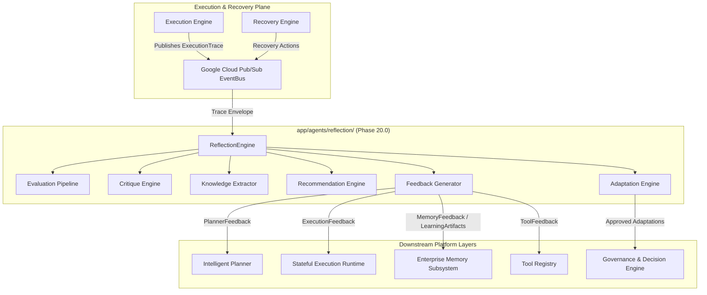

---

### Diagram 2: Evaluation Pipeline Architecture
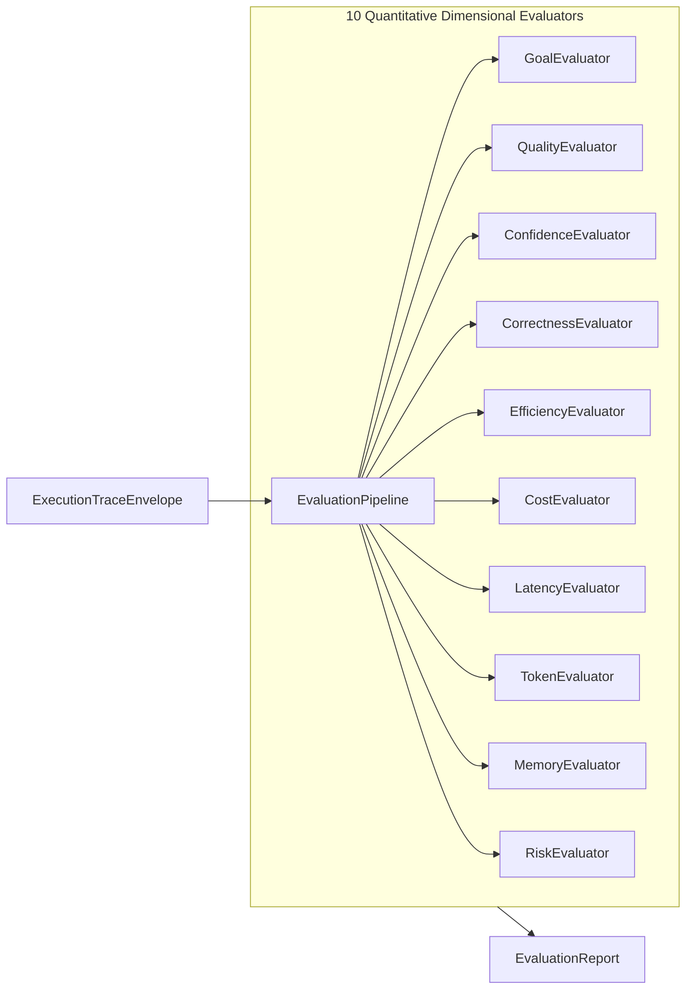

---

### Diagram 3: Reflection Lifecycle State Machine
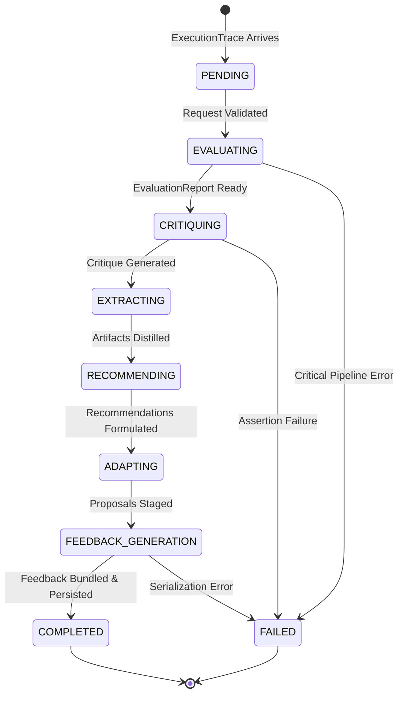

---

### Diagram 4: Execution Analysis Workflow
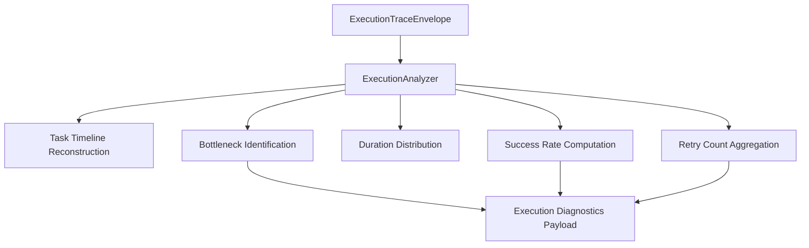

---

### Diagram 5: Planner Critique & Decomposition Analysis
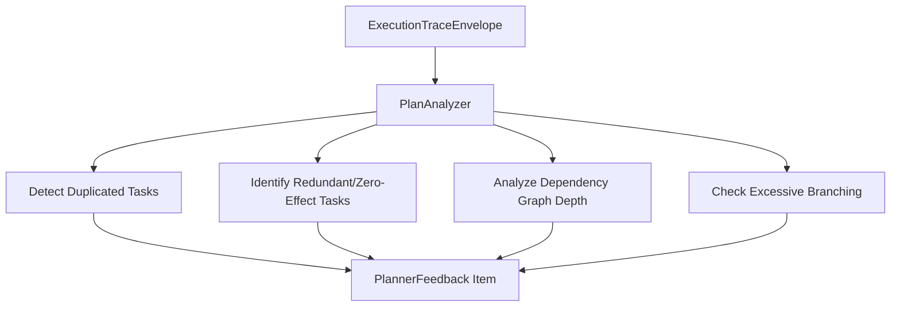

---

### Diagram 6: Tool Usage & Degradation Analysis
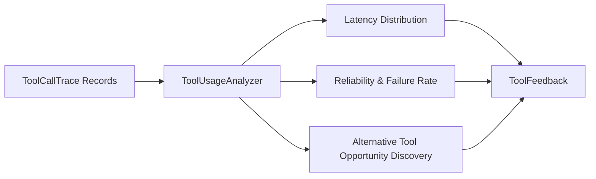

---

### Diagram 7: Cross-Execution Pattern Detection
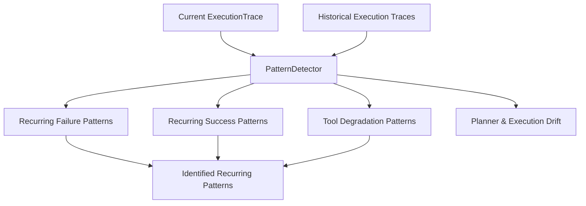

---

### Diagram 8: Immutable Learning Artifact Flow
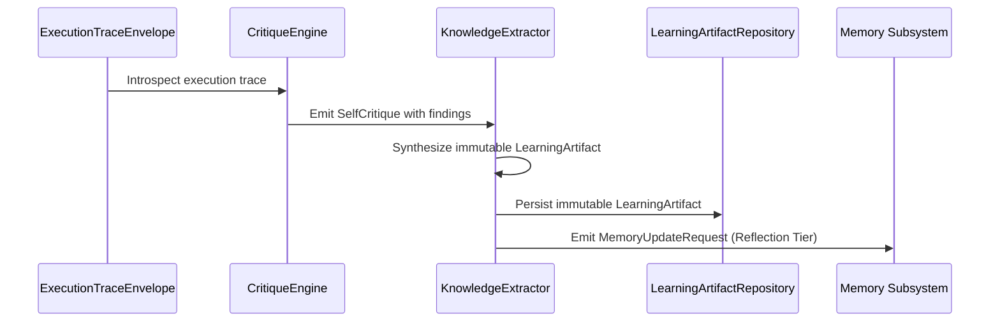

---

### Diagram 9: Recommendation Engine Flow
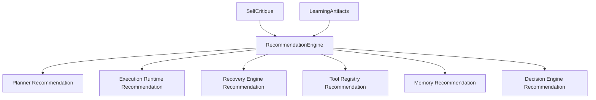

---

### Diagram 10: Adaptation Engine Approval & Activation Flow
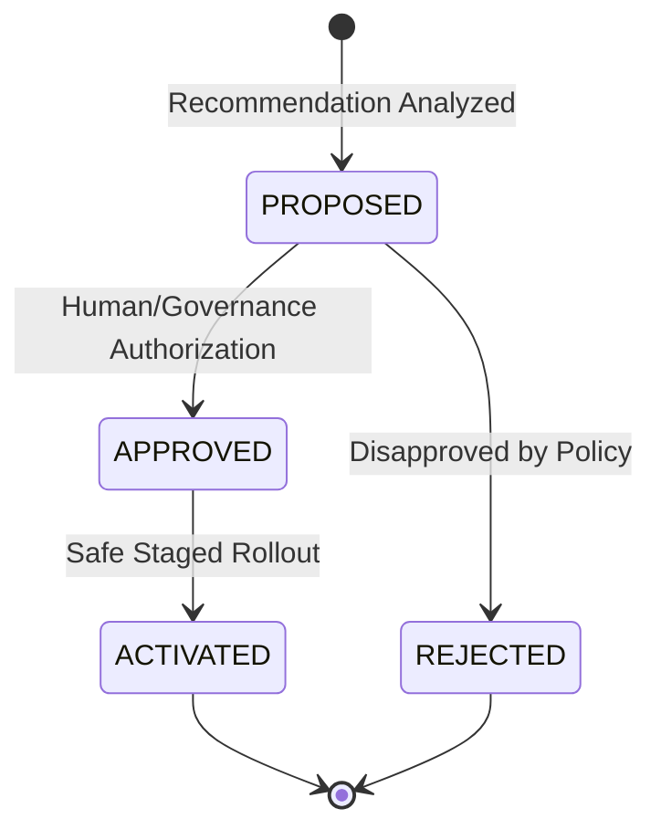

---

### Diagram 11: Subsystem Feedback Formulation Flow
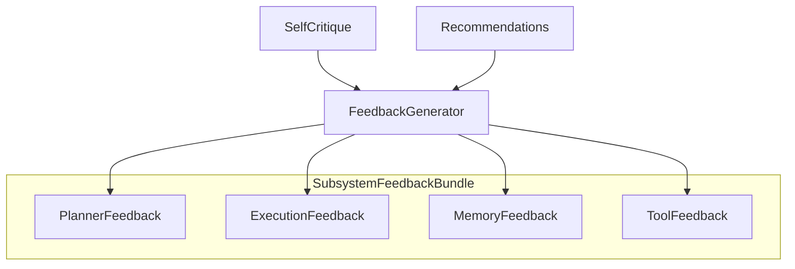

---

### Diagram 12: Memory Integration & Knowledge Promotion
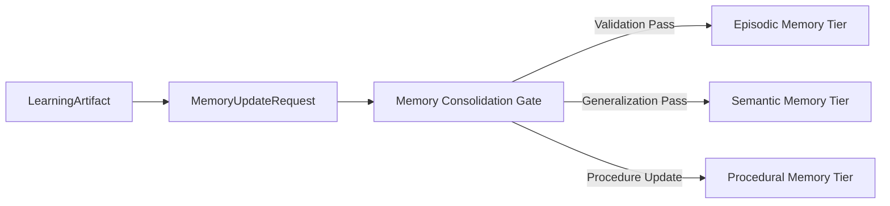

---

### Diagram 13: Event Streaming & OpenTelemetry Correlation
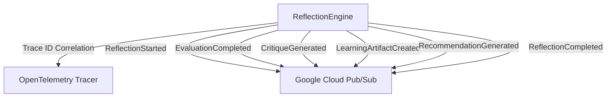

---

### Diagram 14: Quality & Correctness Evaluation
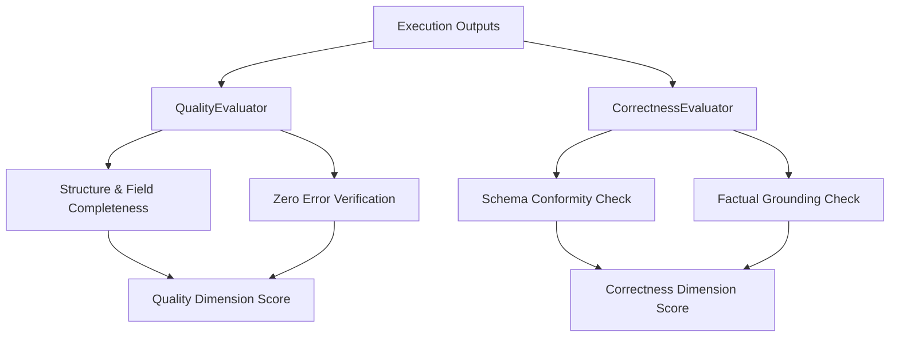

---

### Diagram 15: Multi-Factor Composite Scoring Pipeline
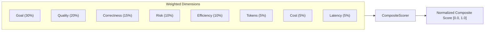

---

### Diagram 16: Longitudinal Trend Analysis
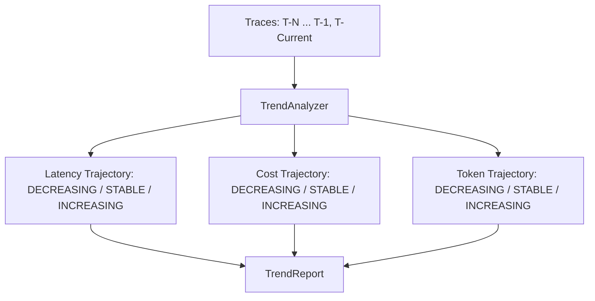

---

### Diagram 17: Class Diagram of Core Reflection Entities
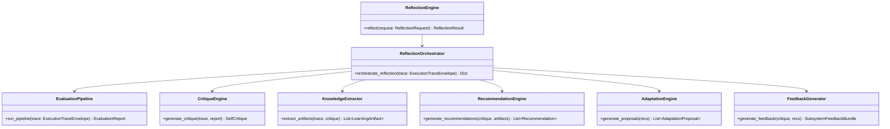

---

### Diagram 18: End-to-End Sequence Diagram
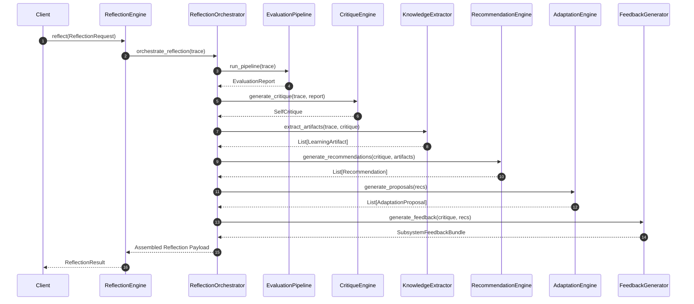

---

### Diagram 19: Component Architecture Diagram
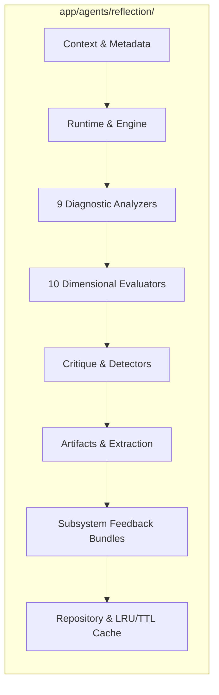

---

### Diagram 20: Comprehensive End-to-End Platform Integration
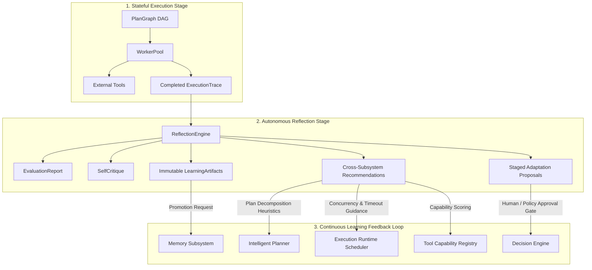

---

## 3. Google Cloud Readiness Matrix

| Google Cloud Service | Subsystem Integration Point | Production Configuration / Compliance |
|---|---|---|
| **Cloud Run** | Host for async Reflection Worker / Runtime | Headless container, autoscaling 0-N, concurrency 80, CPU allocation always-on |
| **Cloud Tasks** | Deferred reflection request dispatch | Dedicated `agent-reflection-queue` with exponential retry & backoff |
| **Cloud Pub/Sub** | Asynchronous domain event streaming | Topics: `agent-reflection-events`, dead-letter subscription configured |
| **Cloud Workflows** | Orchestration of multi-agent review batches | Long-running asynchronous reflection orchestration |
| **Cloud SQL / AlloyDB** | Persistent storage of Reflection aggregates | PostgreSQL JSONB columns with read replicas and pgvector index |
| **Secret Manager** | Sensitive token and evaluation credential access | IAM-bound role-based secret resolution |
| **Cloud Monitoring** | Custom reflection and latency metrics | Custom metrics prefixed `custom.googleapis.com/agent/reflection/` |
| **Cloud Logging** | Structured JSON logs | Trace-correlated JSON logs with severity levels and error codes |
| **Cloud Trace** | Distributed latency and stage tracking | W3C tracecontext propagation through `correlation_id` and OpenTelemetry |
| **Vertex AI** | Embedding computation for semantic memory promotion | Vertex AI Embeddings API used during knowledge consolidation |

---

## 4. Verification & Readiness Assessment

The test suite in [`tests/test_agent_reflection.py`](file:///C:/Users/User/Desktop/ai_document_processing_platform/tests/test_agent_reflection.py) covers:
- Complete end-to-end reflection pipeline runs on successful and failed execution traces.
- All 9 diagnostic analyzers and 10 quantitative dimensional evaluators.
- Cognitive critique, hallucination detection, inconsistency detection, and bias detection.
- Learning artifact immutability, recommendation generation, and adaptation approval gates.
- Typed feedback generation for Planner, Execution, Memory, and Tool Registry layers.
- Longitudinal trend analysis, root cause attribution, and comparative benchmarking.
- Versioned Pydantic v2 JSON and Google Cloud Pub/Sub serialization.
- Fluent builders, in-memory repositories, and LRU/TTL caching.

The subsystem is verified, deterministic, and architecturally primed for higher-level multi-agent orchestration and production workflows.
