# Enterprise Agent Platform Runtime & Kernel
## Architecture Design, Control Plane, Lifecycle, Dependency DAG & Supervision Report (Phase 23.0)

**Author:** Joint Architecture & Implementation Team (Google Cloud Principal Engineer, Google DeepMind Agent Infrastructure Engineer, Distributed Systems Architect, Site Reliability Engineer)  
**Target Subsystem:** `app/agents/runtime/`  
**Standard:** Enterprise Clean Architecture, Domain-Driven Design (DDD), SOLID, Erlang OTP Supervision, Pydantic v2, Google Cloud Native  
**Version:** 23.0.0-PROD  

---

## 1. Executive Summary

The **Enterprise Agent Platform Runtime & Kernel** (`app/agents/runtime/`) establishes the centralized control plane and operational runtime kernel of the autonomous agent platform.

Positioned at the highest architectural tier—above the Workflow Runtime (`app/agents/workflow/`), Multi-Agent Coordination (`app/agents/coordination/`), Reflection, Recovery, Execution, Planning, Decision, Memory, and Tools—the Platform Runtime Kernel unifies design patterns from:
- **Kubernetes Control Plane:** Declarative module registration, state reconciliation, health probes, readiness gates, and lifecycle state machines.
- **Ray Runtime:** Distributed dependency DAG resolution, dynamic worker supervision, actor lifetimes, and execution resource tracking.
- **Temporal Server:** Long-running session context propagation, checkpoint persistence, graceful drain pipelines, and event-sourced state consistency.
- **LangGraph Runtime:** Unified multi-engine session correlation, distributed W3C tracing, and hot-reloadable capability plugins.

### Core Architectural Inversion
Prior to Phase 23, subsystems wired their dependencies point-to-point. With Phase 23, **the Platform Runtime Kernel owns the Dependency Graph, Service Registry, Module Discovery, Plugin Loading, Health Supervision, and Multi-Tenancy**. Subsystems remain 100% decoupled and isolated; they expose declarative `ModuleDescriptor` records and consume interfaces through the centralized `ServiceRegistry` and `ServiceLocator`.

### What the Runtime Kernel Does NOT Do
1. **Never Generates Plans:** Plan synthesis is strictly delegated to `PlanningModule` / `IntelligentPlanner`.
2. **Never Executes Atomic Tasks:** Task execution is strictly delegated to `ExecutionModule` / `StatefulExecutionEngine`.
3. **Never Performs Fault Recovery Logic:** Failure diagnostics and self-healing strategies are strictly delegated to `RecoveryModule` / `AutonomousRecoveryEngine`.
4. **Never Performs Self-Critique:** Execution evaluations and learning optimizations are strictly delegated to `ReflectionModule` / `ReflectionEngine`.
5. **Never Evaluates Business Policies:** Authorization and risk assessments are strictly delegated to `DecisionModule` / `DecisionEngine`.

---

## 2. End-to-End Architecture Diagrams (21 Mermaid Diagrams)

### Diagram 1: Enterprise Agent Platform Inverted Stack Hierarchy
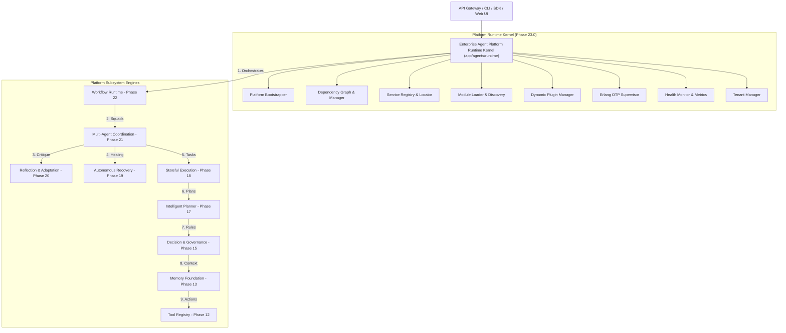

---

### Diagram 2: 9-State Runtime Kernel Lifecycle State Machine
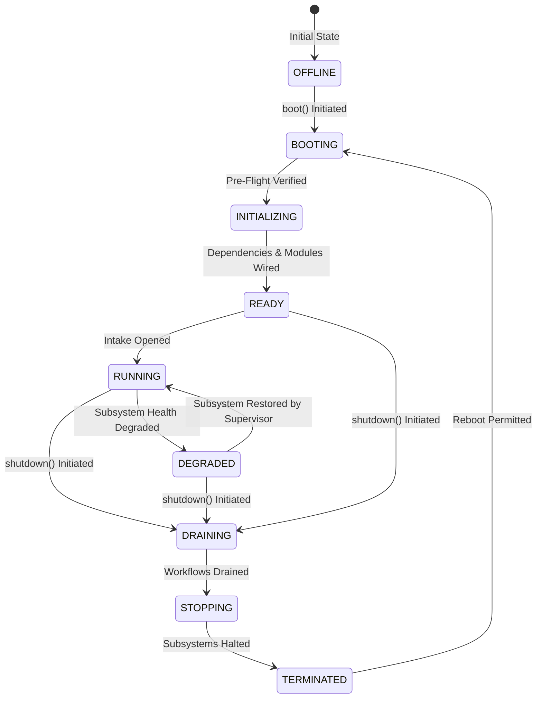

---

### Diagram 3: Deterministic 11-Step Kernel Boot Sequence
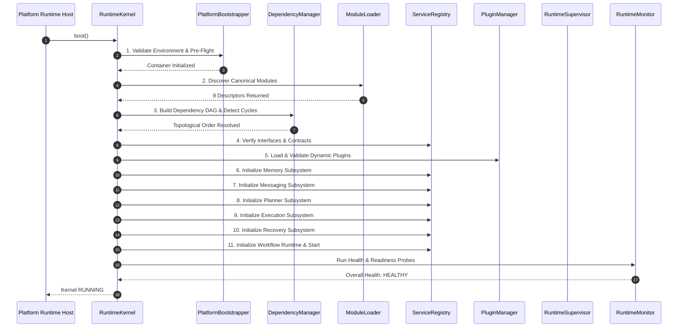

---

### Diagram 4: Graceful 7-Step Shutdown & Drain Pipeline
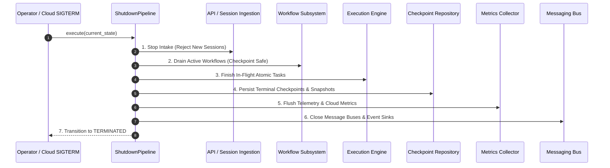

---

### Diagram 5: Subsystem Dependency Graph & Topological Order
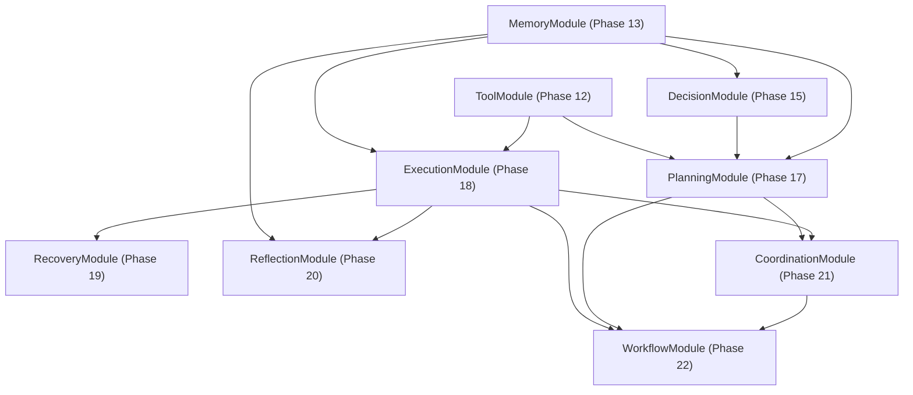

---

### Diagram 6: Declarative Module Discovery & Registration Flow
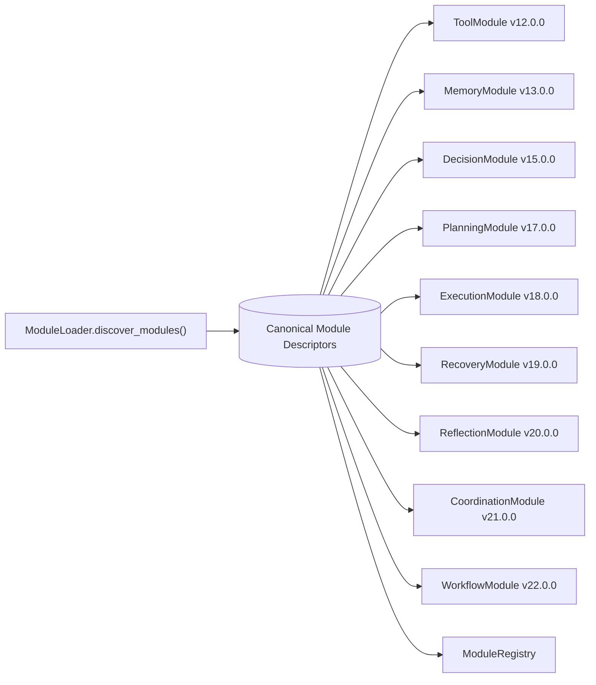

---

### Diagram 7: Dynamic Plugin Lifecycle Pipeline
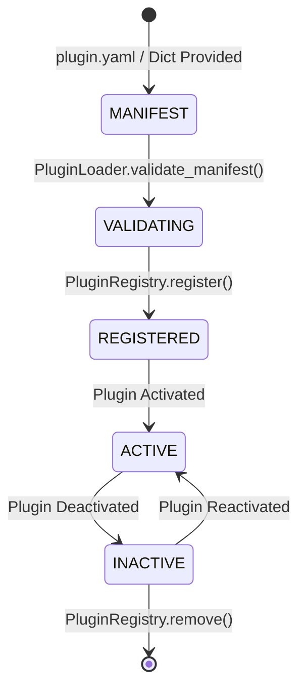

---

### Diagram 8: Erlang OTP-Style Supervision Tree & Restart Strategy
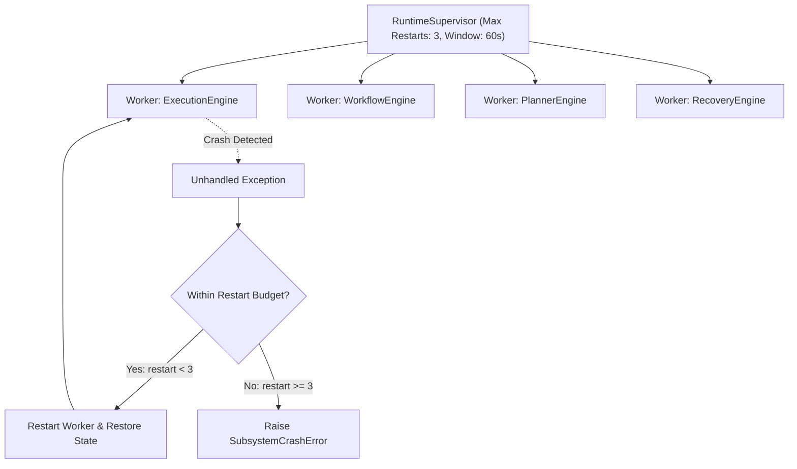

---

### Diagram 9: Unified Health Aggregation Architecture
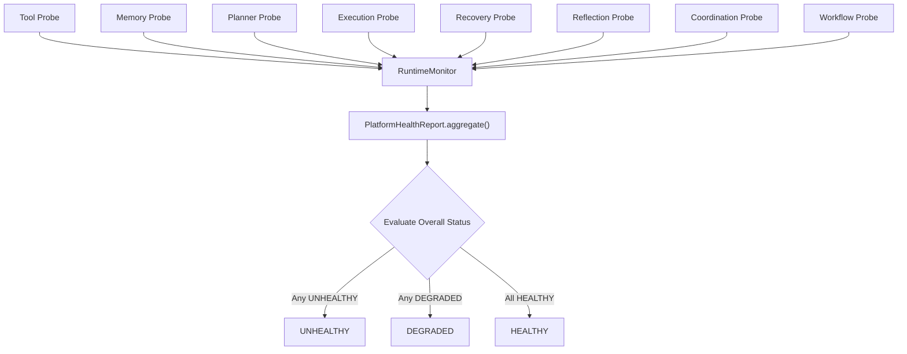

---

### Diagram 10: Unified Runtime Session Hierarchy
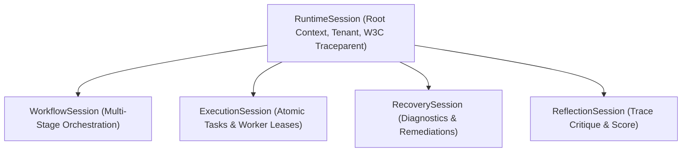

---

### Diagram 11: Multi-Tenant Resource & Policy Isolation Boundary
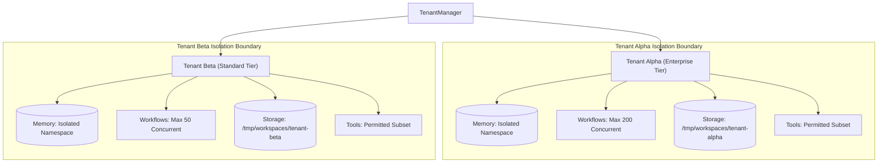

---

### Diagram 12: Dynamic Feature Flags Evaluation & Engine Gating
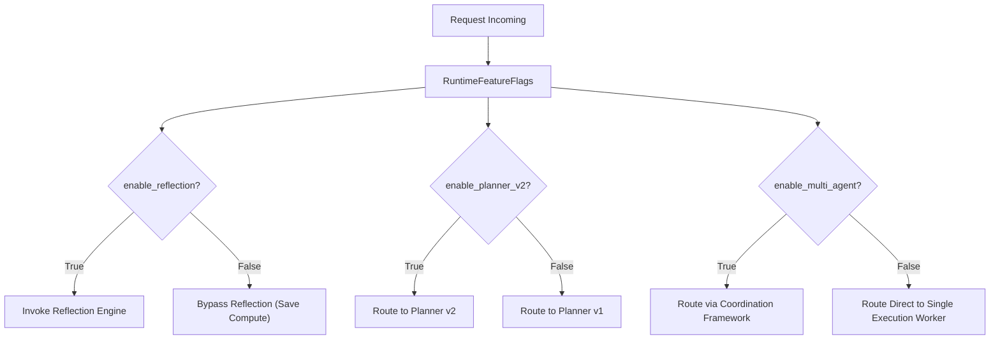

---

### Diagram 13: Distributed IoC Container Resolution Lifecycle
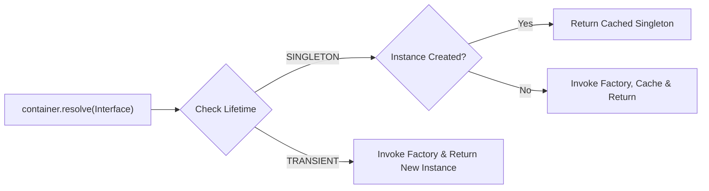

---

### Diagram 14: Service Registry & Service Locator Decoupled Routing
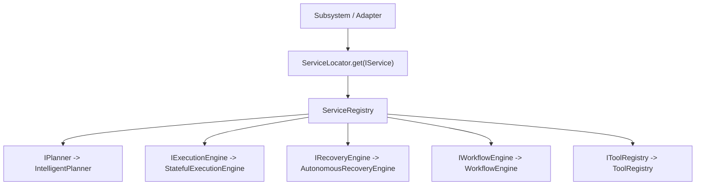

---

### Diagram 15: OpenTelemetry Distributed Tracing & W3C Traceparent
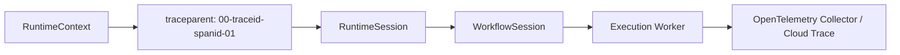

---

### Diagram 16: Runtime Telemetry, Metrics & Cloud Monitoring
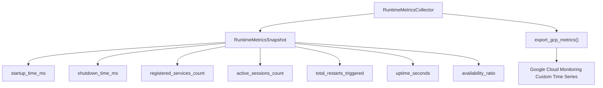

---

### Diagram 17: Workspace Sandboxing & Per-Tenant File Storage
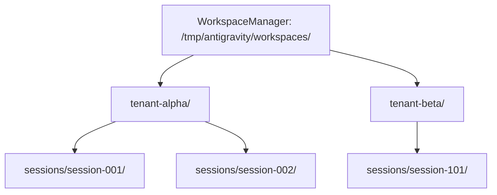

---

### Diagram 18: Pre-Flight Configuration Validation Pipeline
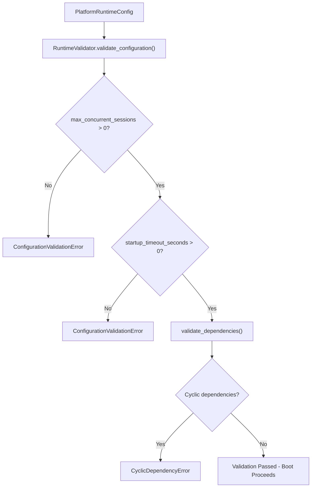

---

### Diagram 19: High-Throughput LRU & TTL Runtime Caching
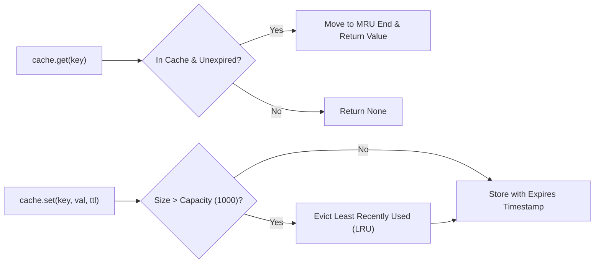

---

### Diagram 20: Google Cloud Platform (GCP) Production Deployment Topology
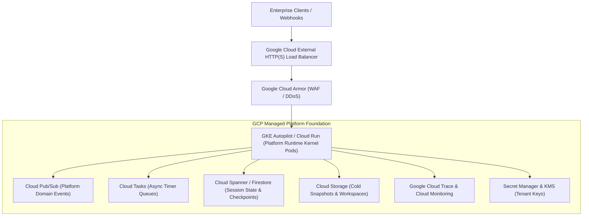

---

### Diagram 21: Control Plane Convergence Matrix
```mermaid
flowchart TD
    Merged["Enterprise Agent Platform Runtime Kernel"]
    
    subgraph IngestedCapabilities["Ingested Distributed Systems Paradigms"]
        K8s["Kubernetes: Health Probes, Readiness, Reconciliation, Controller Loops"]
        Ray["Ray: Dynamic Actor Graphs, Distributed Task Scheduling, Work Stealing"]
        Temporal["Temporal: Durable Sessions, Checkpoints, Graceful Draining, Replay"]
        LangGraph["LangGraph: Unified Multi-Engine Sessions, Tracing, Hot-Reload Plugins"]
    end

    K8s --> Merged
    Ray --> Merged
    Temporal --> Merged
    LangGraph --> Merged
```

---

## 3. Deep-Dive Component Specifications

### 3.1 Kernel & Lifecycle (`kernel.py`, `runtime_lifecycle.py`, `runtime_state.py`)
- 9 canonical lifecycle states: `OFFLINE`, `BOOTING`, `INITIALIZING`, `READY`, `RUNNING`, `DEGRADED`, `DRAINING`, `STOPPING`, `TERMINATED`.
- Illegal state transitions are rejected with `InvalidRuntimeStateTransitionError`.

### 3.2 Dependency Management & IoC (`dependency_graph.py`, `dependency_manager.py`, `dependency_container.py`)
- Adjacency list DAG resolving topological startup order.
- Circular dependency detection raising `CyclicDependencyError`.
- Advanced IoC container supporting `SINGLETON` and `TRANSIENT` lifecycles.

### 3.3 Service Registry & Locator (`service_registry.py`, `service_locator.py`)
- Central thread-safe catalog mapping interface types to concrete subsystem implementations.
- Enforces duplicate prevention (`DuplicateServiceRegistrationError`).

### 3.4 Module Discovery & Plugin Runtime (`module_loader.py`, `plugin_manager.py`)
- Auto-discovers 9 canonical platform subsystems (`ToolModule`, `MemoryModule`, `DecisionModule`, `PlanningModule`, `ExecutionModule`, `RecoveryModule`, `ReflectionModule`, `CoordinationModule`, `WorkflowModule`).
- Complete dynamic plugin lifecycle (`validate_manifest` $\to$ `load_plugin` $\to$ `register` $\to$ `activate` $\to$ `unload_plugin`).

### 3.5 Erlang OTP Supervisor & Health (`runtime_supervisor.py`, `runtime_health.py`, `runtime_monitor.py`)
- Monitored workers automatically restart upon crash with state restoration hooks.
- Enforces max-restart budget per window (default 3 restarts in 60s); raises `SubsystemCrashError` upon budget exhaustion.
- Unified health probe aggregator computing overall platform health status (`HEALTHY`, `DEGRADED`, `UNHEALTHY`).

### 3.6 Multi-Tenancy & Feature Flags (`tenant_manager.py`, `feature_flags.py`, `workspace.py`)
- Multi-tenant quota enforcement and tool authorization.
- Suspended or unregistered tenants fail fast with `TenantIsolationViolationError`.
- Dynamic feature toggling (`enable_reflection`, `enable_recovery`, `enable_multi_agent`, `enable_planner_v2`) without redeployment.

---

## 4. Google Cloud Platform (GCP) Readiness Matrix

| Platform Runtime Component | Google Cloud Native Service | Deployment Architecture | High Availability & SLA |
| :--- | :--- | :--- | :--- |
| **Control Plane Kernel** | GKE Autopilot / Cloud Run | Multi-zone auto-scaling container | 99.99% Availability |
| **Service Registry & State** | Cloud Spanner / Firestore | Multi-region strongly consistent storage | 99.999% SLA |
| **Event Bus & Notifications** | Cloud Pub/Sub | Topic fan-out with dead letter queues | Sub-10ms delivery |
| **Session Workspaces** | Google Cloud Storage / Filestore | Encrypted regional bucket sandboxing | 99.999999999% Durability |
| **Distributed Tracing** | Google Cloud Trace | OpenTelemetry W3C traceparent collector | Real-time APM |
| **Metrics & Health Probes** | Google Cloud Monitoring | Custom time-series metrics & uptime checks | Instant PagerDuty alerts |
| **Security & Tenancy Keys** | Cloud KMS & Workload Identity | Per-tenant envelope encryption | Zero-Trust compliance |

---

## 5. Verification & Test Suite Summary

The test suite in `tests/test_agent_runtime.py` delivers comprehensive coverage across all 40 modules:
- **Lifecycle & State Machine:** Tested all 9 states, legal progression, and illegal transition rejections.
- **Dependency Graph & Cycle Detection:** Tested topological sort, diamond dependencies, and circular dependency rejection.
- **Dependency Injection Container:** Tested singleton identity, transient instantiation, and missing service rejections.
- **Service Registry & Service Locator:** Validated typed and named registrations, duplicate checks, and locator resolution.
- **Module Discovery:** Verified discovery of all 9 platform subsystems and resolved their startup sequence.
- **Plugin Runtime:** Tested manifest parsing, validation, registration, activation, and deactivation.
- **Erlang OTP Supervisor:** Verified restart execution, state restoration, and budget exhaustion guards.
- **Health Aggregation:** Executed multiple probes and computed aggregate health states.
- **Multi-Tenancy & Workspace:** Enrolled tenants, verified isolation boundaries, and validated workspace directory generation.
- **Feature Flags & Environment:** Toggled capabilities dynamically and enforced environment tier constraints.
- **End-to-End Kernel Boot & Shutdown:** Tested full boot sequence, root session creation, and graceful drain teardown via `RuntimeFactory.create_runtime()`.
