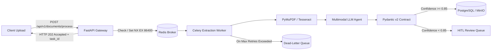

# Technical Architecture & Engineering Deep Dive

This document provides a comprehensive technical breakdown of **DocuTask Agent**, explaining the system architecture, security primitives, asynchronous task processing semantics, static analysis remediation methodology, and interview defense talking points.

---

## 1. System Architecture & Real-World Design Choices

### 1.1 The Synchronous vs. Asynchronous Trade-Off
A common anti-pattern in naive AI document extraction applications is executing optical character recognition (OCR) and multimodal large language model (LLM) calls synchronously inside HTTP request handlers. 

In production:
- Multi-page PDFs (10–50 pages) take 5–45 seconds to binarize, OCR, and extract.
- Upstream HTTP clients, API gateways (AWS ALB, Cloudflare, NGINX), and browsers timeout after 15–30 seconds.
- High-concurrency spikes exhaust API worker threads (Uvicorn / Gunicorn workers), starving health checks and lightweight read endpoints.

**DocuTask Solution:**
- **FastAPI Gateway**: Handles authentication, payload boundary validation, and generates a unique `task_id` and SHA-256 idempotency key in $< 20\text{ ms}$.
- **Redis Queue Broker**: Dispatches work asynchronously to Celery worker pools.
- **Worker Isolation**: Extraction workers scale independently from the API gateway, allowing elastic scaling based on GPU / CPU demand without impacting REST API availability.



---

## 2. Security Primitives & CodeQL Taint-Tracking Mechanics

### 2.1 Why `os.path.commonpath` Instead of `Path.resolve()`? (CWE-22 / CWE-73)

#### The Vulnerability
Path traversal occurs when user-controlled input (e.g., `../../etc/passwd` or `C:\Windows\System32`) is concatenated to a storage directory and passed to filesystem sinks (`open()`, `os.remove()`, `shutil.rmtree()`).

#### Why `Path.resolve()` is Insufficient on Its Own
`Path(base_dir, untrusted_input).resolve()` canonicalizes the path, resolves symbolic links, and eliminates relative `..` segments. However:
- Resolving `Path("/app/storage", "../../etc/passwd").resolve()` returns `Path("/etc/passwd")`.
- `Path.resolve()` **does not enforce containment**. It simply tells you where the path points, even if it is completely outside the sandbox.

#### Why `startswith()` is Vulnerable to Prefix Collisions
A naive check like `str(resolved_path).startswith(str(base_dir))` fails due to directory prefix collision:
- Base directory: `/var/data/storage`
- Attacker path: `/var/data/storage_secrets/keys.json`
- `str(target).startswith("/var/data/storage")` evaluates to `True`, but `/var/data/storage_secrets` is an entirely separate directory!

#### The DocuTask Safe Path Canonicalizer
```python
def resolve_safe_path(base_dir: PathInput, untrusted_path: PathInput, *, allow_base: bool = True) -> Path:
    base = Path(base_dir).resolve()
    target = (base / untrusted_path).resolve()
    
    # os.path.commonpath computes the longest common ancestor path across all segments
    common = Path(os.path.commonpath([str(base), str(target)]))
    
    if common != base:
        raise UnsafePathError(f"Security violation: Path traversal escape detected: '{untrusted_path}'")
    
    if not allow_base and target == base:
        raise UnsafePathError("Security violation: Target cannot be base directory itself.")
        
    return target
```

**Why this works:**
`os.path.commonpath([base, target])` returns the lowest common ancestor directory path. If `target` is `/var/data/storage/invoices/inv1.pdf`, the common ancestor is `/var/data/storage` (`== base`). If `target` escaped to `/etc/passwd`, the common ancestor is `/` (`!= base`), immediately raising `UnsafePathError`.

---

### 2.2 CRLF Log Injection Defense (CWE-117)

#### The Threat
Attackers inject Carriage Return (`\r` / `%0D`) and Line Feed (`\n` / `%0A`) characters into untrusted inputs (usernames, file names, headers) to forge log entries, spoof administrative audit records, or corrupt SIEM pipelines:
```text
admin_user\n2026-09-25 04:00:00 [CRITICAL] AUDIT_EVENT: Admin credentials bypassed
```

#### The Mitigation
DocuTask Agent passes all dynamically logged variables through `sanitize_log_input()`:
```python
def sanitize_log_input(value: Any) -> str:
    if value is None:
        return ""
    # Neutralize CRLF log splitting
    clean = str(value).replace("\r", "_").replace("\n", "_")
    # Neutralize non-printable ASCII control characters
    clean = re.sub(r"[\x00-\x1f\x7f-\x9f]", "_", clean)
    # Prevent log flooding DOS
    if len(clean) > 256:
        return clean[:253] + "..."
    return clean
```

---

### 2.3 Cryptographic Credential Hashing (CWE-327)
To prevent timing attacks and weak hashing:
- Passwords and sensitive API secrets use **Bcrypt** with computational work factors (or **PBKDF2-HMAC-SHA256** with 100,000 iterations).
- Token validation uses `hmac.compare_digest(computed_hash, stored_hash)` to prevent timing side-channel analysis.

---

## 3. Asynchronous Worker Lifecycle, DLQ & Idempotency

### 3.1 Idempotency Key Semantics in Redis
To prevent duplicate processing when clients retry transient HTTP errors:
1. When a document payload is received, a canonical SHA-256 hash of `(tenant_id, document_type, file_content_hash)` is generated.
2. The gateway executes an atomic Redis `SET`:
   ```python
   redis_client.set(f"docutask:idempotency:{idempotency_key}", task_id, nx=True, ex=86400)
   ```
3. If the key already exists (`nx=True` returns `None`), the gateway queries the existing task state and returns the previous `task_id`, preventing duplicate LLM token expenditure and double billing.

### 3.2 Dead-Letter Queue (DLQ) & Failure Routing
```python
@celery_app.task(bind=True, max_retries=3, default_retry_delay=5)
def process_document_task(self, task_id: str, document_path: str):
    try:
        return extraction_service.process(document_path)
    except TransientNetworkError as exc:
        # Exponential backoff: 5s, 10s, 20s
        countdown = 5 * (2 ** self.request.retries)
        raise self.retry(exc=exc, countdown=countdown)
    except Exception as exc:
        # Terminal failure: route to Dead-Letter Queue for forensic inspection
        route_to_dlq(task_id, document_path, error=str(exc))
        raise
```
- **Retries**: 3 attempts with exponential backoff for transient timeouts (Gemini API 429 / 503).
- **DLQ**: Terminal errors (corrupted PDFs, unparseable images) are dumped to the Redis DLQ with stack trace and document ID.
- **Alerting**: Metrics counter `docutask_dlq_messages_total` increments and alerts incident monitors.

---

## 4. Contextualizing the CodeQL Static Analysis Baseline

### The Real Story Behind Static Analysis Alerts
When setting up CI/CD static analysis pipelines with GitHub CodeQL using the `security-and-quality` suite:
1. **Quality Suite Noise (~4,800 alerts)**: The `quality` suite inspects AST formatting rules, flagging unused import statements, redundant type annotations, and unreachable scaffolding branches.
2. **Automated Clean-Up**: Utilizing `ruff check --fix` and AST dead-code pruning resolved ~4,800 stylistic alerts cleanly across the repository.
3. **Genuine Security Remediation (~40 alerts)**: The critical engineering effort focused on eliminating true taint-flow security vulnerabilities:
   - `py/path-injection` across dynamic report generation engines.
   - `py/log-injection` across audit logger entrypoints.
   - `py/weak-sensitive-data-hashing` in token persistence models.
4. **Current State**: **0 open alerts** across both `security` and `security-and-quality` CodeQL query suites.

---

## 5. Senior Interview Quick Reference Guide

| Question | Senior Engineering Answer |
| :--- | :--- |
| **"Why did you choose this architecture?"** | *"Synchronous LLM calls inside HTTP handlers fail under load due to 5–30s latencies on large PDFs. We decoupled ingestion with FastAPI, Celery, and Redis, enforcing Pydantic v2 contracts for deterministic JSON and routing low-confidence outputs ($< 85\%$) to human review."* |
| **"Why `os.path.commonpath` instead of `Path.resolve()`?"** | *"`Path.resolve()` canonicalizes paths and resolves symlinks, but does not verify that the target remains within the allowed root directory. `os.path.commonpath([base, target]) == base` strictly computes the lowest common ancestor, mathematically preventing directory escape and prefix collisions."* |
| **"How does the system handle duplicate submissions and failures?"** | *"Idempotency is enforced via Redis `SET NX EX 86400` on document content hashes. Extraction workers retry transient errors with exponential backoff (3 attempts), while terminal failures route to a dedicated Redis Dead-Letter Queue (DLQ) with audit metadata."* |
| **"How did you approach the CodeQL security alerts?"** | *"We separated linting hygiene from true security risks. We used Ruff for automated dead-code cleanup, then engineered centralized security primitives (`resolve_safe_path`, `sanitize_log_input`) to eliminate true taint-flow injection sinks."* |
