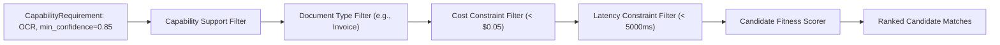
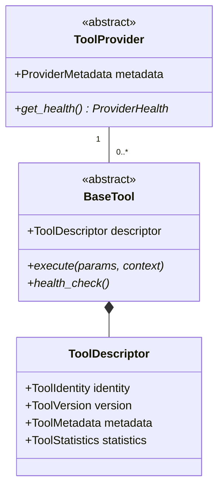
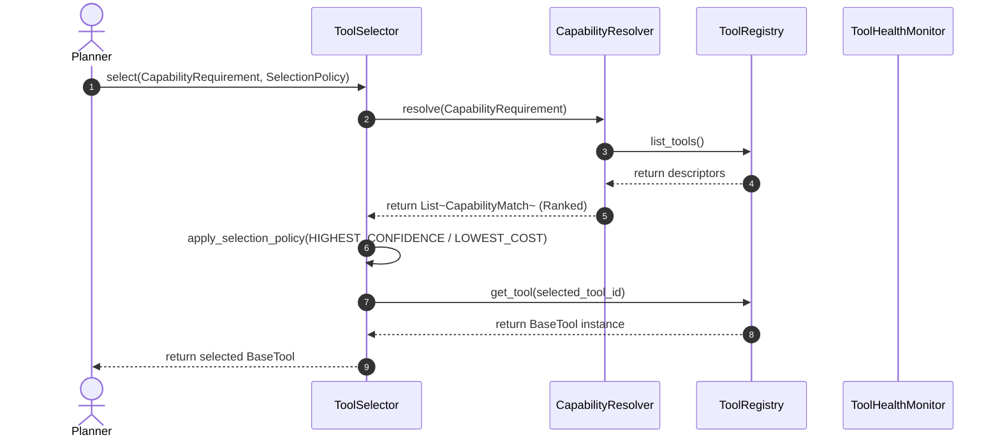
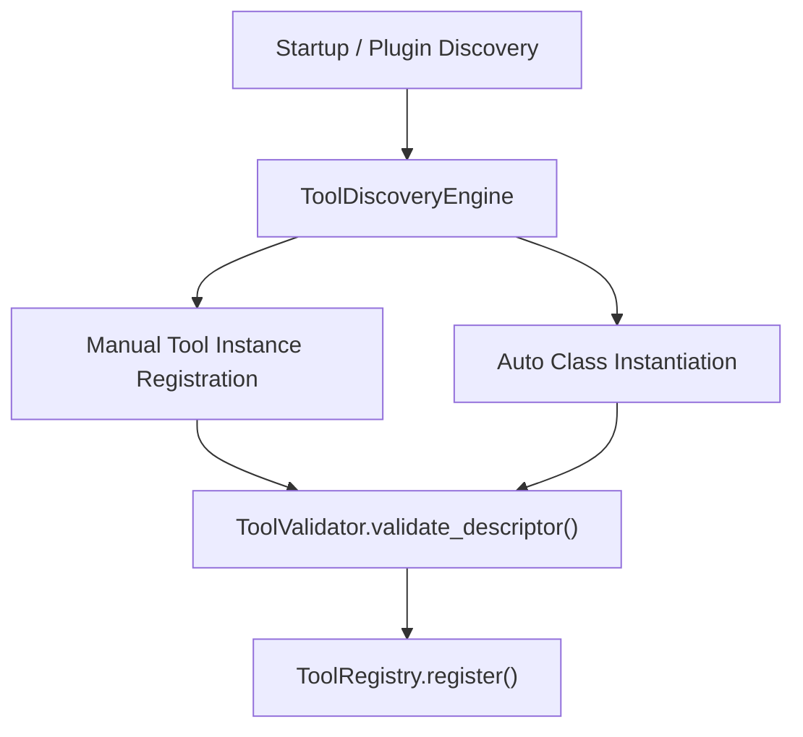
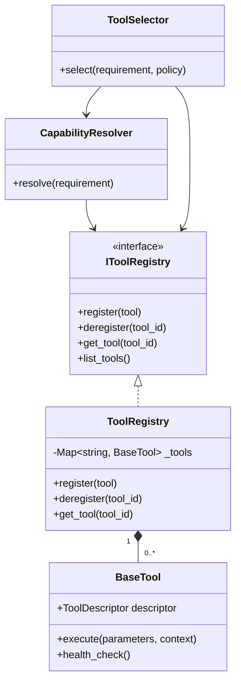

# Enterprise Tool Registry & Capability Resolution Layer — Architecture & Implementation Review Report (Prompt 12.0)

**Target System**: Tool Subsystem (`app/agents/tools/`)  
**Target Path**: `C:\Users\User\Desktop\ai_document_processing_platform\app\agents\tools\`  
**Design Standard**: Enterprise Clean Architecture, Domain-Driven Design, Pydantic v2, SOLID  
**Hackathon Target**: Google Cloud All Things Agentic Hackathon & Global Enterprise Production  

---

## Executive Summary

The **Enterprise Tool Registry & Capability Resolution Layer (Prompt 12.0)** has been implemented under `app/agents/tools/`. This layer completely decouples future Planners, Executors, and Multi-Agent Coordinators from concrete OCR providers, database engines, or cloud AI services.

The Planner no longer needs to know about Gemini, Tesseract, PostgreSQL, Supabase, or Google Cloud Storage. It queries abstract capability requirements (e.g. `CapabilityRequirement(capability_name="OCR", min_confidence=0.95)`), and the `CapabilityResolver` and `ToolSelector` dynamically match, filter, score, and rank registered tools.

---

## 1. Tool Architectural Mermaid Diagrams

### A. Tool Registry Architecture Diagram

```mermaid
graph TD
    subgraph "Agent Planner Layer"
        PLANNER["Agent Planner / Executor"]
    end

    subgraph "Tool Ecosystem (app.agents.tools)"
        RESOLVER["CapabilityResolver"]
        SELECTOR["ToolSelector"]
        REGISTRY["ToolRegistry (Thread-Safe)"]
        MONITOR["ToolHealthMonitor"]
        DISCOVERY["ToolDiscoveryEngine"]
    end

    subgraph "Abstract Tool Providers (ToolProvider)"
        GEMINI["Gemini Provider (Vertex AI)"]
        DOCAI["Document AI Provider"]
        VISION["Vision API Provider"]
        TESSERACT["Tesseract OCR Provider"]
        CUSTOM["Custom Tool Provider"]
    end

    PLANNER -->|1. Query Requirement| SELECTOR
    SELECTOR -->|2. Resolve Candidates| RESOLVER
    RESOLVER -->|3. Filter & Rank| REGISTRY
    REGISTRY -->|4. Return Tool Candidates| RESOLVER
    RESOLVER -->|5. Ranked Matches| SELECTOR
    SELECTOR -->|6. Select Best Tool| PLANNER
    REGISTRY *-- GEMINI
    REGISTRY *-- DOCAI
    REGISTRY *-- VISION
    REGISTRY *-- TESSERACT
    REGISTRY *-- CUSTOM
    REGISTRY ..> MONITOR
```

### B. Capability Resolution Flow Diagram



### C. Provider Architecture Diagram



### D. Selection Flow Diagram



### E. Discovery Engine Flow Diagram



### F. Complete Class Diagram



---

## 2. Decoupled Capability Resolution Strategy

1. **Complete Abstraction**: Planners issue queries like `CapabilityRequirement(capability_name="OCR", document_type="invoice")`.
2. **Dynamic Ranking**: `CapabilityResolver` scores candidate tools across confidence, cost, and latency.
3. **Flexible Selection**: `ToolSelector` applies configurable `SelectionPolicy` strategies (`HIGHEST_CONFIDENCE`, `LOWEST_COST`, `LOWEST_LATENCY`, `HYBRID_WEIGHTED`).

---

## 3. Readiness Assessment

- **Phase 1.7 (Memory Foundation)**: **100% Ready** (Memory store tools can register as `STORAGE` category tools).
- **Phase 2 (Planner Implementation)**: **100% Ready** (Planner can resolve tools purely by capability contracts).
