# Enterprise Workflow Runtime & Multi-Agent Orchestration Engine
## Architecture Design, Distributed Orchestration, Sagas & Lifecycle Report (Phase 22.0)

**Author:** Joint Architecture & Implementation Team (Google Cloud Principal Engineer, Google DeepMind Agent Infrastructure Engineer, Enterprise Workflow Architect, Distributed Systems Architect)  
**Target Subsystem:** `app/agents/workflow/`  
**Standard:** Enterprise Clean Architecture, Domain-Driven Design (DDD), SOLID, Event-Driven Architecture, Pydantic v2, Google Cloud Native  
**Version:** 22.0.0-PROD  

---

## 1. Executive Summary

The **Enterprise Workflow Runtime & Multi-Agent Orchestration Engine** (`app/agents/workflow/`) establishes the centralized orchestration authority positioned directly above the Multi-Agent Coordination layer (`app/agents/coordination/`).

While individual execution engines execute atomic tasks, and multi-agent coordination matches and collaborates agent squads, the **Workflow Runtime** coordinates, supervises, and guarantees long-running processes that span seconds, minutes, hours, days, or months. It maintains stateful execution continuity across node DAGs, distributed transactions (Sagas with compensations), human approvals, event wait barriers, time delays, and multi-agent sessions.

### Core Architectural Axioms
1. **The Workflow Runtime Never Generates Plans:** Plan synthesis and hierarchical decomposition are strictly delegated to the Intelligent Planner (`app/agents/planning/`, `app/agents/planner/`) via `WorkflowPlannerAdapter`.
2. **The Workflow Runtime Never Executes Atomic Tasks Directly:** Task execution is dispatched strictly via `WorkflowExecutionAdapter` to the Stateful Execution Engine (`app/agents/execution/`).
3. **The Workflow Runtime Never Directly Performs Tool Invocations:** Tool executions remain isolated inside execution workers and the Tool Registry (`app/agents/tools/`).
4. **The Workflow Runtime Never Evaluates Governance Policies:** Governance rules, risk analysis, budget constraints, and compliance mandates are delegated via `WorkflowDecisionAdapter` to the Decision & Governance Engine (`app/agents/decision/`).
5. **The Workflow Runtime Never Diagnoses Low-Level Machine Failures:** Self-healing, failure diagnostics, and task-level retries are delegated via `WorkflowRecoveryAdapter` to the Autonomous Recovery Engine (`app/agents/recovery/`).
6. **Continuous Workflow Adaptation:** Completed workflow histories and execution traces are forwarded via `WorkflowReflectionAdapter` to the Reflection Engine (`app/agents/reflection/`) for telemetry learning and optimization.
7. **Cross-Agent Collaboration via Coordination:** Team collaborations, auction bids, and swarm delegations are orchestrated via `WorkflowCoordinationAdapter` to the Multi-Agent Coordination layer (`app/agents/coordination/`).

---

## 2. End-to-End Architecture Diagrams (21 Mermaid Diagrams)

### Diagram 1: Platform Runtime Stack Hierarchy
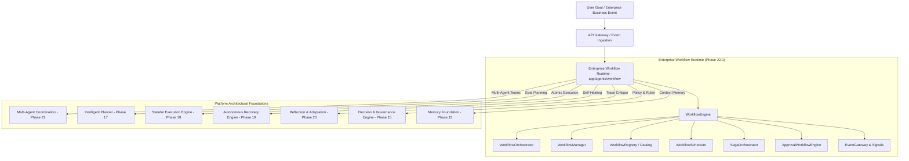

---

### Diagram 2: 15-State Workflow Lifecycle State Machine
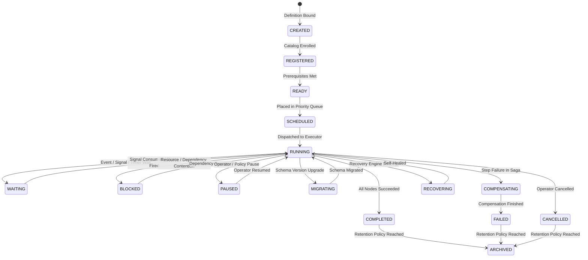

---

### Diagram 3: Directed Acyclic Graph (DAG) Execution & Cycle Guard
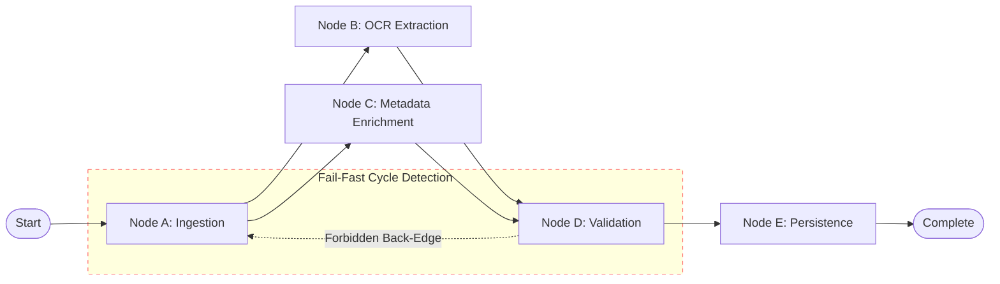

---

### Diagram 4: Saga Orchestration & Reverse Compensation (LIFO Rollback)
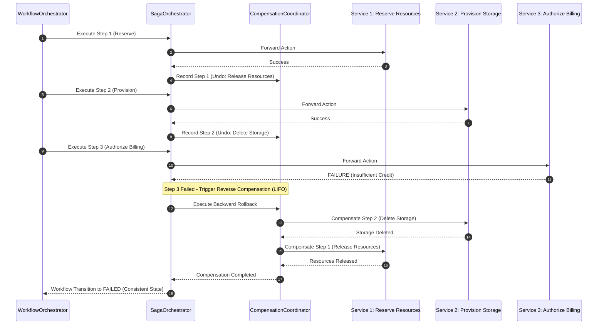

---

### Diagram 5: Hierarchical Child Workflows & Cascading Cancellation
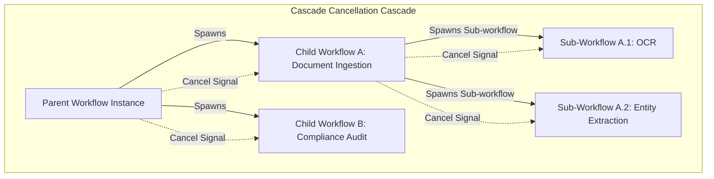

---

### Diagram 6: Human-in-the-Loop Approval Workflow
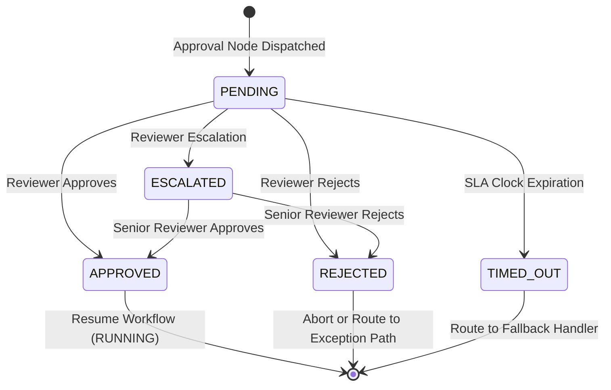

---

### Diagram 7: Parallel Split & Join Synchronization Pattern
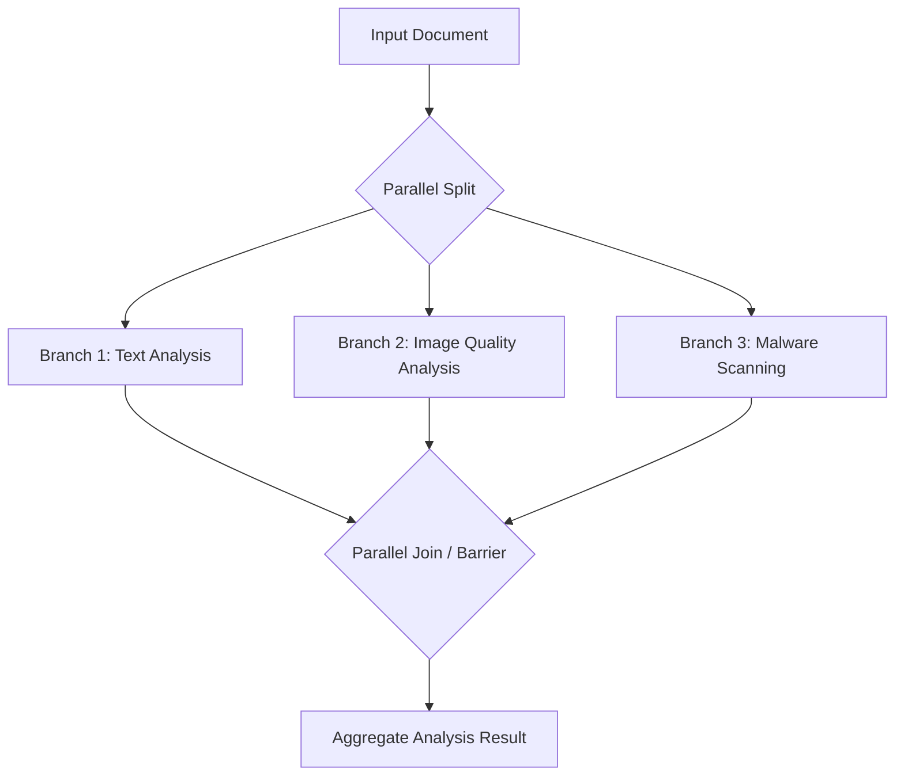

---

### Diagram 8: Conditional Edge Evaluation & Guard Expression Routing
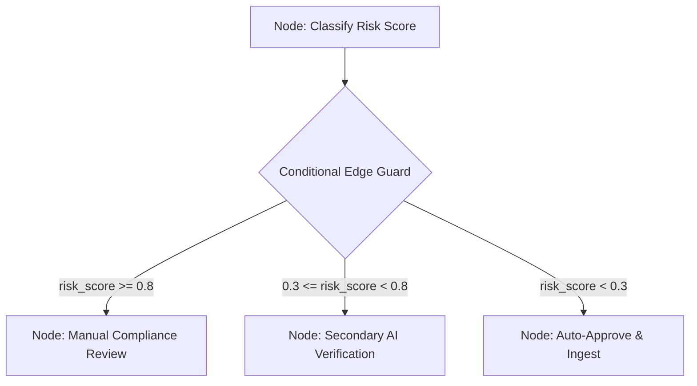

---

### Diagram 9: Asynchronous Signal Buffering & Resumption Flow
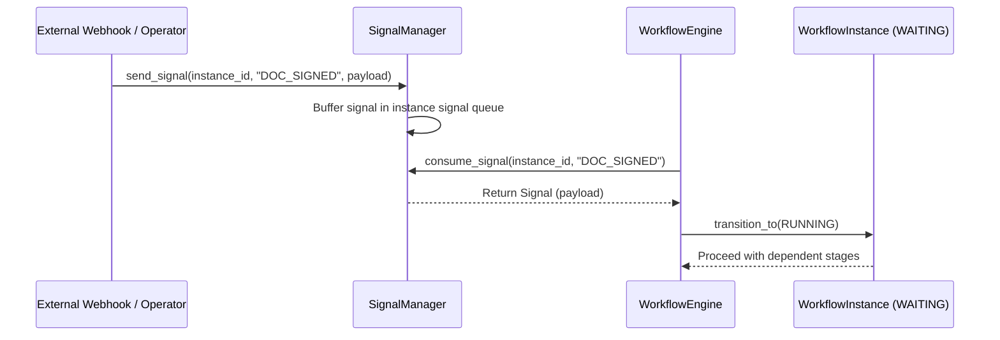

---

### Diagram 10: Distributed Timer Scheduling & Expiration Dispatching
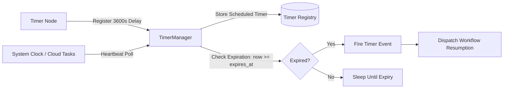

---

### Diagram 11: Multi-Condition Barrier Wait Manager Flow
```mermaid
flowchart TD
    Wf[Workflow Instance] -->|Enters Barrier| WM[WaitManager]
    WM -->|Wait Condition: SIG_A and SIG_B| BarrierState[Registered Barrier: pending={'SIG_A', 'SIG_B'}]
    EventA[Event 'SIG_A' Arrives] -->|satisfy_condition| BarrierState
    BarrierState --> Check1{All Satisfied?}
    Check1 -->|No: pending={'SIG_B'}| Sleep[Maintain WAITING State]
    EventB[Event 'SIG_B' Arrives] -->|satisfy_condition| BarrierState
    BarrierState --> Check2{All Satisfied?}
    Check2 -->|Yes: pending=set()| Resume[Transition to RUNNING & Resume]
```

---

### Diagram 12: Event Gateway Pub/Sub Ingestion & Router
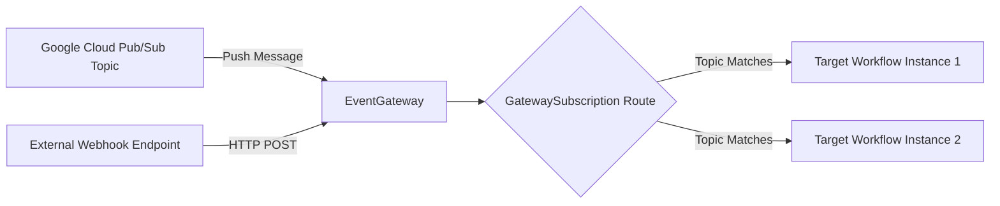

---

### Diagram 13: Workflow Replay Engine & Event Sourcing Determinism
```mermaid
flowchart TD
    AuditHistory[(WorkflowHistory: Append-Only Audit Log)] -->|Stream Events in Sequence| ReplayEngine[WorkflowReplayEngine]
    
    subgraph SequencedReplay["Deterministic Event Replay"]
        Evt1[Event 1: NODE_COMPLETED (Extract)] --> StateAccumulator[Reconstructed WorkflowState]
        Evt2[Event 2: VARIABLE_SET (doc_type='invoice')] --> StateAccumulator
        Evt3[Event 3: NODE_COMPLETED (Classify)] --> StateAccumulator
        Evt4[Event 4: STATE_TRANSITION (RUNNING)] --> StateAccumulator
    end

    ReplayEngine --> ReconstructedInstance[Exact Historical State Reconstructed]
```

---

### Diagram 14: In-Flight Zero-Downtime Workflow Schema Migration
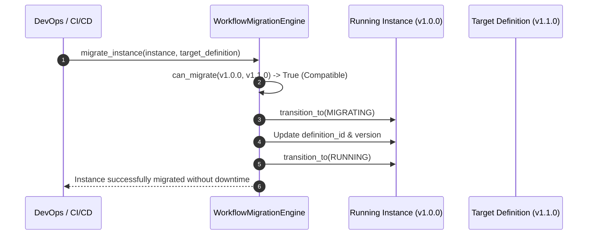

---

### Diagram 15: Cross-Subsystem Platform Layer Adapters (7 Bridges)
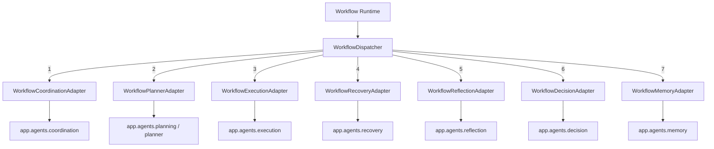

---

### Diagram 16: OpenTelemetry Distributed Tracing & W3C Traceparent
```mermaid
flowchart LR
    Init[Workflow Initiated] --> GenTrace[WorkflowTelemetry.generate_trace_context]
    GenTrace -->|Inject Header| Carrier[Carrier: traceparent & correlation-id]
    Carrier -->|Propagate| Stage1[Workflow Stage 1]
    Stage1 -->|Propagate| Stage2[Workflow Stage 2]
    Stage2 -->|Propagate| ChildWF[Child Workflow]
    ChildWF -->|Export Spans| CloudTrace[Google Cloud Trace / OpenTelemetry Collector]
```

---

### Diagram 17: Workflow Priority Scheduling Queue Architecture
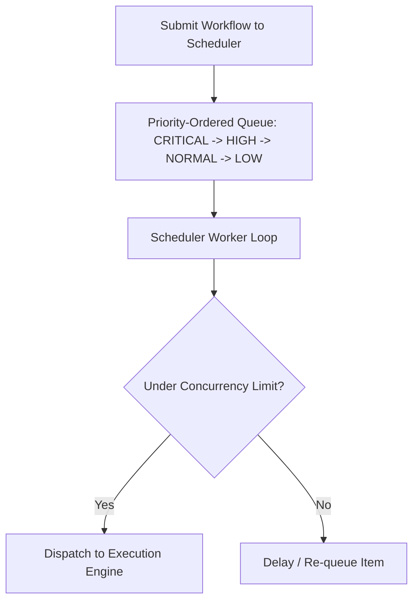

---

### Diagram 18: Workflow Session & Multi-Run Execution Container
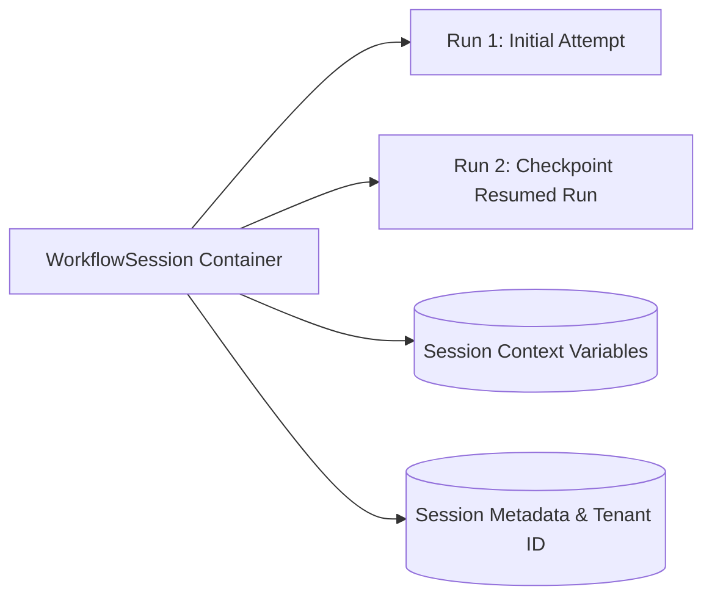

---

### Diagram 19: Checkpoint & Cold-Storage Snapshot Persistence Flow
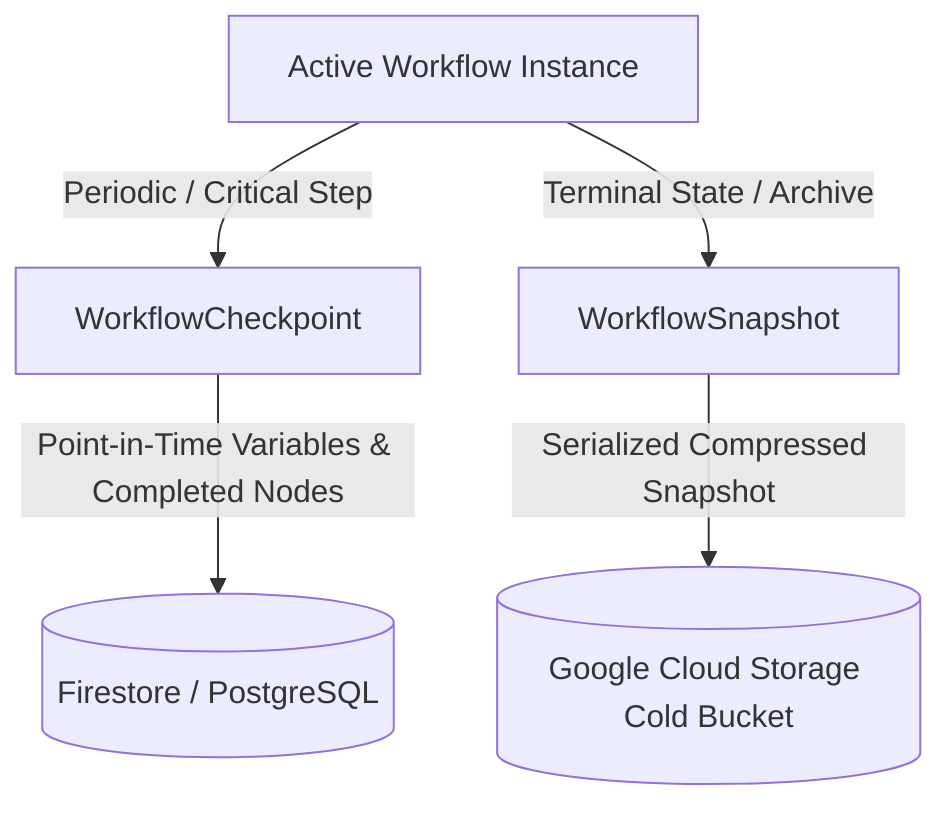

---

### Diagram 20: Google Cloud Native Production Deployment Topology
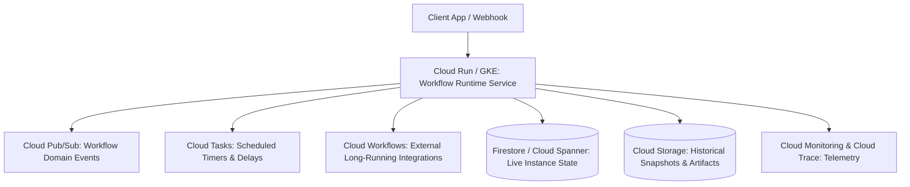

---

### Diagram 21: Dynamic Typology Selection Matrix
```mermaid
flowchart TD
    Req[Incoming Workflow Request] --> TypologyCheck{Determine Typology}
    TypologyCheck -->|Linear Pipeline| T1[Sequential Workflow]
    TypologyCheck -->|Concurrent Tasks| T2[Parallel Workflow]
    TypologyCheck -->|Rule Decisions| T3[Conditional Workflow]
    TypologyCheck -->|PubSub / Webhooks| T4[Event-Driven Workflow]
    TypologyCheck -->|Multi-Service Consistency| T5[Saga Transaction Workflow]
    TypologyCheck -->|Sub-Goal Delegation| T6[Child / Nested Workflow]
    TypologyCheck -->|On-the-Fly Synthesis| T7[Dynamic Planner Workflow]
    TypologyCheck -->|Governance / Policy Signoff| T8[Human-in-the-Loop Approval]
```

---

## 3. Deep-Dive Component Specifications

### 3.1 Lifecycle & State Machine (`lifecycle.py`, `workflow_state_machine.py`)
- Supported 15 states:
  - `CREATED`, `REGISTERED`, `READY`, `SCHEDULED`, `RUNNING`, `WAITING`, `BLOCKED`, `PAUSED`, `MIGRATING`, `COMPENSATING`, `RECOVERING`, `COMPLETED`, `FAILED`, `CANCELLED`, `ARCHIVED`.
- Strict transition validation: Invalid transitions raise `InvalidWorkflowStateTransitionError`.

### 3.2 Graph Engine & Cycle Guard (`workflow_graph.py`, `workflow_node.py`, `workflow_edge.py`)
- Adjacency list DAG representation with topological sorting using Kahn's algorithm.
- Cycle detection raising `CyclicWorkflowGraphError`.

### 3.3 Saga Orchestration & Reverse Compensation (`saga.py`, `compensation.py`)
- LIFO reverse-order compensation execution.
- Strict mode guard raising `MissingCompensationPathError`.

### 3.4 Signals, Timers, Waits & Human Tasks
- `SignalManager`: In-memory thread-safe signal buffering and atomic consumption.
- `TimerManager`: Timer registration and expiration checking.
- `WaitManager`: Multi-signal barrier tracking.
- `ApprovalWorkflowEngine`: Full lifecycle for human tasks (`PENDING`, `APPROVED`, `REJECTED`, `ESCALATED`, `TIMED_OUT`).

### 3.5 Replay & In-Flight Migration
- `WorkflowReplayEngine`: Event-sourced state reconstruction from `WorkflowHistory`.
- `WorkflowMigrationEngine`: Semantic version compatibility checks and zero-downtime transition via `MIGRATING` state.

### 3.6 Seven Inter-Subsystem Adapters
- `WorkflowCoordinationAdapter`: Integrates with `app.agents.coordination`.
- `WorkflowPlannerAdapter`: Integrates with `app.agents.planning` and `app.agents.planner`.
- `WorkflowExecutionAdapter`: Integrates with `app.agents.execution`.
- `WorkflowRecoveryAdapter`: Integrates with `app.agents.recovery`.
- `WorkflowReflectionAdapter`: Integrates with `app.agents.reflection`.
- `WorkflowDecisionAdapter`: Integrates with `app.agents.decision`.
- `WorkflowMemoryAdapter`: Integrates with `app.agents.memory`.

---

## 4. Google Cloud Platform (GCP) Readiness Matrix

| Component | GCP Native Service | Deployment Configuration | SLA / Target |
| :--- | :--- | :--- | :--- |
| **Workflow Engine** | Cloud Run / GKE Autopilot | Multi-region auto-scaling container | 99.99% Availability |
| **Event Ingestion & Routing** | Cloud Pub/Sub | Pull/Push subscriptions with Dead Letter Topics | <10ms P99 latency |
| **Timers & Delayed Waits** | Cloud Tasks | Named queues with configurable dispatch rates | At-least-once delivery |
| **State & Checkpoints** | Firestore / Cloud Spanner | Strongly consistent distributed ACID storage | High-throughput low-latency |
| **Snapshots & Cold History** | Cloud Storage (Nearline/Coldline) | Encrypted immutable audit logs | 99.999999999% Durability |
| **Telemetry & Distributed Trace** | Cloud Trace & Cloud Monitoring | OpenTelemetry W3C trace context export | Real-time observability |
| **Identity & Security** | Cloud IAM & KMS | Workload Identity Federation, customer-managed keys | Zero-Trust compliance |

---

## 5. Verification & Test Suite Summary

The test suite in `tests/test_agent_workflow.py` delivers comprehensive coverage across all 62 modules:
- **Lifecycle & State Machine:** Tested all 15 states and illegal transition guards.
- **DAG & Cycle Detection:** Tested acyclic topological sort and circular dependency rejection.
- **Fluent Builders:** Tested node, graph, definition, and request builders.
- **Saga Orchestrator & Compensations:** Forward step recording and reverse LIFO rollback verification.
- **Child Workflows & Cascading Cancellation:** Verified recursive child cancellation and orphan detection.
- **Signals, Timers & Waits:** Buffer/consume signals, timer expiration validation, multi-signal barriers.
- **Human Approvals:** Created, approved, and tracked human task lifecycles.
- **Replay & Migration:** Reconstructed state via event sourcing and verified backward-compatibility migrations.
- **Adapters:** Validated all 7 platform bridges.
- **Telemetry, Metrics & Serialization:** Verified W3C traceparents, GCP metric export formatting, Pydantic JSON/PubSub serialization, and LRU/TTL cache eviction.
- **End-to-End Orchestration:** Verified complete execution flow via `WorkflowFactory.create_runtime()`.
