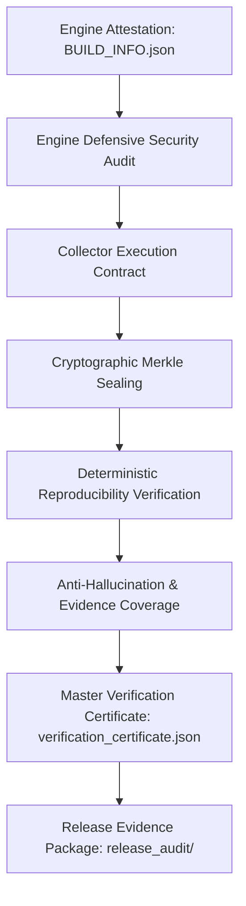

# Enterprise Audit Engine: Certification & Self-Verification Model

## 1. Overview
The Enterprise Audit Engine operates as a self-verifying assurance platform. It certifies the target repository through immutable machine-collected evidence, deterministic reproducibility, anti-hallucination report sanitization, and cryptographic Merkle tree sealing.

## 2. Core Pillars of Engine Certification

### Pillar 1: Immutable Identity & Attestation
- Engine version (`VERSION`), git commit hash, Python runtime, and dependencies SHA-256 hash are recorded into `BUILD_INFO.json` and `ENGINE_MANIFEST.json`.
- Reports cannot be forged without invalidating manifest attestation hashes.

### Pillar 2: Self-Auditing Defensive Security
- The audit engine scans its own source tree for insecure patterns (e.g. unsafe pickle deserialization, unrestricted `shell=True` subprocess calls, `eval()` injections, or path traversal vectors).
- Any detected vulnerability blocks engine execution with status `UNCERTIFIED_GAPS_DETECTED`.

### Pillar 3: Cryptographic Merkle Sealing
- Evidence records are sorted by ID, hashed via SHA-256, and aggregated into a balanced Merkle tree.
- The resulting `audit_merkle_root.json` guarantees leaf immutability and facilitates zero-knowledge audit proofs.

### Pillar 4: Deterministic Reproducibility
- The engine executes independent twin audit runs (`run_a` and `run_b`) against the repository.
- Verification passes only if evidence counts, classifications, and Merkle root hashes match identically.

### Pillar 5: 100% Evidence Coverage & Anti-Hallucination
- Every claim in generated reports must map to an existing, validly hashed `EV-XXXXX` record in the evidence store.
- Marketing hyperbole (e.g., "100% secure", "bug-free") is stripped automatically.

## 3. Certification Outputs
Successful certification produces:
1. `audit_output/audit-evidence/audit_merkle_root.json`
2. `audit_output/audit-evidence/audit_quality_report.json`
3. `release_audit/verification_certificate.json`
4. Complete release evidence directory structure.
