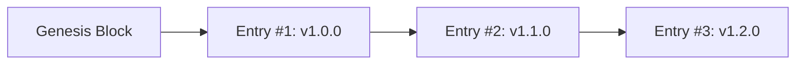

# Certification Transparency Log & Cryptographic Ledger

## Design
Inspired by **Certificate Transparency (RFC 6962)** and **Sigstore Rekor**, the Certification Authority maintains an append-only cryptographic ledger (`transparency_log.jsonl`) recording every certificate issued.

## Hash Chaining Scheme

Each entry calculates:
$$\text{Entry Hash}_i = \text{SHA256}(\text{Entry ID}_i \,\|\, \text{Cert ID}_i \,\|\, \text{Merkle Root}_i \,\|\, \text{Prev Hash}_{i-1} \,\|\, \dots)$$

Where $\text{Prev Hash}_0 = \text{SHA256}(\text{"GENESIS\_BLOCK"})$.



## Tamper Evidence
Any retroactive modification, deletion, or reordering of historical records breaks the cryptographic hash chain downstream, causing `verify_log_integrity()` to immediately detect the tampering.

## Verification
```bash
python -m enterprise_audit_engine.cli.main verify-transparency-log --repo-root .
```
