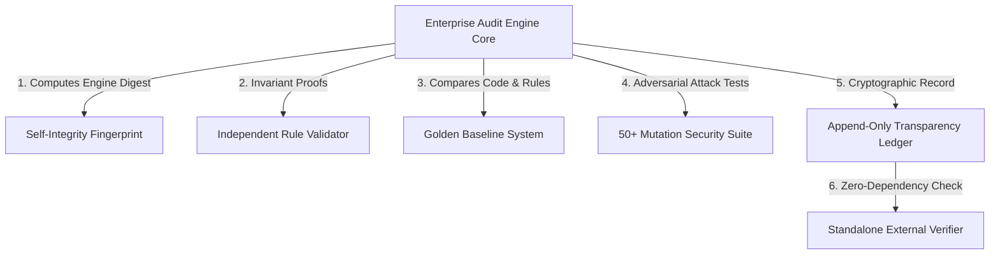

# Enterprise Audit Engine Trust Model & Architecture

## Overview
The **Enterprise Audit Engine Trust Model** resolves the core due diligence question: **"Who verifies the verifier?"**
Rather than assuming the verification tool is infallible, the engine treats itself as an untrusted system subject to cryptographic self-integrity verification, independent invariant validation, golden baseline comparison, and append-only transparency logging.

## Trust Boundaries & Guarantees

### 1. Root of Trust
1. **Source Code Fingerprint**: SHA-256 hash across all engine modules, schemas, and policy definitions.
2. **Deterministic Cryptographic Sealing**: Evidence digests committed to a Merkle tree signed by an Ed25519 private key.
3. **Immutability Ledger**: Parent-hashed JSONL transparency log preventing backdated or selective certificate issuance.
4. **Third-Party Verifiability**: Zero internal dependencies required to cryptographically validate signatures and Merkle proofs.

### 2. Threat Vector Mitigations
- **Engine Source Modification**: Detected immediately via `SelfIntegrityVerifier`.
- **Policy Relaxation / Degradation**: Detected by `PolicyRegressionDetector`.
- **Audit Tampering / Forgery**: Blocked by Ed25519 signature checks and Merkle proofs.
- **Log Modification / Deletion**: Detected by parent-hash chain validation in `CertificationTransparencyLog`.
