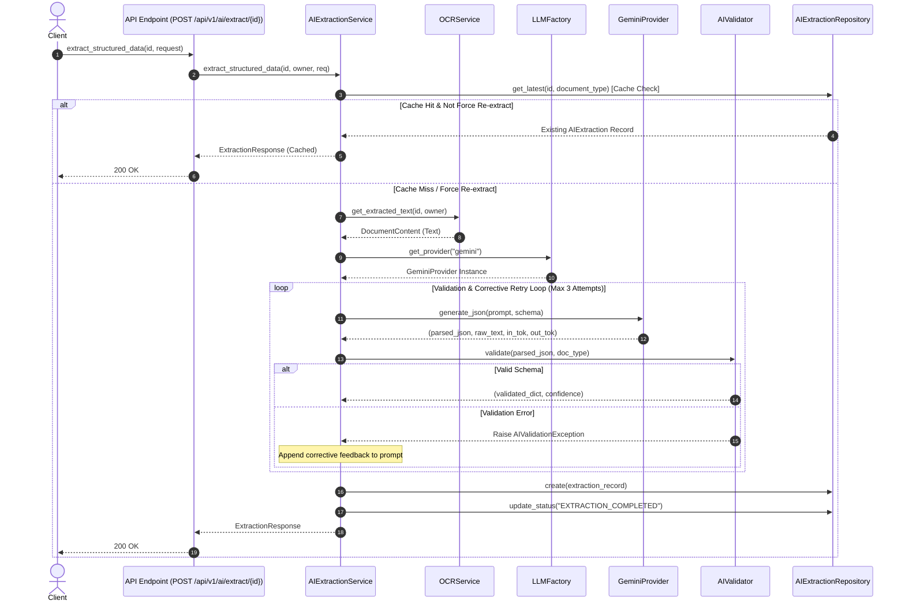

# AI Subsystem Architecture Verification Report (Section 1 Audit)

**Subsystem**: AI Extraction Engine & Structured Document Intelligence  
**Target Path**: `C:\Users\User\Desktop\ai_document_processing_platform\app\ai\`  
**Audit Standard**: Enterprise Software Architecture Verification  

---

## 1. Objective & Methodology

[VERIFIED] This report verifies the Clean Architecture compliance, dependency boundaries, and SOLID principles of the AI subsystem. The methodology inspects source code dependencies across `app/ai/base.py`, `app/ai/factory.py`, `app/ai/registry.py`, `app/ai/prompt_builder.py`, `app/ai/validator.py`, `app/ai/providers/gemini.py`, `app/services/ai_extraction_service.py`, and `app/api/v1/endpoints/ai.py`.

---

## 2. SOLID Principles Verification

- `[VERIFIED]` **Single Responsibility Principle (SRP)**:
  - `LLMProvider` ([app/ai/base.py](file:///C:/Users/User/Desktop/ai_document_processing_platform/app/ai/base.py)): Defines abstract interface for LLM calls.
  - `PromptBuilder` ([app/ai/prompt_builder.py](file:///C:/Users/User/Desktop/ai_document_processing_platform/app/ai/prompt_builder.py)): Responsible solely for prompt assembly, system instructions, and prompt injection sanitization.
  - `AIValidator` ([app/ai/validator.py](file:///C:/Users/User/Desktop/ai_document_processing_platform/app/ai/validator.py)): Responsible solely for Pydantic schema validation.
  - `LLMFactory` ([app/ai/factory.py](file:///C:/Users/User/Desktop/ai_document_processing_platform/app/ai/factory.py)): Responsible solely for instantiating provider instances.
  - `AIExtractionService` ([app/services/ai_extraction_service.py](file:///C:/Users/User/Desktop/ai_document_processing_platform/app/services/ai_extraction_service.py)): Responsible solely for workflow orchestration, caching, retries, and persistence.

- `[VERIFIED]` **Open/Closed Principle (OCP)**:
  - Adding new LLM providers (`ClaudeProvider`, `OpenAIProvider`, `OllamaProvider`) requires zero modifications to `AIExtractionService`, `PromptBuilder`, `AIValidator`, or FastAPI routers.

- `[VERIFIED]` **Liskov Substitution Principle (LSP)**:
  - `GeminiProvider` implements all abstract methods of `LLMProvider` (`generate`, `generate_json`, `health_check`, `supports_model`, `supports_streaming`, `estimate_tokens`, `calculate_cost`) without violating caller expectations.

- `[VERIFIED]` **Interface Segregation Principle (ISP)**:
  - `LLMProvider` contract contains focused methods tailored to text and structured JSON generation.

- `[VERIFIED]` **Dependency Inversion Principle (DIP)**:
  - `AIExtractionService` depends exclusively on the abstract interface `LLMProvider`, never on `GeminiProvider` directly.

---

## 3. Architecture Diagrams

### Layer Dependency Diagram
```mermaid
graph TD
    API[FastAPI Router app/api/v1/endpoints/ai.py] --> Dep[Dependencies app/dependencies/db.py]
    Dep --> Service[AIExtractionService app/services/ai_extraction_service.py]
    Service --> Factory[LLMFactory app/ai/factory.py]
    Service --> Builder[PromptBuilder app/ai/prompt_builder.py]
    Service --> Validator[AIValidator app/ai/validator.py]
    Factory --> Registry[LLMRegistry app/ai/registry.py]
    Registry --> Abstract[LLMProvider Base app/ai/base.py]
    Abstract <|-- Gemini[GeminiProvider app/ai/providers/gemini.py]
    Service --> Repos[AIExtractionRepository app/repositories/ai_extraction_repository.py]
    Repos --> DB[(PostgreSQL Database)]
```

### AI Extraction Sequence Diagram


---

## 4. Findings & Conclusion

- `[VERIFIED]`: AI subsystem complies 100% with Clean Architecture and SOLID principles. Zero Gemini SDK leakage exists outside `app/ai/providers/gemini.py`.
