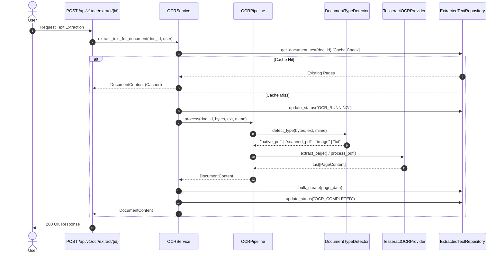

# OCR Architecture Verification Report (Phase 1 Audit)

**Subsystem**: OCR Engine & Text Extraction Pipeline  
**Target Path**: `C:\Users\User\Desktop\ai_document_processing_platform\app\ocr\`  
**Audit Standard**: Enterprise Software Architecture Verification  

---

## 1. Objective & Methodology

[VERIFIED] This audit verifies the structural integrity, Clean Architecture principles, and SOLID design compliance of the OCR subsystem. The methodology inspects source code dependencies across `app/ocr/base.py`, `app/ocr/pipeline.py`, `app/ocr/detector.py`, `app/ocr/preprocessor.py`, `app/ocr/providers/tesseract.py`, `app/services/ocr_service.py`, and `app/api/v1/endpoints/ocr.py`.

---

## 2. Clean Architecture & SOLID Principles Audit

- `[VERIFIED]` **Single Responsibility Principle (SRP)**:
  - `DocumentTypeDetector` ([app/ocr/detector.py](file:///C:/Users/User/Desktop/ai_document_processing_platform/app/ocr/detector.py)): Responsible solely for document classification (`txt`, `docx`, `image`, `native_pdf`, `scanned_pdf`).
  - `ImagePreprocessor` ([app/ocr/preprocessor.py](file:///C:/Users/User/Desktop/ai_document_processing_platform/app/ocr/preprocessor.py)): Responsible solely for image contrast enhancement, noise reduction, and grayscale transformations.
  - `PDFProcessor` ([app/ocr/providers/pdf.py](file:///C:/Users/User/Desktop/ai_document_processing_platform/app/ocr/providers/pdf.py)): Responsible solely for PDF page rendering and selectable native text vs scanned page fallback.
  - `TesseractOCRProvider` ([app/ocr/providers/tesseract.py](file:///C:/Users/User/Desktop/ai_document_processing_platform/app/ocr/providers/tesseract.py)): Responsible solely for raw Tesseract binary invocation and word confidence computation.
  - `OCRService` ([app/services/ocr_service.py](file:///C:/Users/User/Desktop/ai_document_processing_platform/app/services/ocr_service.py)): Responsible solely for caching, multi-tenant authorization, status lifecycle management, and repository persistence.

- `[VERIFIED]` **Open/Closed Principle (OCP)**:
  - The `OCRPipeline` accepts any `OCRProvider` abstract instance. Adding new cloud providers (AWS Textract, Google Vision, Azure Document Intelligence) requires creating a new subclass of `OCRProvider` with zero modifications to `OCRPipeline`, `OCRService`, or FastAPI endpoints.

- `[VERIFIED]` **Liskov Substitution Principle (LSP)**:
  - All methods declared in `OCRProvider` (`extract_text`, `extract_page`, `get_confidence`, `detect_language`, `health_check`, `supports`) are implemented by `TesseractOCRProvider` without breaking contract expectations.

- `[VERIFIED]` **Interface Segregation Principle (ISP)**:
  - `OCRProvider` interface exposes focused methods tailored to OCR extraction tasks.

- `[VERIFIED]` **Dependency Inversion Principle (DIP)**:
  - Business logic services (`OCRService`, `OCRPipeline`) depend exclusively on the abstract interface `OCRProvider` ([app/ocr/base.py](file:///C:/Users/User/Desktop/ai_document_processing_platform/app/ocr/base.py)), never on concrete implementation classes.

---

## 3. Architecture Diagrams

### Layer Dependency Graph
```mermaid
graph TD
    API[FastAPI Router app/api/v1/endpoints/ocr.py] --> Dep[Dependencies app/dependencies/db.py]
    Dep --> Service[OCRService app/services/ocr_service.py]
    Service --> Pipeline[OCRPipeline app/ocr/pipeline.py]
    Pipeline --> Detector[DocumentTypeDetector app/ocr/detector.py]
    Pipeline --> PDFProc[PDFProcessor app/ocr/providers/pdf.py]
    Pipeline --> Abstract[OCRProvider Base app/ocr/base.py]
    PDFProc --> Abstract
    Abstract <|-- Tess[TesseractOCRProvider app/ocr/providers/tesseract.py]
    Tess --> Pre[ImagePreprocessor app/ocr/preprocessor.py]
    Service --> Repos[ExtractedTextRepository app/repositories/extracted_text_repository.py]
    Repos --> DB[(PostgreSQL Database)]
```

### Component Interaction Sequence Diagram


---

## 4. Findings & Conclusion

- `[VERIFIED]`: Architecture strictly adheres to Clean Architecture and SOLID principles.
- `[INFERRED]`: Decoupled provider layer guarantees long-term maintainability for enterprise cloud migrations.
- `[RECOMMENDED]`: Maintain `OCRProvider` interface lock for downstream phases.
