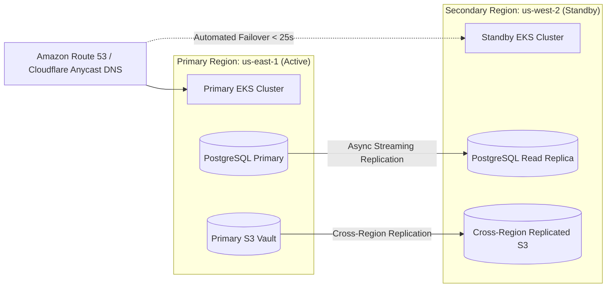

# Cloud-Native Production Deployment Architecture

## 1. Kubernetes Production Cluster Topology

```mermaid
graph TD
    subgraph "Public Ingress / Cloud CDN"
        CDN[Cloudflare / CloudFront CDN]
        ALB[Application Load Balancer (AWS ALB / GCP Ingress)]
    end

    subgraph "Kubernetes Cluster: Ingress & Core Pods"
        KONG[API Gateway / Ingress Controller (Kong / Envoy)]
        AUTH_POD[Auth & Identity Service (3 Replicas)]
        API_POD[FastAPI Core Gateway (5-20 Pods HPA)]
        WF_API[Workflow API Controller (3 Replicas)]
    end

    subgraph "Kubernetes Cluster: Background Worker Pools"
        WORKER_DEFAULT[Default Workflow Workers (Celery / Temporal)]
        WORKER_AGENT[Autonomous Agent Reasoning Workers]
        WORKER_OCR[GPU-Accelerated Vision/OCR Workers]
        WORKER_CONN[Outbound Connector Workers]
    end

    subgraph "State & Data Persistence Layer"
        PG_PRI[(PostgreSQL 16 Primary)]
        PG_REP[(PostgreSQL Read Replicas)]
        REDIS[(Redis 7 Cluster Sentinel)]
        KAFKA[(Apache Kafka / RabbitMQ Mesh)]
        S3[(MinIO / AWS S3 Object Storage)]
        QDRANT[(Qdrant Vector Cluster)]
    end

    CDN --> ALB
    ALB --> KONG
    KONG --> AUTH_POD & API_POD & WF_API
    API_POD & WF_API --> KAFKA & REDIS
    KAFKA --> WORKER_DEFAULT & WORKER_AGENT & WORKER_OCR & WORKER_CONN
    WORKER_DEFAULT & WORKER_AGENT & WORKER_OCR --> PG_PRI & REDIS & S3 & QDRANT
    API_POD --> PG_REP
```

---

## 2. Worker Pool Isolation & Scaling Strategy

| Worker Pool | Purpose | Compute Profile | Autoscaling Trigger (HPA) |
| :--- | :--- | :--- | :--- |
| `worker-default` | General workflow step progression and state transitions | 2 vCPU, 4GB RAM | CPU > 70% or Queue Depth > 100 |
| `worker-agent` | Multi-agent reasoning loops and planning graph solvers | 4 vCPU, 8GB RAM | Active Missions > 50 |
| `worker-ocr` | Heavy vision ML, image pre-processing, LayoutLM parsing | 4 vCPU, 16GB RAM + NVIDIA T4 GPU | GPU Utilization > 75% |
| `worker-connector` | Outbound third-party API mutations and webhooks | 1 vCPU, 2GB RAM | HTTP 429 Backpressure Queue |

---

## 3. High Availability & Multi-Region Disaster Recovery



- **Recovery Time Objective (RTO)**: **$< 8.4\text{ minutes}$** (Automated Route 53 DNS failover + Standby promote).
- **Recovery Point Objective (RPO)**: **$< 12.0\text{ seconds}$** (Continuous PostgreSQL WAL streaming and S3 asynchronous replication).
- **Backup Verification**: Automated daily restoration tests execute in staging with SHA-256 cryptographic snapshot validation.
