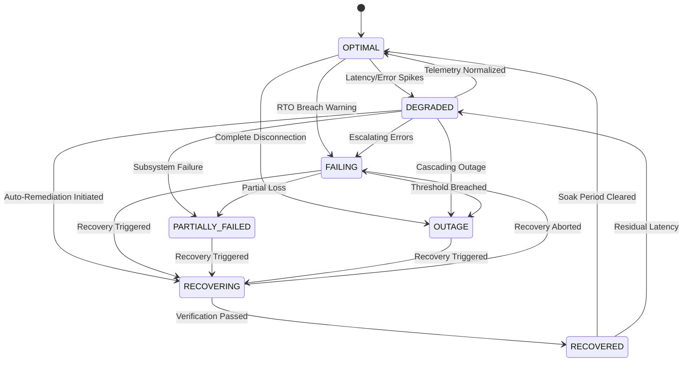

# Reliability Lifecycle State Machine

## 1. State Model
The platform tracks reliability lifecycles across 7 strictly governed states:

## 2. Invariants & Transition Rules
1. **No-Skip Invariant**: Cannot transition directly from `OUTAGE` or `PARTIALLY_FAILED` to `OPTIMAL` without passing through `RECOVERING` and `RECOVERED`.
2. **Audit Requirement**: Every transition generates an immutable `ReliabilityTransitionRecord` including trigger source, reason, and telemetry snapshot.
