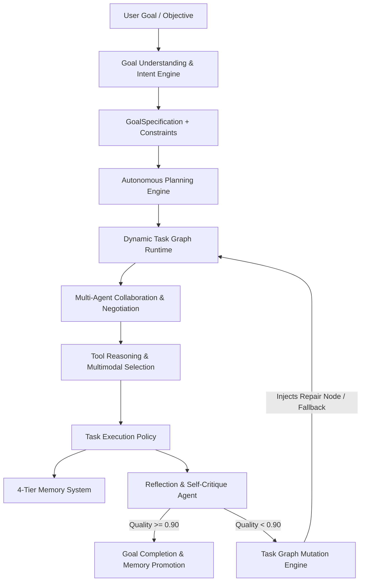

# Phase 25.0 — Autonomous Agent Intelligence Operating System Architecture

## 1. System Overview

The Autonomous Agent Intelligence Operating System elevates the platform from a distributed agent execution runtime into an autonomous operating kernel. Rather than merely executing static graphs, the system independently parses open-ended goals, reasons about agent and tool capabilities, schedules dynamic execution waves, critiques in-flight execution artifacts, mutates running directed acyclic graphs (DAGs) without human intervention, and continuously updates persistent memory stores.

---

## 2. Core Architectural Pillars

### 2.1 Goal Understanding Layer (`app/agents/intelligence/goal/`)
Translates unstructured natural language and semi-structured input payloads into mathematically unambiguous `GoalSpecification` objects.
- **Intent Taxonomy:** Deterministic regex & semantic pattern classifier spanning `INVOICE_PROCESSING`, `RECEIPT_ANALYSIS`, `CONTRACT_REVIEW`, `COMPLIANCE_AUDIT`, `FRAUD_DETECTION`, `BATCH_INGESTION`, and `RECONCILIATION`.
- **Constraint Extractor:** Parses SLAs, latency thresholds, accuracy targets ($A_{\min}$), cost caps, and compliance mandates (`SOX`, `GDPR`, `HIPAA`).
- **Success Criteria:** Enforces verifiable mathematical operators (`>=`, `<=`, `==`) with assigned priority weights.

### 2.2 Autonomous Planning Layer (`app/agents/planning/`)
- **Capability Discovery:** Dynamic manifest cataloging agent profiles and tool capabilities with multi-attribute Pareto scoring.
- **Domain Task Decomposer:** Recursively expands goals into topologically sound task lists.
- **Topological Invariant Validator:** Guarantees strict acyclicity across composite execution plans.
- **Fallback Planning:** Synthesizes alternative agent and tool branches up-front.

### 2.3 Dynamic Task Graph Runtime (`app/agents/workflow/task_graph/`)
- **Live State Machine:** Promotes nodes across `PENDING`, `READY`, `RUNNING`, `COMPLETED`, `FAILED`, `MUTATED`, and `SKIPPED`.
- **Concurrency Wave Resolution:** Dynamically identifies ready task subsets for parallel execution.
- **Task Graph Mutation Engine:** Transactionally splices nodes (`insert_node_between`, `replace_failed_node_with_fallback`, `inject_correction_cycle`), demoting downstream tasks when dependencies mutate.

### 2.4 Multi-Agent Collaboration Engine (`app/agents/collaboration/`)
- **Agent Profiles & Registry:** Real-time tracking of capacity, concurrency load, and heartbeat timeouts.
- **Contract-Net Negotiation Protocol:** Distributed bidding protocol evaluating bids on utility:
  $$U = 0.5 \cdot \text{Confidence} - 0.3 \cdot \text{Cost} - 0.2 \cdot \text{Latency}$$
- **Agent Message Bus:** Asynchronous pub/sub broker with point-to-point routing, topic broadcast, dead letter queue (DLQ), and distributed correlation tracing.

### 2.5 Tool Reasoning Engine (`app/agents/tools/reasoning/`)
- **Modality-Aware Selection:** Evaluates input modalities (`TEXT`, `IMAGE`, `PDF`, `HANDWRITING`, `TABLE`, `JSON`).
- **Execution Policy:** Fallback cascading with retry backoff and timeout guarantees.

### 2.6 4-Tier Memory Intelligence (`app/agents/memory/intelligence/`)
1. **Short-Term Memory:** Ephemeral scratchpad with TTL and LRU eviction.
2. **Working Memory:** Live session state, task pointers, findings, and errors.
3. **Episodic Memory:** Historical execution episodes and recovery paths.
4. **Semantic Memory:** Persistent facts, tax formulas, schemas, and learned heuristics.
- **Unified Retrieval Scoring Formula:**
  $$\text{Score} = 0.35 \cdot \text{Similarity} + 0.25 \cdot \text{Importance} + 0.20 \cdot \text{Recency} + 0.20 \cdot \text{TaskRelevance}$$

### 2.7 Reflection & Self-Improvement Loop (`app/agents/reflection/`)
- **Multi-Factor Critique:**
  $$\text{QualityScore} = 0.20 \cdot S_{\text{format}} + 0.35 \cdot S_{\text{arithmetic}} + 0.25 \cdot S_{\text{completeness}} + 0.20 \cdot S_{\text{confidence}}$$
- **Self-Correction Trigger:** Auto-diagnoses root causes and commands dynamic graph mutations or prompt repairs when $\text{QualityScore} < 0.90$.
