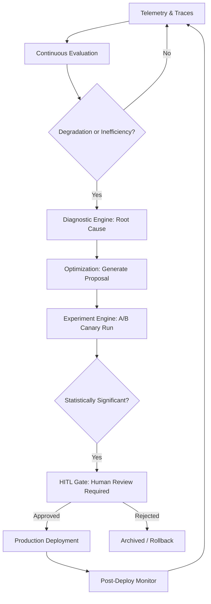

# Phase 13.17: Autonomous AI Operations Center (AAIOC)
## Enterprise Agent Observability, Evaluation, Optimization & Controlled Self-Improvement Architecture

---

## 1. Executive Summary & Vision

Phase 13.17 introduces the **Autonomous AI Operations Center (AAIOC)**. It transforms the autonomous multi-agent platform from an execution and cognitive modeling engine into an **enterprise-grade AI Operations Control Plane** (resembling a unified Datadog for AI, LangSmith, Arize AI, WhyLabs, and OpenTelemetry).

The central design principle of AAIOC is the closed-loop operational lifecycle:
$$\text{Observe} \longrightarrow \text{Evaluate} \longrightarrow \text{Diagnose} \longrightarrow \text{Optimize} \longrightarrow \text{Controlled Improvement (HITL Required)} \longrightarrow \text{Validate} \longrightarrow \text{Deploy} \longrightarrow \text{Monitor}$$

---

## 2. Core Architectural Principles

1. **Deterministic Telemetry & Distributed Tracing**: High-precision OpenTelemetry-compatible span and trace graphs capturing every agent reasoning step, tool invocation, token consumption, and memory state.
2. **Multi-Faceted Continuous Evaluation**: Real-time scoring of Task Success, Semantic Accuracy, Hallucination Index, Tool Efficiency, Cost-to-Value Ratio, and Safety Alignment.
3. **Automated Root-Cause Diagnosis**: Automated failure classification isolating tool timeouts, context overflows, prompt drift, hallucination loops, and schema violations.
4. **Pareto-Optimal Multi-Objective Routing**: Dynamic routing across LLM model tiers (e.g. Flash-Lite, Flash, Pro, Omni, Local) optimizing the trade-off surface between Cost ($C$), Latency ($L$), and Quality ($Q$).
5. **Controlled Self-Improvement with Mandatory Human-in-the-Loop (HITL)**:
   - AI detects performance degradation or optimization opportunities.
   - AI generates candidate prompt/model mutation proposals.
   - AI runs isolated A/B canary experiments with statistical significance testing ($p$-value, effect size).
   - Deployment to production strictly requires explicit human sign-off.
6. **Enterprise Governance & Regulatory Auditability**: Continuous PII/secrets redaction, SLA enforcement, and immutable cryptographic audit trails.

---

## 3. Subsystem Architecture

```
+---------------------------------------------------------------------------------------------------+
|                                 AUTONOMOUS AI OPERATIONS CENTER                                   |
+---------------------------------------------------------------------------------------------------+
|                                                                                                   |
|  +--------------------+    +--------------------+    +--------------------+    +----------------+ |
|  |     Telemetry      |    |     Evaluation     |    |     Debugging      |    |  Optimization  | |
|  |     Subsystem      |--->|     Subsystem      |--->|  & Root Cause      |--->|   Subsystem    | |
|  | (Traces, Spans,    |    | (Accuracy, Safety, |    | (Failure Classify, |    | (Prompt Mutate,| |
|  |  Tokens, Latency)  |    |  LLM Judge, Evals) |    |  Critical Path)    |    |  Model Router) | |
|  +--------------------+    +--------------------+    +--------------------+    +----------------+ |
|            |                                                                           |          |
|            v                                                                           v          |
|  +--------------------+    +--------------------+    +--------------------+    +----------------+ |
|  |     Prediction     |    |    Improvement     |    |    A/B Testing     |    |   Governance   | |
|  |     Subsystem      |    |     Subsystem      |    |     Subsystem      |    |   & Security   | |
|  | (Context Blowup,   |    | (Proposals, Diff,  |--->| (Canary Eval,      |--->| (PII Redaction,| |
|  |  Confidence Decay) |    |  HITL Gate)        |    |  Stat Sig P-Value) |    |  Audit Trail)  | |
|  +--------------------+    +--------------------+    +--------------------+    +----------------+ |
|                                                                                                   |
|  +----------------------------------------------------------------------------------------------+ |
|  |                         MASTER AI OPERATIONS RUNTIME COORDINATOR                              | |
|  +----------------------------------------------------------------------------------------------+ |
+---------------------------------------------------------------------------------------------------+
```

---

## 4. Mathematical Formulations

### 4.1. Multi-Objective Pareto Model Routing
For a task $T$ with requirement vector $\mathbf{r} = (w_q, w_l, w_c)$ where $w_q + w_l + w_c = 1$:
$$Score(M_i) = w_q \cdot Q(M_i, T) - w_l \cdot \frac{L(M_i, T)}{L_{max}} - w_c \cdot \frac{C(M_i, T)}{C_{max}}$$
Where $Q(M_i, T) \in [0, 1]$ is estimated historical quality, $L(M_i, T)$ is expected latency, and $C(M_i, T)$ is estimated token cost. The optimal model $M^*$ maximizes the Pareto utility score subject to hard budget and SLA constraints:
$$M^* = \arg\max_{M_i \in \mathcal{M}} Score(M_i) \quad \text{s.t.} \quad L(M_i) \le SLA_{target}, \quad C(M_i) \le Budget_{max}$$

### 4.2. Statistical Significance in A/B Canary Experiments
When evaluating a candidate prompt/model $B$ against baseline $A$ over sample sizes $n_A, n_B$:
Two-sample Welch's $t$-statistic:
$$t = \frac{\bar{X}_B - \bar{X}_A}{\sqrt{\frac{s_A^2}{n_A} + \frac{s_B^2}{n_B}}}$$
Cohen's $d$ effect size:
$$d = \frac{\bar{X}_B - \bar{X}_A}{s_{pooled}}$$
A proposal is marked as statistically validated if $p < 0.05$ and $d > 0.2$ (positive improvement).

### 4.3. Hallucination Index
Let $E = \{e_1, e_2, \dots, e_k\}$ be the set of verifiable factual claims extracted from the agent output, and $S(e_i) \in [0, 1]$ be the grounding support score from retrieved context:
$$H_{index} = 1 - \frac{1}{k} \sum_{i=1}^k S(e_i)$$

---

## 5. Failure Taxonomy

The diagnostic engine automatically categorizes trace failures into:
1. `TOOL_TIMEOUT`: Downstream API/tool took $> \tau_{timeout}$ seconds.
2. `TOOL_SCHEMA_VIOLATION`: Invalid arguments or unparsable JSON payload.
3. `RECURSIVE_LOOP`: Repeated cyclic tool calls with identical parameters.
4. `CONTEXT_WINDOW_OVERFLOW`: Exceeded maximum token limit ($> 95\%$ context capacity).
5. `CONFIDENCE_DECAY`: Step-by-step reasoning confidence dropped below critical threshold ($\alpha < 0.40$).
6. `HALLUCINATION_DETECTED`: Grounding score dropped below compliance boundary.
7. `PII_POLICY_VIOLATION`: Prompt or output contained unmasked sensitive tokens.

---

## 6. Controlled Improvement Lifecycle & HITL Approval



---

## 7. REST API Surface Summary

- `/api/v1/ai_operations/overview` — High-level operational metrics, fleet health, cost rate.
- `/api/v1/ai_operations/telemetry/agents` — Fleet telemetry breakdown.
- `/api/v1/ai_operations/telemetry/traces` — Distributed execution traces and spans.
- `/api/v1/ai_operations/evaluation/run` — On-demand evaluation suite execution.
- `/api/v1/ai_operations/evaluation/results` — Historical evaluation scores & LLM judge reports.
- `/api/v1/ai_operations/optimization/model-route` — Pareto model selection endpoint.
- `/api/v1/ai_operations/optimization/prompts` — Prompt versions, mutations, and laboratory.
- `/api/v1/ai_operations/cost/analytics` — Cost analytics and projections.
- `/api/v1/ai_operations/debugging/failures` — Failure classifications & root cause logs.
- `/api/v1/ai_operations/improvement/proposals` — Active self-improvement proposals.
- `/api/v1/ai_operations/improvement/proposals/{id}/approve` — HITL deployment approval.
- `/api/v1/ai_operations/improvement/proposals/{id}/reject` — Proposal rejection.
- `/api/v1/ai_operations/experiments` — A/B canary experiment metrics.
- `/api/v1/ai_operations/governance/audit-logs` — Audit trail & PII compliance events.
- `/api/v1/ai_operations/runtime/cycle` — Full autonomous operations cycle execution.
