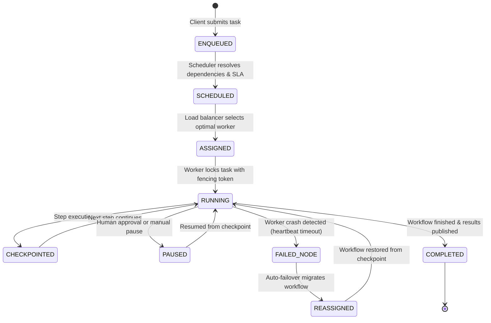

# Phase 13.18: Autonomous Cloud Runtime & Distributed Agent Fabric (ACR-DAF)
## Enterprise Distributed Execution Engine, Cloud Worker Fleet, Durable Workflows & Infrastructure Architecture

---

## 1. Executive Summary & Vision

Phase 13.18 transforms the platform into an **Autonomous Cloud Runtime & Distributed Agent Fabric (ACR-DAF)**. It provides production infrastructure capabilities inspired by **Temporal, Ray, Kubernetes, Prefect, Dagster, and OpenTelemetry Service Mesh**, specifically tailored for autonomous multi-agent workloads.

### Core Architecture Shift
$$\text{Single-Node Execution} \longrightarrow \text{Globally Distributed Execution Fabric}$$

```
+---------------------------------------------------------------------------------------------------+
|                     AUTONOMOUS CLOUD RUNTIME & DISTRIBUTED AGENT FABRIC                           |
+---------------------------------------------------------------------------------------------------+
|                                                                                                   |
|  +--------------------+    +--------------------+    +--------------------+    +----------------+ |
|  | Distributed Queue  |    | Priority Scheduler |    | Capacity-Weighted  |    | Interchangeable| |
|  | (Critical/Batch/   |--->| (SLA & Multi-Tenant|--->| Load Balancer      |--->| Cloud Worker   | |
|  |  Dead-Letter DLQ)  |    |  Fair-Share Alloc) |    | (CPU/RAM/Queue/Lat)|    | Fleet (Nodes)  | |
|  +--------------------+    +--------------------+    +--------------------+    +----------------+ |
|            |                                                                           |          |
|            v                                                                           v          |
|  +--------------------+    +--------------------+    +--------------------+    +----------------+ |
|  | Durable Workflow   |    | Distributed Lock   |    | Multi-Region       |    | Model Gateway  | |
|  | Engine (Temporal   |--->| Manager (Fencing   |--->| Router (US, EU,    |--->| & Distributed  | |
|  |  Checkpoints)      |    |  Tokens & Leases)  |    |  Asia Latency-Opt) |    | Cache Proxy    | |
|  +--------------------+    +--------------------+    +--------------------+    +----------------+ |
|                                                                                                   |
|  +----------------------------------------------------------------------------------------------+ |
|  |          AUTOSCALING ENGINE • DISASTER RECOVERY DRILLS • EVENT STREAMING MESH                | |
|  +----------------------------------------------------------------------------------------------+ |
+---------------------------------------------------------------------------------------------------+
```

---

## 2. Core Architectural Invariants & Subsystems

1. **Provider-Agnostic Abstraction Layer**:
   - Queues, caches, object stores, and secret managers operate through abstract interfaces with default in-memory and Google Cloud adapters (Pub/Sub, Cloud Storage, Secret Manager, Cloud Run), ensuring portability to AWS or Azure.
2. **Temporal-Like Durable Workflows & Zero-Data-Loss Checkpointing**:
   - Workflows persist step-level state, inputs, outputs, memory, and variables to distributed storage. If a worker node crashes or is drained, the workflow is dynamically migrated and resumed from the last verified checkpoint without losing progress.
3. **Multi-Tenant Fair-Share Priority Scheduler**:
   - Enforces priority classes (`CRITICAL`, `HIGH`, `NORMAL`, `BATCH`) with starvation prevention, SLA deadline monitoring, and tenant quotas.
4. **Capacity-Weighted Load Balancing**:
   - Worker selection evaluates a composite score balancing CPU load, available memory, active queue depth, and historical node latency:
     $$\text{CapacityScore}(W_i) = 1.0 - \left( 0.35 \cdot \frac{CPU_i}{100} + 0.30 \cdot \frac{RAM_i}{RAM_{max}} + 0.20 \cdot \frac{QueueDepth_i}{Queue_{max}} + 0.15 \cdot \frac{Latency_i}{Lat_{max}} \right)$$
5. **Distributed Lock Manager with Fencing Tokens**:
   - Prevents duplicate task execution and race conditions across multi-worker deployments using lease timeouts and monotonically increasing fencing tokens.
6. **Autoscaling Intelligence**:
   - Predicts and evaluates worker scale-up/scale-down triggers based on queue depth, request burst rates, and SLA latency targets:
     $$N_{desired} = \left\lceil \frac{\text{QueueDepth} \times \text{AvgTaskDuration}}{\text{TargetLatencySLA}} \right\rceil$$
7. **Centralized Model Gateway & Distributed Cache**:
   - Token-bucket rate limiting, automatic provider failover chains, and distributed caching for prompts, embeddings, and tool responses.
8. **Disaster Recovery & Chaos Resilience**:
   - Cross-region snapshot replication and automated chaos failover drills validating RPO (Recovery Point Objective) and RTO (Recovery Time Objective).

---

## 3. Distributed Lifecycle State Machine



---

## 4. REST API Endpoints Overview

- `GET /api/v1/distributed/cluster/overview` — High-level cluster health, active worker count, queue throughput.
- `GET /api/v1/distributed/workers` — Worker fleet state, resource utilization, and heartbeat status.
- `POST /api/v1/distributed/workers/register` — Worker node registration.
- `POST /api/v1/distributed/workers/{id}/heartbeat` — Ingest heartbeat from worker node.
- `POST /api/v1/distributed/workers/{id}/drain` — Gracefully drain worker node.
- `GET /api/v1/distributed/queues` — Distributed priority and dead-letter queue metrics.
- `POST /api/v1/distributed/scheduler/jobs` — Enqueue scheduled job.
- `GET /api/v1/distributed/scheduler/jobs` — List active and scheduled jobs.
- `GET /api/v1/distributed/workflows/durable` — List durable workflows and lifecycle states.
- `POST /api/v1/distributed/workflows/{id}/pause` — Pause running workflow.
- `POST /api/v1/distributed/workflows/{id}/resume` — Resume workflow from last checkpoint.
- `GET /api/v1/distributed/checkpoints/{id}` — Checkpoint history for workflow.
- `GET /api/v1/distributed/autoscaling/status` — Autoscaler status and scaling events.
- `POST /api/v1/distributed/autoscaling/evaluate` — Trigger autoscaling policy evaluation.
- `GET /api/v1/distributed/regions` — Multi-region topology and latency statistics.
- `POST /api/v1/distributed/chaos/inject-failure` — Simulate worker node crash.
- `GET /api/v1/distributed/disaster-recovery/status` — DR backup and snapshot replication status.
- `POST /api/v1/distributed/disaster-recovery/drill` — Execute disaster recovery failover drill.
