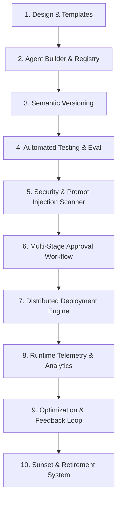

# Phase 13.20 Architecture: Autonomous AI Application Lifecycle Platform (AAILP)

## 1. Architectural Overview
The Autonomous AI Application Lifecycle Platform (AAILP) elevates AI agents from ephemeral runtime components into governed, versioned, testable, and enterprise-grade software applications. AAILP mirrors modern DevSecOps, MLOps, and Cloud-Native application platforms (GitHub, Kubernetes, MLflow, AppExchange) specifically tailored for autonomous agentic systems.

## 2. Core Subsystems

### A. Enterprise Agent Registry (`app/platform_ai_lifecycle/registry/`)
- Central catalog of all enterprise AI applications, workflows, tool bindings, and prompt assets.
- Explicit ownership model: `(tenant_id, organization_id, workspace_id, owner_id)`.
- Lifecycle state transitions:
  `DRAFT -> DEVELOPMENT -> TESTING -> SECURITY_REVIEW -> APPROVED -> DEPLOYED -> DEPRECATED -> RETIRED`.

### B. Agent Version Control System (`app/platform_ai_lifecycle/versioning/`)
- Git-like immutable snapshotting of agent configurations, prompt variations, tool schemas, and model parameters.
- Direct version diffing, performance comparison matrices, and one-click instant rollback.

### C. Comprehensive AI Testing Platform (`app/platform_ai_lifecycle/testing/`)
- Functional testing (tool calls, goal fulfillment, recovery handling).
- Quality evaluation (grounding, factual precision, hallucination scoring).
- Security assertion (prompt injection resistance, data leakage detection).
- Performance benchmarking (latency, throughput, token cost).

### D. Agent Security Scanner (`app/platform_ai_lifecycle/security/`)
- Automated static & dynamic scanning for prompt injection vulnerabilities, excessive tool privileges, PII/PHI leakage, and vulnerable dependencies.
- Generates composite security risk scores (0-100) and actionable remediation directives.

### E. Enterprise Approval Workflow Engine (`app/platform_ai_lifecycle/approval/`)
- Configurable multi-stage review pipelines (Developer Submission -> Automated Security Gate -> Business Owner Signoff -> Compliance Verification -> Production Release).

### F. Distributed Deployment Manager (`app/platform_ai_lifecycle/deployment/`)
- Tight integration with Phase 13.18 Distributed Cloud Runtime.
- Deployment strategies: Direct, Blue-Green, Canary (10% -> 50% -> 100%), and Automatic Failure Rollback.

### G. Dependency Graph & Breaking Change Detection (`app/platform_ai_lifecycle/dependencies/`)
- Explicit dependency tracking across Agents, Tools, Model Endpoints, External Connectors, Datasets, and Security Policies.

### H. Enterprise Marketplace & Publishing (`app/platform_ai_lifecycle/marketplace/`)
- Enterprise-internal asset sharing, verified certification badges, community ratings, and one-click workspace installation.

### I. Business ROI & Adoption Analytics (`app/platform_ai_lifecycle/analytics/`)
- Quantifies Automation ROI in USD, developer hours saved, agent adoption scores, and error rate distributions.

### J. Deprecation & Retirement Center (`app/platform_ai_lifecycle/retirement/`)
- Controlled sunsetting, deprecation warning headers, traffic rerouting, and archived artifact retention.
