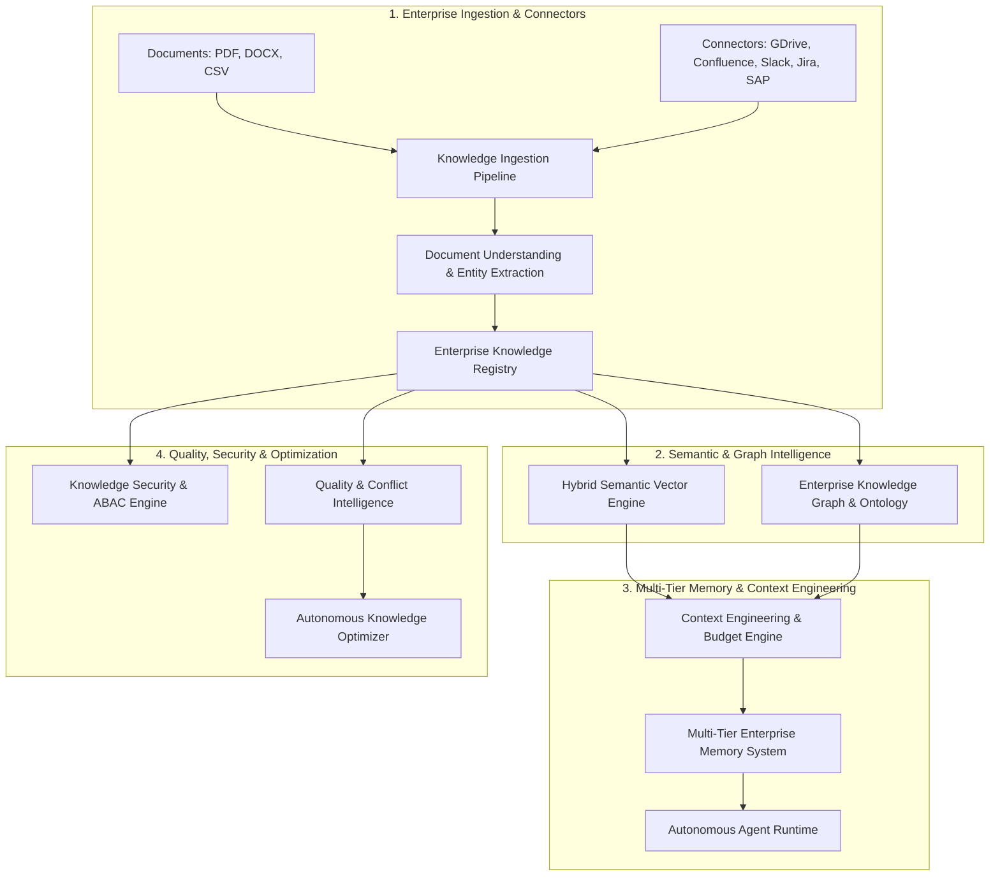

# Phase 13.21 — Enterprise AI Knowledge & Context Intelligence Platform (EAKCIP)
## Architectural Blueprint & Technical Specification

---

### Executive Vision

Phase 13.21 transforms the platform from a system that runs AI applications into an **Enterprise Cognitive Memory & Context Intelligence Platform**. It provides autonomous agents with deep organizational understanding, semantic enterprise memory, grounded context engineering, automated knowledge conflict reconciliation, and a multi-relational knowledge graph.

---

### Architectural Diagram

---

### Subsystems Breakdown

1. **Enterprise Knowledge Registry (`registry/knowledge_registry.py`)**
   - Multi-tenant asset catalog `(tenant_id, organization_id, workspace_id, project_id)`.
   - Complete lifecycle tracking (`DISCOVERED` -> `INGESTED` -> `PROCESSED` -> `INDEXED` -> `AVAILABLE` -> `UPDATED` -> `ARCHIVED`).
   - Granular access policy bindings (`AccessPolicy`, `SecurityClassification`).

2. **Ingestion & Connector Engine (`ingestion/`)**
   - Direct support for raw documents (PDF, DOCX, XLSX, CSV, PPTX) and external sync connectors (Google Drive, SharePoint, Confluence, Slack, Teams, Jira, Salesforce, GitHub).
   - Ingestion normalization, token calculation, and metadata extraction.

3. **Document Understanding Layer (`understanding/`)**
   - Extracts business entities, expiry dates, contractual terms, responsibilities, and organizational policy constraints.

4. **Semantic Vector Intelligence Engine (`vector/`)**
   - 16-dimensional deterministic pseudo-embeddings with cosine similarity.
   - Hybrid retrieval algorithm combining semantic similarity (0.7) and keyword BM25 overlap (0.3).
   - Strict clearance filtering (`PUBLIC`, `INTERNAL`, `CONFIDENTIAL`, `RESTRICTED`, `STRICT_SECRET`).

5. **Enterprise Knowledge Graph Engine (`knowledge_graph/`)**
   - Relational organizational ontology (`Employee`, `Department`, `Project`, `AI Agent`, `System`, `Policy`, `Contract`, `Vendor`).
   - Entity resolution and multi-hop graph traversal.

6. **Context Engineering Engine (`context/`)**
   - Dynamic context selection, token budgeting, relevance re-ranking, and context compression.
   - Grounded prompt packing for autonomous agent execution.

7. **Multi-Tier Enterprise Memory System (`memory/`)**
   - **Short-Term Memory**: Ephemeral active task scratchpad.
   - **Long-Term Memory**: Historical episodic memory and decision logs.
   - **Organizational Memory**: Company-wide verified guidelines and architectures.
   - **Procedural Memory**: Step-by-step SOPs and workflow execution patterns.

8. **Knowledge Quality Intelligence (`quality/`)**
   - Automated detection of outdated documentation, policy conflicts, and duplicate assets.
   - Freshness index, reliability scoring, and coverage assessment.

9. **Autonomous Knowledge Improvement Engine (`optimization/`)**
   - Self-improving knowledge base that reconciles policy discrepancies and triggers archiving of stale assets.

10. **Knowledge Security Engine (`security/`)**
    - Cryptographic tenant boundaries, ABAC/RBAC enforcement, and automated PII redaction.

11. **FastAPI Endpoints (`app/api/v1/endpoints/knowledge.py`)**
    - Mounted at `/api/v1/knowledge` with 15+ REST endpoints.

12. **Frontend Knowledge Studio (12 Views)**
    - Located in `src/workspace/knowledge/` and integrated into `src/workspace/WorkspacePage.tsx`.
