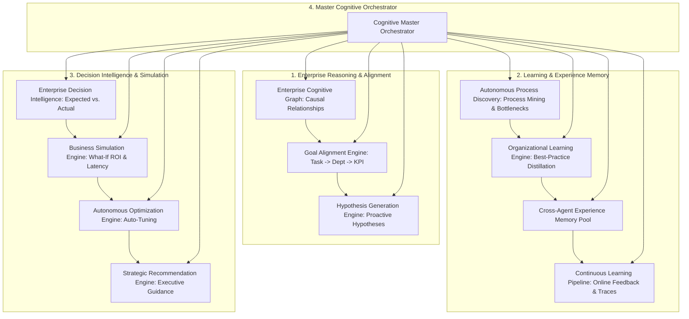

# Phase 13.22 — Enterprise Cognitive Intelligence & Autonomous Organizational Learning Platform (ECIAOLP)
## Architectural Blueprint & Technical Specification

---

### Executive Vision

Phase 13.22 elevates the platform into an **Enterprise Cognitive Operating System**. Rather than executing isolated tasks or performing static RAG retrieval, the platform observes, reasons, learns, discovers workflows, generates hypotheses, runs business simulations, aligns goals, and autonomously optimizes across every agent, process, tenant, and business KPI.

---

### Architectural Diagram

---

### Subsystems Breakdown

1. **Enterprise Cognitive Graph Engine (`graph/cognitive_graph_engine.py`)**
   - Multi-hop causal reasoning graph connecting `KPI`, `BUSINESS_GOAL`, `AGENT`, `PROJECT`, `CUSTOMER`, `INCIDENT`, `WORKFLOW`, `POLICY`, `RISK`, `DECISION`, and `HYPOTHESIS`.
   - Causal edges: `caused_by`, `influences`, `depends_on`, `contradicts`, `recommends`, `improves`, `blocked_by`, `validates`, `predicts`.

2. **Organizational Learning Engine (`learning/organizational_learning_engine.py`)**
   - Continuously mines agent execution histories to identify highest-performing patterns and distill new organizational SOPs without human intervention.

3. **Cross-Agent Experience Memory (`experience/cross_agent_experience_memory.py`)**
   - Universal enterprise experience pool enabling instant zero-shot knowledge and trace transfer across all running agent pods.

4. **Autonomous Process Discovery Engine (`process_discovery/process_discovery_engine.py`)**
   - Process mining engine that reconstructs end-to-end workflows from execution logs, detects delays, and isolates critical-path bottlenecks.

5. **Enterprise Decision Intelligence (`decision/enterprise_decision_intelligence.py`)**
   - Structured decision ledger recording rationale, alternatives, confidence, and calibrated expected vs. actual outcomes.

6. **Hypothesis Generation Engine (`hypothesis/hypothesis_generation_engine.py`)**
   - Proactive engine deriving operational hypotheses, impact areas, confidence scores, and concrete suggested actions.

7. **Business Simulation Engine (`simulation/business_simulation_engine.py`)**
   - Multi-variable "what-if" simulation modeling latency, cost, and business ROI across architectural and model changes.

8. **Autonomous Optimization Engine (`optimization/autonomous_optimization_engine.py`)**
   - Continuous self-tuning across prompts, model routing, worker fleet concurrency, and embedding caches.

9. **Goal Alignment Engine (`alignment/goal_alignment_engine.py`)**
   - Multi-tier alignment hierarchy mapping Task -> Agent -> Department Goal -> Business Goal -> Corporate KPI.

10. **Strategic Recommendation Engine (`recommendations/strategic_recommendation_engine.py`)**
    - Executive-level strategic guidance covering automation, hiring, risk prevention, budget, and model upgrades.

11. **Continuous Learning Pipeline (`pipeline/continuous_learning_pipeline.py`)**
    - Online learning loop refining prompts, routing, and memory policies without altering foundation model weights.

12. **Cognitive Master Orchestrator (`runtime/cognitive_master_orchestrator.py`)**
    - Unified facade coordinating all cognitive and organizational learning pipelines.
