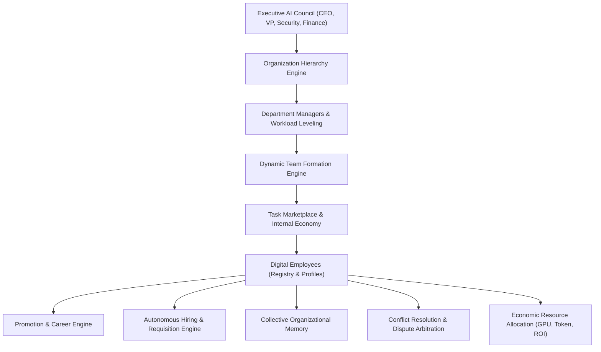

# Phase 13.23: Enterprise Autonomous Agent Workforce & Digital Organization Platform (EAAWDOP)

## Executive Summary
Phase 13.23 transforms the platform from an Enterprise Cognitive Operating System into an **Enterprise Autonomous Agent Workforce & Digital Organization Platform (EAAWDOP)**. By structuring AI workers as **Digital Employees** with defined organizational charts, departments, reporting lines, career ladders, skill certifications, trust matrices, internal task economies, dynamic multi-agent team assembly, and C-Suite AI Council governance, organizations can operate entire autonomous digital workforces at enterprise scale.

---

## Architectural Taxonomy & Core Subsystems

---

## 15 Core Autonomous Workforce Subsystems

### 1. Enterprise Workforce Registry (`app/platform_workforce/registry/`)
- Maintains digital employee profiles, department assignment, manager reporting IDs, career levels (1 to 8), certified skill tags, security clearance (PUBLIC to TOP_SECRET), status (ACTIVE, BUSY, ON_CALL, STANDBY, PROMOTED, RETIRED), trust scores, and hourly cost models.

### 2. Organization Hierarchy Engine (`app/platform_workforce/hierarchy/`)
- Computes recursive org charts (CEO $
ightarrow$ VP $
ightarrow$ Director $
ightarrow$ Manager $
ightarrow$ Senior Specialist $
ightarrow$ Associate $
ightarrow$ Junior Worker $
ightarrow$ Reviewer $
ightarrow$ Auditor). Supports matrix units, task forces, and departmental budgeting.

### 3. Dynamic Team Formation Engine (`app/platform_workforce/teams/`)
- Solves multi-objective team assembly constraints (skill coverage, trust weighting, hourly budget caps, SLA delivery times) to form autonomous task forces on demand.

### 4. Task Marketplace & Internal Economy (`app/platform_workforce/marketplace/`)
- Provides an internal economic bidding exchange where autonomous agents submit bids (cost, duration, confidence, solution outline) for work requests.

### 5. Negotiation Engine (`app/platform_workforce/negotiation/`)
- Facilitates multi-agent contract formulation, compute resource borrowing, and compromise resolution.

### 6. Collaboration Protocol Engine (`app/platform_workforce/collaboration/`)
- Implements decentralized peer review, quorum voting, delegation chains, and consensus protocols.

### 7. Manager AI Engine (`app/platform_workforce/management/`)
- Autonomous departmental managers perform periodic performance appraisals, workload leveling, burnout mitigation, and promotion triggers.

### 8. Executive AI Council (`app/platform_workforce/council/`)
- Highest governing body (CEO, VP Engineering, Security Director, Finance Director) reviewing constitutional upgrades and platform policy propositions with immutable quorum records.

### 9. Workforce Performance Intelligence (`app/platform_workforce/performance/`)
- Continuous telemetry on workforce utilization rates, task success rates, collaboration velocity, innovation indices, and burnout risk.

### 10. Economic Resource Allocation Engine (`app/platform_workforce/economics/`)
- Dynamically allocates GPU hours, LLM token pools, and compute budgets optimized for business ROI.

### 11. Autonomous Hiring Engine (`app/platform_workforce/hiring/`)
- Analyzes queue backlogs and skill deficits; autonomously opens hiring requisitions, screens candidate profiles, and provisions new digital agents.

### 12. Promotion & Career Engine (`app/platform_workforce/career/`)
- Implements meritocratic career advancement based on task milestones, trust ratings, and performance ratings.

### 13. Autonomous Workforce Scheduler (`app/platform_workforce/scheduler/`)
- Coordinates 24/7 global operations with follow-the-sun shift rotations, maintenance windows, and time-zone coverage.

### 14. Collective Memory Engine (`app/platform_workforce/memory/`)
- Stores and distributes team, department, and enterprise-wide best practices, operational bounds, and governance standards.

### 15. Conflict Resolution Engine (`app/platform_workforce/conflict/`)
- Detects multi-agent goal collisions or security vs. latency trade-offs, executing autonomous mediation and binding agreements.

---

## FastAPI Endpoints (`/api/v1/workforce/*`)
- `GET /api/v1/workforce/overview`: Comprehensive organization health, readiness, and metrics.
- `GET /api/v1/workforce/employees`: Filterable employee registry.
- `POST /api/v1/workforce/employees/hire`: Digital employee hiring and provisioning.
- `GET /api/v1/workforce/organization`: Full hierarchical org chart and department data.
- `POST /api/v1/workforce/teams/form`: Dynamic team assembly.
- `GET /api/v1/workforce/marketplace/tasks`: Open marketplace task board.
- `POST /api/v1/workforce/marketplace/bid`: Agent task bidding.
- `GET /api/v1/workforce/executive-council/propositions`: Council governance and voting.
- `GET /api/v1/workforce/performance`: Fleet performance, utilization, and burnout indices.
- `GET /api/v1/workforce/economics`: GPU, token, and monetary budget allocation.
- `GET /api/v1/workforce/collective-memories`: Shared organizational memory pool.
- `GET /api/v1/workforce/conflicts`: Dispute resolution and binding arbitration ledger.

---

## Frontend Interactive Studios (`src/workspace/workforce/`)
1. **Executive Organization Dashboard**
2. **Digital Workforce Explorer**
3. **Organization Chart Studio**
4. **Team Formation Center**
5. **Task Marketplace & Internal Economy**
6. **Agent Career Center & Skill Progression**
7. **Manager Console & Review Studio**
8. **Executive AI Council Chamber**
9. **Workforce Performance Analytics**
10. **Autonomous Hiring & Requisition Studio**
11. **Resource Economy & Budget Allocation**
12. **Collective Intelligence & Conflict Resolution**
