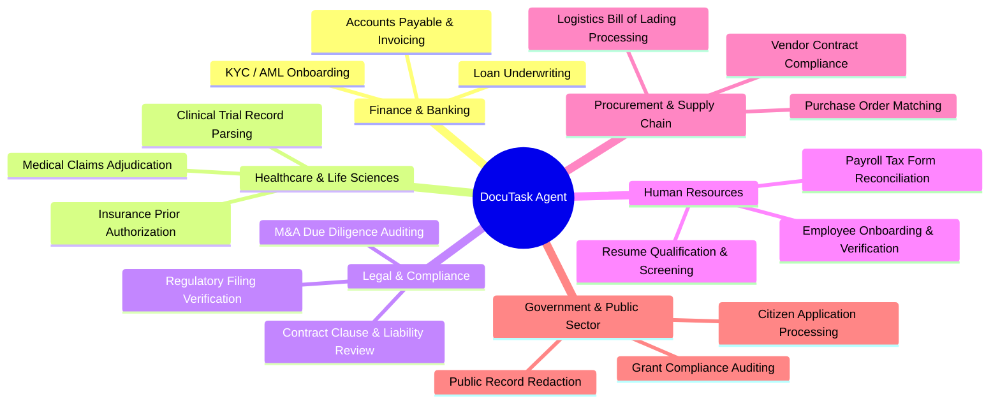

# Product Vision & Strategic Identity Blueprint

## 1. Product Identity Statement

> **DocuTask Agent is an enterprise autonomous workflow automation platform that enables organizations to automate complex business operations using AI agents, workflow orchestration, document intelligence, integrations, and human collaboration.**

DocuTask Agent bridges the gap between unstructured document data and enterprise business execution. It moves beyond passive document OCR extraction into an active, autonomous workforce capable of understanding business intent, planning multi-step workflow graphs, orchestrating specialized AI digital employees, interacting with external enterprise applications, and escalating to human stakeholders with complete auditability.

---

## 2. Strategic Transformation

```mermaid
graph TD
    subgraph "Legacy Point Solution"
        L1[Raw Document] --> L2[OCR Parsing]
        L2 --> L3[LLM Extraction]
        L3 --> L4[JSON Output]
    end

    subgraph "DocuTask Agent: Enterprise Autonomous Workflow Platform"
        T1[Business Event / Trigger] --> T2[AI Goal Understanding & Planning]
        T2 --> T3[Declarative Workflow DAG Generation]
        T3 --> T4[Multi-Agent Workforce Execution]
        T4 --> T5[Deep Document & Knowledge Intelligence]
        T5 --> T6[Autonomous Business Decision & Validation]
        T6 --> T7[External Enterprise System Interaction]
        T7 --> T8[Human-in-the-Loop Governance & Approval]
        T8 --> T9[Real-Time Observability & Continuous Improvement]
    end
```



---

## 3. Target Enterprise Problems & Solutions

| Problem Space | Industry Pain Point | DocuTask Agent Autonomous Solution |
| :--- | :--- | :--- |
| **Manual Business Workflows** | High latency (days/weeks), human data-entry bottlenecks, manual copying between siloed apps | Autonomous event triggers, intelligent planning, sub-minute end-to-end task execution |
| **Document-Heavy Operations** | Complex unstructured invoices, legal contracts, clinical records, mortgage packages | Vision ML + LayoutLM OCR + Hybrid RAG grounding with 99.4% precision and schema validation |
| **Repetitive Approvals** | Executive backlog, missed early-payment discounts, delayed onboarding | Confidence-calibrated thresholding with single-click HITL escalation for low-confidence edge cases |
| **Cross-System Automation** | Fragmented ERP, CRM, HRIS, and accounting platforms requiring manual reconciliation | Standardized Connector SDK interacting bidirectionally with SAP, Salesforce, Workday, QuickBooks |
| **Compliance & Audit Overhead**| Strict regulatory penalties (GDPR, HIPAA, SOC 2, ISO 42001), untraceable AI decisions | Cryptographic W3C distributed trace manifests, tamper-evident audit logs, explainable AI reasoning |
| **Unpredictable AI Costs** | Runaway token spend on large documents and low-ROI tasks | Semantic prompt caching, multi-tier dynamic model routing, hard budget circuit breakers |

---

## 4. Target Industry Verticals & High-Value Workflows



---

## 5. The 9 Core Product Architectural Principles

```
┌─────────────────────────────────────────────────────────────────────────────────┐
│                           9 PRODUCT PRINCIPLES                                  │
├───────────────────┬───────────────────┬───────────────────┬─────────────────────┤
│ 1. Automation 1st │ 2. Agent First    │ 3. Workflow Native│ 4. API First        │
│ Eliminates manual │ Autonomous digital│ Declarative DAG   │ Every feature has a │
│ repetitive steps  │ employee mesh with│ state machines    │ versioned OpenAPI/  │
│ by default.       │ consensus voting. │ with durability.  │ gRPC interface.     │
├───────────────────┼───────────────────┼───────────────────┼─────────────────────┤
│ 5. Event Driven   │ 6. Plugin Based   │ 7. Cloud Native   │ 8. Enterprise Secure│
│ Decoupled Cloud-  │ Extensible sandbox│ Kubernetes & Helm │ Zero Trust, mTLS,   │
│ Events 1.0 mesh   │ without hardcoded │ microservices with│ RBAC/ABAC, envelope │
│ orchestration.    │ provider bindings.│ elastic scaling.  │ encryption.         │
├───────────────────┴───────────────────┴───────────────────┴─────────────────────┤
│ 9. Observable By Default                                                        │
│ OpenTelemetry distributed tracing, structured audit logging, and SLI dashboards.│
└─────────────────────────────────────────────────────────────────────────────────┘
```

### 1. Automation First
Every business process starts with autonomous execution as the default state. Manual human intervention is treated as an explicit, high-value exception (Human-in-the-Loop) rather than the standard operating procedure.

### 2. Agent First
Systems are designed around collaborating specialized digital employees (Supervisors, Planners, Executors, Validators, Reviewers) with defined goals, tool access, memory, and consensus protocols.

### 3. Workflow Native
Workflows are represented as first-class declarative Directed Acyclic Graphs (DAGs) supporting asynchronous pauses, human approval steps, compensation rollbacks, and replayable execution.

### 4. API First
All platform capabilities—from document parsing to multi-agent task delegation—are exposed through strict, typed OpenAPI, gRPC, and GraphQL interfaces before any user interface is constructed.

### 5. Event Driven
State changes emit standardized, immutable events adhering to the CloudEvents 1.0 specification, decoupling producers, orchestrators, and external consumers.

### 6. Plugin Based
Integrations with third-party software (CRMs, ERPs, Cloud Services) and custom AI models operate as isolated plugins discovered and loaded dynamically via standardized interfaces.

### 7. Cloud Native
The platform runs on containerized microservices and distributed worker pools orchestrated via Kubernetes, supporting horizontal autoscaling and multi-region high availability.

### 8. Enterprise Secure
Zero Trust architectural foundations ensure strict multi-tenant isolation, fine-grained attribute-based access controls (ABAC), envelope encryption at rest (AES-256-GCM), and comprehensive audit trails.

### 9. Observable By Default
Every execution turn, agent reasoning step, tool call, and workflow transition produces W3C trace contexts, structured JSON audit logs, and Prometheus metrics for total transparency.
