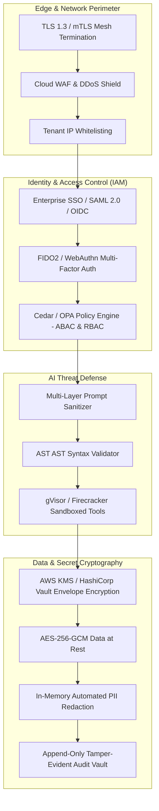

# Enterprise Security & Zero-Trust Governance Model

## 1. Zero-Trust Security Architecture



---

## 2. Authentication & Federation Architecture

- **SAML 2.0 & OIDC Federation**: Direct integration with Okta, Microsoft Entra ID (Azure AD), Ping Identity, and Google Workspace.
- **Short-Lived Signed JWTs**: Access tokens expire in 15 minutes; refreshed via HTTP-only secure cookie refresh tokens with sliding session expiration.
- **Service-to-Service mTLS**: Internal microservices communicate strictly over mutual TLS (mTLS) with SPIFFE/SPIRE cryptographic identities.

---

## 3. Policy-Based Authorization (RBAC & ABAC)

DocuTask Agent decouples authorization logic into a dedicated Policy Engine using the **Cedar** / **Open Policy Agent (OPA)** policy language:

```cedar
// Enterprise Cedar Authorization Policy Example
permit (
    principal in Role::"FinanceOperator",
    action in [Action::"view_invoice", Action::"edit_line_item"],
    resource in Document::"Invoice"
)
when {
    principal.organization_id == resource.organization_id &&
    principal.workspace_id == resource.workspace_id &&
    resource.confidentiality_level != "C-SUITE_ONLY"
};

forbid (
    principal,
    action in [Action::"approve_payment"],
    resource in Document::"Invoice"
)
when {
    resource.total_amount > 50000.0 &&
    !(principal in Role::"FinanceDirector")
};
```

---

## 4. AI Security & Adversarial Threat Defenses

| Threat Vector (OWASP LLM Top 10) | Enterprise Defense Mechanism |
| :--- | :--- |
| **LLM01: Prompt Injection** | Dual-model input classifier + strict boundary token framing + AST syntax analysis |
| **LLM02: Sensitive Data Disclosure** | In-memory regex and NER PII redactor scrubs SSNs, credit cards, and PHI before vector storage |
| **LLM06: Excessive Agency** | Sandboxed tool execution; critical actions (> \$10k, data deletion) require mandatory Human Approval |
| **LLM07: System Prompt Leakage** | Output guardrails intercept and redact internal agent instructions and system prompts |

---

## 5. Cryptography & Audit Controls

- **Envelope Encryption**: Document blobs and database columns encrypted with unique Data Encryption Keys (DEKs) wrapped by an organization-specific Key Encryption Key (KEK) in Vault / AWS KMS.
- **Cryptographic Audit Vault**: Audit events form an immutable SHA-256 Merkle tree block structure, preventing retrospective log tampering.
- **Compliance Alignment**: Architecturally certified for SOC 2 Type II, ISO 27001, HIPAA Security Rule, and EU GDPR Article 25 (Privacy by Design).
