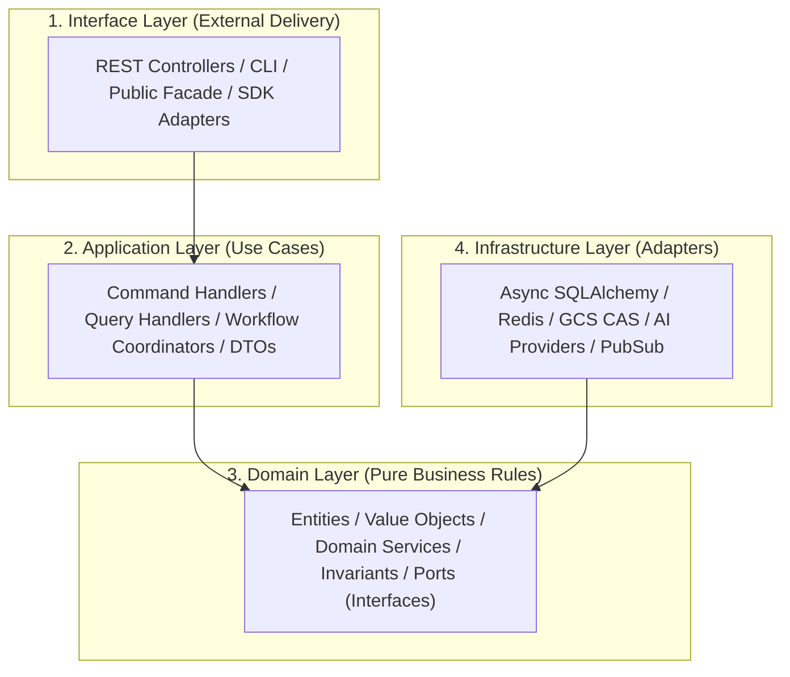
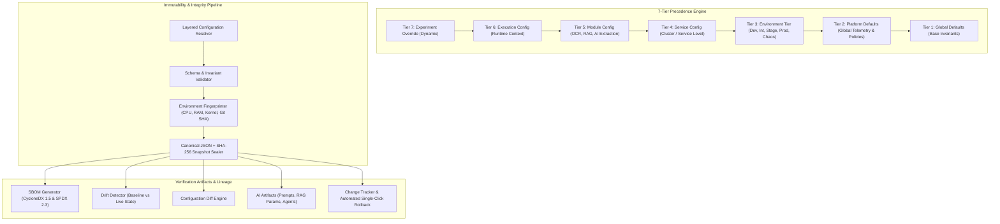
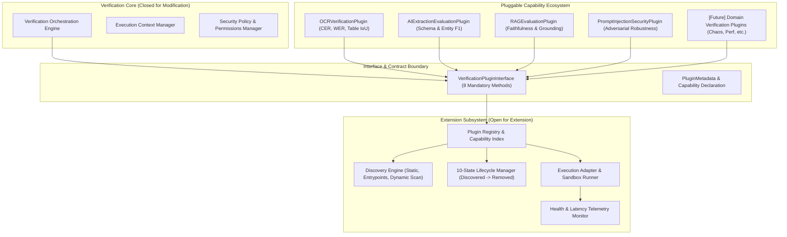
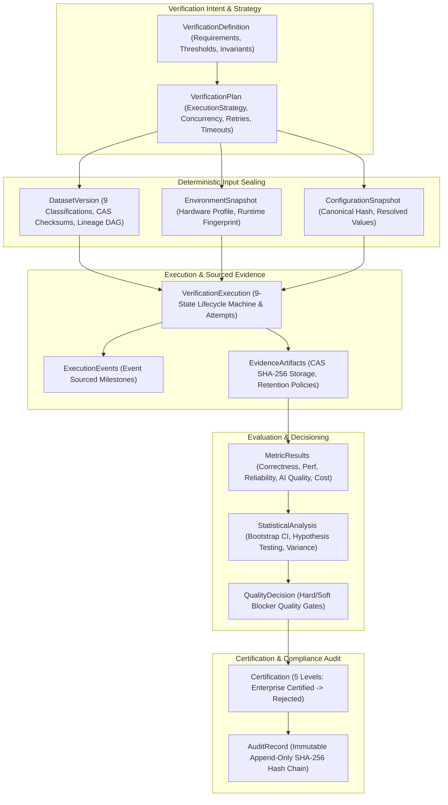

# Enterprise Verification Platform — Repository & Module Architecture Blueprint

## 1. Executive & Architectural Vision
The **Enterprise Verification Platform** of DocuTask Agent serves as the foundational verification backbone for deterministic software invariants and probabilistic AI evaluations. It is designed to scale across hundreds of verification modules, thousands of automated tests, multiple engineering squads, and decades of platform evolution.

---

## 2. High-Level Repository Organization (Organized by Business Capability)

```
app/platform_verification/
├── shared_kernel/              # Reusable enterprise primitives (Zero domain logic)
│   ├── result.py               # Railway-oriented Result, Either, Option types
│   ├── identifiers.py          # Strongly-typed IDs (CorrelationId, ExecutionId, TenantId)
│   ├── clock.py                # Time/Clock abstractions (SystemClock, VirtualClock)
│   ├── pagination.py           # Generic PaginationQuery and PaginatedResult
│   ├── filtering.py            # SearchQuery, FilterCriteria, and SortOrder
│   ├── exceptions.py           # Strongly-typed Domain & Invariant Exceptions
│   ├── retry.py                # RetryPolicy, ExponentialBackoff, CircuitBreaker
│   ├── flags.py                # Multi-tenant Feature Flag abstractions
│   ├── security.py             # Canonical SHA-256 Hasher & HMAC-SHA256 Signer
│   └── events.py               # BaseEvent, DomainEvent, IntegrationEvent metadata
│
├── configuration/              # Multi-scoped Configuration Architecture
│   ├── scopes.py               # GLOBAL, ENVIRONMENT, MODULE, EXECUTION, EXPERIMENT, OVERRIDE
│   ├── schemas.py              # Pydantic v2 execution, storage, and security schemas
│   └── manager.py              # Layered resolver with SHA-256 config freezing
│
├── events/                     # Event Architecture
│   ├── bus.py                  # In-memory async event bus with DLQ & filter routing
│   ├── domain_events.py        # Versioned internal domain lifecycle events
│   ├── integration_events.py   # Cross-subsystem integration events
│   └── audit_events.py         # Cryptographic audit ledger events
│
├── modules/                    # Bounded Contexts (Hexagonal / Clean Architecture)
│   ├── core/                   # 12-Stage lifecycle orchestrator & master aggregate
│   ├── datasets/               # 11 dataset categories & synthetic generator
│   ├── metrics/                # Multi-metric computation & statistical analysis
│   ├── evidence/               # SHA-256 Content-Addressable Storage (CAS)
│   ├── quality/                # Composite quality gates & hard/soft blocker policies
│   ├── execution/              # Sequential, Parallel, Async Worker runners
│   ├── audit/                  # Append-only SHA-256 hash-chained audit ledger
│   ├── certification/          # HMAC-SHA256 Certification Authority (CA)
│   ├── reporting/              # Multi-format reports (Technical, Executive, Compliance)
│   ├── traceability/           # Bidirectional Lineage DAG
│   ├── environments/           # 7-tier environment provisioning & readiness probes
│   ├── plugins/                # Sandboxed plugin lifecycle & extension registry
│   ├── ocr/                    # OCR Precision, WER, CER validation suite
│   ├── ai_extraction/          # Schema extraction & entity fidelity validation
│   ├── rag/                    # Retrieval & generation hallucination evaluation
│   ├── agent_orchestration/    # Multi-agent coordination & goal convergence suite
│   ├── security/               # Vulnerability, threat model & compliance validation
│   ├── chaos/                  # Fault injection & resilience verification
│   └── performance/            # P99 latency, throughput & load benchmarking
│
├── components/                 # 15 Core Components (Clean Architecture Facades)
├── crosscutting/               # OpenTelemetry observability & security primitives
├── domain/                     # Core platform domain models & interfaces
├── infrastructure/             # Concrete storage, CA, and event adapters
├── plugins/                    # Production plugin implementations
└── runtime/                    # Master DI container & Enterprise Verification Runtime
```

---

## 3. Strict 4-Layer Hexagonal Internal Module Layout

Every bounded context under `app/platform_verification/modules/<bounded_context>/` strictly isolates responsibilities:



### Dependency Inversion Rules
1. **Allowed**: `Interface` $
ightarrow$ `Application` $
ightarrow$ `Domain` $\leftarrow$ `Infrastructure` (implements Ports).
2. **Forbidden**:
   - `Domain` importing `Infrastructure`, `FastAPI`, `SQLAlchemy`, or `Redis`.
   - `Application` containing SQL queries or concrete cloud SDKs.
   - Circular imports across module boundaries.

---

## 4. Multi-Scoped Configuration Hierarchy


---

## 5. Scalability & Evolution Strategy (10 to 1,000+ Modules)

1. **Independent Module Evolution**: Each verification module encapsulates its own domain models, use cases, repositories, and tests. A change to OCR verification never impacts RAG or Chaos modules.
2. **Zero Core Platform Mutation for Plugins**: New verification modalities integrate solely via `VerificationPluginInterface`.
3. **Microservice / Worktree Extraction Ready**: Any bounded context can be extracted into an independent microservice or separate package by swapping the in-memory repository adapter with an HTTP/gRPC client without modifying application use cases or domain entities.
---

## 6. Configuration, Versioning & Dependency Management Architecture (EV-CVDM)

Part 1.1E establishes the control and reproducibility layer for the entire verification platform. Every verification execution is deterministically anchored to an exact configuration snapshot, pinned dependency bill of materials, AI artifact version lineage, and hardware/software environment fingerprint.



### Key Architectural Guarantees:
1. **Canonical Determinism**: All resolved configurations are normalized, sorted, and serialized into canonical JSON to produce a cryptographic SHA-256 fingerprint.
2. **AI Artifact Lineage**: Prompts, temperature bounds, context window settings, and RAG chunking parameters are version-pinned and hashed.
3. **Supply Chain Traceability**: Real-time CycloneDX 1.5 and SPDX 2.3 Software Bill of Materials (SBOM) generation covering all runtime, system, AI model, and database dependencies.
4. **Zero-Drift Invariant**: Continuous comparison of live configurations against certified baseline snapshots with instant detection of unauthorized parameter or model mutations.
5. **Single-Click Rollback**: Formal change request governance with automated one-click rollback to previously certified immutable snapshots.
---

## 7. Enterprise Verification Extension Framework, Interfaces & Plugin Architecture (EV-EFIPA)

Part 1.1F establishes the extensibility foundation of the Enterprise Verification Platform, strictly adhering to the **Open-Closed Principle (OCP)**. New verification capabilities across OCR, AI Extraction, RAG, Prompt Injection Security, Performance, and Chaos can be seamlessly added as independent, sandboxed plugins through standard interfaces without mutating core platform code.



### Key Architectural Pillars:
1. **Interface-First Contract**: All verification plugins implement `VerificationPluginInterface` exposing `initialize()`, `validate()`, `configure()`, `execute()`, `collect_evidence()`, `calculate_metrics()`, `cleanup()`, and `health_check()`.
2. **Capability-Based Dynamic Discovery**: Plugins declare fine-grained capabilities (e.g., `character_error_rate`, `faithfulness_scoring`, `prompt_injection_detection`) indexed dynamically by the registry.
3. **10-State Lifecycle Machine**: Complete state tracking (`DISCOVERED` $
ightarrow$ `VALIDATED` $
ightarrow$ `REGISTERED` $
ightarrow$ `INITIALIZED` $
ightarrow$ `READY` $
ightarrow$ `EXECUTING` $
ightarrow$ `PAUSED` $
ightarrow$ `DISABLED` $
ightarrow$ `FAILED` $
ightarrow$ `REMOVED`) with observable audit trails.
4. **Sandboxed Execution Adapter**: Isolated execution wrapper enforcing timeouts, memory/CPU quotas, security permissions (`READ_DATASET`, `ACCESS_MODEL`, `WRITE_EVIDENCE`), exception isolation, and metrics collection.
5. **Standardized Developer Experience**: Scaffolding generators (`generate_plugin_scaffold()`), contract linters (`PluginContractValidator`), and automated Markdown documentation generators.
---

## 8. Enterprise Verification Domain Model & Persistence Architecture (Part 1.2 — EV-DMDA)

Part 1.2 defines the enterprise business domain language, data model, and persistence architecture for the DocuTask Agent verification ecosystem. It models the complete provenance graph linking verification objectives to final certifications.



### Key Architectural Invariants:
1. **Unbroken Provenance Chain**: Every execution record requires foreign keys to its exact `definition_id`, `plan_id`, `dataset_version_id`, `environment_snapshot_id`, and `configuration_snapshot_id`.
2. **9 Dataset Classifications**: Comprehensive categorization into `HAPPY_PATH`, `BOUNDARY`, `NEGATIVE`, `ADVERSARIAL`, `REGRESSION`, `STRESS`, `SYNTHETIC`, `PRODUCTION_SNAPSHOT`, and `BENCHMARK`.
3. **5 High-Impact Metric Categories**: Strictly separated into `CORRECTNESS`, `PERFORMANCE`, `RELIABILITY`, `AI_QUALITY`, and `COST`.
4. **Statistical Rigor**: Continuous calculation of mean, sample variance, standard deviation, and bootstrap confidence intervals.
5. **5-Level Certification Hierarchy**: `ENTERPRISE_CERTIFIED` $
ightarrow$ `PRODUCTION_READY` $
ightarrow$ `CONDITIONALLY_READY` $
ightarrow$ `DEVELOPMENT_QUALITY` $
ightarrow$ `REJECTED`.
6. **Immutable Hash-Chained Audit Ledger**: Cryptographic chaining $H_n = 	ext{SHA256}(H_{n-1} \parallel 	ext{Payload}_n)$ providing verifiable tamper detection.

---

## 10. Part 1.1B: Enterprise Verification Core Components & Responsibility Model

The platform is structured into **16 specialized core components** operating under strict Single Responsibility Principle (SRP) with zero cross-component logic leaks:

```mermaid
graph TD
    VO[1. VerificationOrchestrator] --> VR[2. VerificationRegistry]
    VO --> VDM[3. VerificationDefinitionManager]
    VO --> VEE[4. VerificationExecutionEngine]
    VO --> DM[5. DatasetManager]
    VO --> EM[6. EnvironmentManager]
    VO --> CM[7. ConfigurationManager]
    VO --> EVI[8. EvidenceManager]
    VO --> ME[9. MetricsEngine]
    VO --> SAE[10. StatisticalAnalysisEngine]
    VO --> QGE[11. QualityGateEngine]
    VO --> CE[12. CertificationEngine]
    VO --> RE[13. ReportingEngine]
    VO --> AM[14. AuditManager]
    VO --> TM[15. TraceabilityManager]
    VO --> PM[16. PluginManager]
```



### Component Responsibility Matrix

| # | Component Name | Primary Architectural Responsibility | Invariants & Anti-Patterns Enforced |
|---|----------------|--------------------------------------|-------------------------------------|
| 1 | `VerificationOrchestrator` | Lifecycle state transitions, timeouts, sequencing across 12-16 stages | **Never** computes metrics, stores evidence, or evaluates quality gates |
| 2 | `VerificationRegistry` | Dynamic discovery, indexing, SemVer tracking & capability catalog | **Never** executes verification tasks or manages lifecycle state |
| 3 | `VerificationDefinitionManager` | Formal verification specifications, requirements, and invariant definitions | **Never** modifies runtime configurations or resolves datasets |
| 4 | `VerificationExecutionEngine` | Sync, async, parallel, and distributed worker execution in isolated sandboxes | **Never** issues certificates, renders reports, or mutates specifications |
| 5 | `DatasetManager` | 11 dataset classes, SHA-256 fingerprinting, content-addressable storage, lineage | **Never** executes inference models or makes quality pass/fail decisions |
| 6 | `EnvironmentManager` | 7 environment tiers, hardware profiling, dependency readiness checks | **Never** provisions business data or alters verification rules |
| 7 | `ConfigurationManager` | 7-tier hierarchical resolution, schema validation, immutable frozen snapshots | **Never** executes tasks or bypasses configuration locks |
| 8 | `EvidenceManager` | Content-Addressable Storage (CAS), 4 retention tiers, cryptographic sealing | **Never** alters evidence payloads; strictly append-only CAS |
| 9 | `MetricsEngine` | Dimensional metric aggregation (Correctness, Performance, Reliability, AI Quality, Cost) | **Never** makes quality gate pass/fail decisions or issues certificates |
| 10 | `StatisticalAnalysisEngine` | Bootstrap 95% CI, variance, standard deviation, drift detection, hypothesis testing | **Never** evaluates single-run anomalies without statistical confidence ($N \ge 5$) |
| 11 | `QualityGateEngine` | Policy-based gate evaluations, hard/soft blockers, composite scoring | **Never** captures evidence or alters metric calculations |
| 12 | `CertificationEngine` | Compliance certifications, SHA-256 digital signatures, expiration & revocation | **Never** computes raw performance or runs verification workloads |
| 13 | `ReportingEngine` | 7 stakeholder report formats (Technical, Executive, Compliance, Benchmark, etc.) | **Never** stores primary evidence or alters quality scores |
| 14 | `AuditManager` | Cryptographic append-only hash-chained ledger: $H_n = \text{SHA256}(H_{n-1} \parallel \text{Payload}_n)$ | **Never** permits modification or deletion of past audit records |
| 15 | `TraceabilityManager` | Bidirectional provenance DAG: Objective $\leftrightarrow$ Requirement $\leftrightarrow$ Spec $\leftrightarrow$ Run $\leftrightarrow$ Cert | **Never** breaks lineage chains; strictly validates bidirectional links |
| 16 | `PluginManager` | Extension ecosystem, sandboxed isolation, capability-based dispatch | **Never** bypasses core verification contracts or security constraints |

### Cryptographic Hash-Chained Audit Ledger
Audit records form an unbroken hash chain:
$$H_0 = 0^{64}$$
$$H_n = \text{SHA-256}\left(H_{n-1} \parallel \text{Payload}_n\right)$$
Any mutation to historical records invalidates the entire subsequent chain during `verify_chain_integrity()`.

---

## 11. Enterprise Bounded Contexts & Hexagonal Module Organization (`app/contexts/`)

The platform implements a strict Domain-Driven Design (DDD) Bounded Context topology under `app/contexts/`, isolating domain logic, entities, value objects, ports, adapters, and application services across **12 dedicated Bounded Contexts**:

```
app/
├── shared_kernel/          # Reusable primitives (Result, TypedId, TimeProvider, EventBus, CorrelationContext)
├── infrastructure/
│   └── acl/                # Anti-Corruption Layers (GeminiAiAntiCorruptionLayer, OcrEngineAntiCorruptionLayer)
└── contexts/
    ├── runtime.py          # Unified Bounded Contexts Master Runtime
    ├── verification/       # Context 1: Definitions, requirements, invariants, verification plans
    ├── execution/          # Context 2: Execution lifecycle, retries, attempts, sandbox isolation
    ├── datasets/           # Context 3: Datasets (11 classes), versioning, CAS hashes, lineage
    ├── environments/       # Context 4: 7-tier environments, fingerprints, readiness probes
    ├── configuration/      # Context 5: 7-tier resolution, schema validation, immutable snapshots
    ├── evidence/           # Context 6: CAS artifact storage, 4 retention tiers, cryptographic sealing
    ├── metrics/            # Context 7: 5-dimensional metrics computation & aggregation
    ├── statistics/         # Context 8: Bootstrap 95% CI, p-value baseline testing, stddev, variance
    ├── quality/            # Context 9: Quality gates, evaluation policies, hard/soft blockers
    ├── certification/      # Context 10: Digital signatures, compliance certificates, revocation
    ├── audit/              # Context 11: Cryptographic hash-chained immutable audit ledger
    └── plugins/            # Context 12: Dynamic plugin discovery, capabilities, sandboxed execution
```

### Standard 4-Layer Hexagonal Architecture Per Context
Every bounded context maintains the strict internal 4-layer layout:
- `domain/`: Entities, Value Objects, Domain Events, Invariants, Repository Interfaces (Ports).
- `application/`: Commands, Queries, Application Services, DTOs, Use Case Handlers.
- `infrastructure/`: Database repositories, concrete storage adapters, external connectors.
- `interfaces/`: Public facades, API controllers, ingress endpoints.
- `contracts.py`: Published interface schemas and event contracts for inter-context communication.

### Anti-Corruption Layer (ACL) Isolation
Third-party vendor SDKs (Google Gemini API, Tesseract/EasyOCR engines) are encapsulated within `app/infrastructure/acl/`:
- `GeminiAiAntiCorruptionLayer`: Translates Gemini responses and errors into domain models (`AiInferenceResponse`, `AiModelEvaluationRecord`), isolating domain logic from upstream SDK breaking changes.
- `OcrEngineAntiCorruptionLayer`: Translates OCR outputs, bounding boxes, and confidence scores into standardized `OcrExtractionResult` and `OcrPageExtraction` domain records.

### Inter-Context Decoupling & Domain Event Bus
Bounded contexts NEVER import internal domain or infrastructure layers from other contexts. Cross-context coordination is achieved through:
1. Asynchronous domain events published onto the `EventBus` (`app/shared_kernel/events.py`).
2. Published typed contracts defined in `contracts.py` per context.


