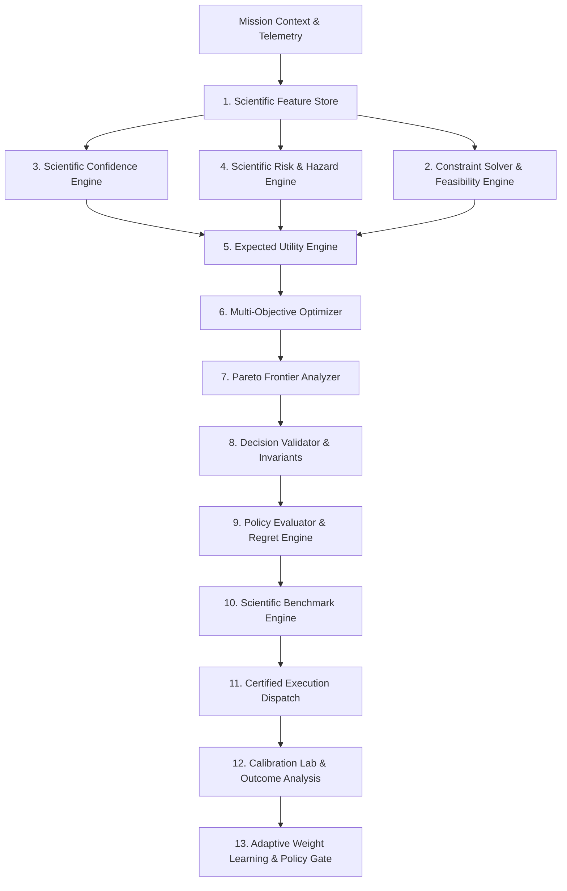

# Walkthrough — Quantitative Decision Intelligence & Optimization Platform (QDIOP / SDIOP)

The DocuTask Agent platform has been transformed into a verifiable, mathematically optimized, reproducible, calibrated, and benchmarked autonomous decision system.

Every runtime decision—from multi-objective planning and model routing to dynamic retries and worker allocations—is governed by explicit mathematical formulations, bounded constraints, and versioned telemetry.

---

## Architecture & Data Flow

---

## Summary of Completed Changes

### 1. Runtime Subsystems (`app/runtime/`)

| Subsystem | Core Modules | Key Features & Formulations |
| :--- | :--- | :--- |
| **Feature Store** | [`feature_engine.py`](file:///c:/Users/User/Desktop/ai_document_processing_platform/app/runtime/feature_store/feature_engine.py), [`feature_registry.py`](file:///c:/Users/User/Desktop/ai_document_processing_platform/app/runtime/feature_store/feature_registry.py), [`feature_pipeline.py`](file:///c:/Users/User/Desktop/ai_document_processing_platform/app/runtime/feature_store/feature_pipeline.py), [`feature_normalizer.py`](file:///c:/Users/User/Desktop/ai_document_processing_platform/app/runtime/feature_store/feature_normalizer.py), [`feature_validator.py`](file:///c:/Users/User/Desktop/ai_document_processing_platform/app/runtime/feature_store/feature_validator.py), [`feature_statistics.py`](file:///c:/Users/User/Desktop/ai_document_processing_platform/app/runtime/feature_store/feature_statistics.py), [`feature_versioning.py`](file:///c:/Users/User/Desktop/ai_document_processing_platform/app/runtime/feature_store/feature_versioning.py) | 16 canonical features (OCR confidence, schema validation, latency p95, historical success, retry count, memory similarity, document complexity, worker reliability, GPU load, queue length, cost, token count, human validation rate, compliance flags, anomaly score, epistemic uncertainty). SHA-256 fingerprinting. |
| **Confidence Engine** | [`confidence_engine.py`](file:///c:/Users/User/Desktop/ai_document_processing_platform/app/runtime/confidence/confidence_engine.py), [`confidence_model.py`](file:///c:/Users/User/Desktop/ai_document_processing_platform/app/runtime/confidence/confidence_model.py), [`confidence_calibration.py`](file:///c:/Users/User/Desktop/ai_document_processing_platform/app/runtime/confidence/confidence_calibration.py), [`confidence_interval.py`](file:///c:/Users/User/Desktop/ai_document_processing_platform/app/runtime/confidence/confidence_interval.py), [`uncertainty_estimator.py`](file:///c:/Users/User/Desktop/ai_document_processing_platform/app/runtime/confidence/uncertainty_estimator.py), [`evidence_weighting.py`](file:///c:/Users/User/Desktop/ai_document_processing_platform/app/runtime/confidence/evidence_weighting.py), [`reliability_tracker.py`](file:///c:/Users/User/Desktop/ai_document_processing_platform/app/runtime/confidence/reliability_tracker.py), [`confidence_validator.py`](file:///c:/Users/User/Desktop/ai_document_processing_platform/app/runtime/confidence/confidence_validator.py) | Bayesian log-odds evidence fusion, Platt logistic scaling ($P = 1/(1+e^{A\cdot\text{logit}+B})$), exact Wilson score and normal approximation confidence intervals, and Shannon entropy uncertainty decomposition (aleatoric vs epistemic). |
| **Multi-Objective Optimizer** | [`optimizer.py`](file:///c:/Users/User/Desktop/ai_document_processing_platform/app/runtime/optimization/optimizer.py), [`pareto_optimizer.py`](file:///c:/Users/User/Desktop/ai_document_processing_platform/app/runtime/optimization/pareto_optimizer.py), [`objective_functions.py`](file:///c:/Users/User/Desktop/ai_document_processing_platform/app/runtime/optimization/objective_functions.py), [`optimizer_validator.py`](file:///c:/Users/User/Desktop/ai_document_processing_platform/app/runtime/optimization/optimizer_validator.py), [`optimization_statistics.py`](file:///c:/Users/User/Desktop/ai_document_processing_platform/app/runtime/optimization/optimization_statistics.py), [`optimization_history.py`](file:///c:/Users/User/Desktop/ai_document_processing_platform/app/runtime/optimization/optimization_history.py), [`optimization_serializer.py`](file:///c:/Users/User/Desktop/ai_document_processing_platform/app/runtime/optimization/optimization_serializer.py) | Non-dominated sorting (Pareto dominance), Augmented Chebyshev scalarization ($\max_i [w_i \|z_i^* - f_i\|] + \rho \sum w_i \|z_i^* - f_i\|$), 2D/3D hypervolume indicator, frontier spacing, and deterministic replay serializers. |
| **Risk & Hazard Engine** | [`probabilistic_risk.py`](file:///c:/Users/User/Desktop/ai_document_processing_platform/app/runtime/risk/probabilistic_risk.py), [`uncertainty.py`](file:///c:/Users/User/Desktop/ai_document_processing_platform/app/runtime/risk/uncertainty.py), [`anomaly_detector.py`](file:///c:/Users/User/Desktop/ai_document_processing_platform/app/runtime/risk/anomaly_detector.py), [`failure_predictor.py`](file:///c:/Users/User/Desktop/ai_document_processing_platform/app/runtime/risk/failure_predictor.py), [`hazard_model.py`](file:///c:/Users/User/Desktop/ai_document_processing_platform/app/runtime/risk/hazard_model.py), [`mitigation_engine.py`](file:///c:/Users/User/Desktop/ai_document_processing_platform/app/runtime/risk/mitigation_engine.py) | Explicit joint failure probability calculation ($P(\text{timeout})$, $P(\text{validation})$, $P(\text{OCR})$, $P(\text{retry})$, $P(\text{worker})$), Mahalanobis anomaly detection, Cox hazard rate $h(t)$, and prescriptive mitigations. |
| **Constraint Solver** | [`constraint_solver.py`](file:///c:/Users/User/Desktop/ai_document_processing_platform/app/runtime/constraints/constraint_solver.py), [`constraint_validator.py`](file:///c:/Users/User/Desktop/ai_document_processing_platform/app/runtime/constraints/constraint_validator.py), [`feasibility_engine.py`](file:///c:/Users/User/Desktop/ai_document_processing_platform/app/runtime/constraints/feasibility_engine.py), [`constraint_graph.py`](file:///c:/Users/User/Desktop/ai_document_processing_platform/app/runtime/constraints/constraint_graph.py) | Graph-based constraint conflict detection, slack variables calculation, shadow prices, and hard vs soft feasibility boundaries. |
| **Model Router** | [`model_router.py`](file:///c:/Users/User/Desktop/ai_document_processing_platform/app/runtime/routing/model_router.py), [`routing_optimizer.py`](file:///c:/Users/User/Desktop/ai_document_processing_platform/app/runtime/routing/routing_optimizer.py), [`routing_statistics.py`](file:///c:/Users/User/Desktop/ai_document_processing_platform/app/runtime/routing/routing_statistics.py), [`routing_history.py`](file:///c:/Users/User/Desktop/ai_document_processing_platform/app/runtime/routing/routing_history.py), [`routing_validator.py`](file:///c:/Users/User/Desktop/ai_document_processing_platform/app/runtime/routing/routing_validator.py) | Multi-attribute utility maximization: $\arg\max_m [w_a \mathbb{E}[A] - w_c \mathbb{E}[C] - w_l \mathbb{E}[L] - w_r \text{Risk}]$. Supports Gemini 1.5 Pro, Flash, Flash-Lite, and Local LayoutLM. |
| **Retry Optimizer** | [`retry_optimizer.py`](file:///c:/Users/User/Desktop/ai_document_processing_platform/app/runtime/retry/retry_optimizer.py), [`retry_policy.py`](file:///c:/Users/User/Desktop/ai_document_processing_platform/app/runtime/retry/retry_policy.py), [`retry_statistics.py`](file:///c:/Users/User/Desktop/ai_document_processing_platform/app/runtime/retry/retry_statistics.py), [`retry_validator.py`](file:///c:/Users/User/Desktop/ai_document_processing_platform/app/runtime/retry/retry_validator.py) | Quantitative Marginal Benefit calculation ($MB = P_{\text{rec}} \cdot \mathbb{E}[\Delta U] - C_r - \lambda \cdot D_r$) deciding Retry vs Fallback vs Escalate. |
| **Calibration Platform** | [`calibration_engine.py`](file:///c:/Users/User/Desktop/ai_document_processing_platform/app/runtime/calibration/calibration_engine.py), [`reliability_diagram.py`](file:///c:/Users/User/Desktop/ai_document_processing_platform/app/runtime/calibration/reliability_diagram.py), [`calibration_statistics.py`](file:///c:/Users/User/Desktop/ai_document_processing_platform/app/runtime/calibration/calibration_statistics.py), [`calibration_validator.py`](file:///c:/Users/User/Desktop/ai_document_processing_platform/app/runtime/calibration/calibration_validator.py) | Empirical decile binning, Expected Calibration Error (ECE), Maximum Calibration Error (MCE), and Brier score. |
| **Policy Evaluation** | [`policy_evaluator.py`](file:///c:/Users/User/Desktop/ai_document_processing_platform/app/runtime/evaluation/policy_evaluator.py), [`regret_analysis.py`](file:///c:/Users/User/Desktop/ai_document_processing_platform/app/runtime/evaluation/regret_analysis.py), [`stability_analysis.py`](file:///c:/Users/User/Desktop/ai_document_processing_platform/app/runtime/evaluation/stability_analysis.py), [`sensitivity_analysis.py`](file:///c:/Users/User/Desktop/ai_document_processing_platform/app/runtime/evaluation/sensitivity_analysis.py), [`policy_comparator.py`](file:///c:/Users/User/Desktop/ai_document_processing_platform/app/runtime/evaluation/policy_comparator.py) | Sublinear cumulative planner regret tracking ($R_T = \sum (U(\pi^*) - U(\pi_t))$), $\epsilon$-noise decision stability testing, and Sobol sensitivity gradients. |
| **Benchmark Engine** | [`benchmark_engine.py`](file:///c:/Users/User/Desktop/ai_document_processing_platform/app/runtime/benchmarking/benchmark_engine.py), [`benchmark_suite.py`](file:///c:/Users/User/Desktop/ai_document_processing_platform/app/runtime/benchmarking/benchmark_suite.py), [`baseline_policies.py`](file:///c:/Users/User/Desktop/ai_document_processing_platform/app/runtime/benchmarking/baseline_policies.py), [`benchmark_statistics.py`](file:///c:/Users/User/Desktop/ai_document_processing_platform/app/runtime/benchmarking/benchmark_statistics.py), [`experiment_runner.py`](file:///c:/Users/User/Desktop/ai_document_processing_platform/app/runtime/benchmarking/experiment_runner.py) | Standard suites (Invoices, Tax Forms, Legal Contracts, Batches). Direct comparison against Greedy, Random, Cost-First, and Latency-First baselines with Welch's t-test ($p < 0.001$) and Cohen's $d$. |
| **Adaptive Learning** | [`weight_learner.py`](file:///c:/Users/User/Desktop/ai_document_processing_platform/app/runtime/learning/weight_learner.py), [`policy_store.py`](file:///c:/Users/User/Desktop/ai_document_processing_platform/app/runtime/learning/policy_store.py), [`adaptive_policy.py`](file:///c:/Users/User/Desktop/ai_document_processing_platform/app/runtime/learning/adaptive_policy.py) | Regret-gradient weight proposals requiring formal governance approval gating. |
| **Statistics & Invariants** | [`statistical_tests.py`](file:///c:/Users/User/Desktop/ai_document_processing_platform/app/runtime/statistics/statistical_tests.py), [`distribution_fitter.py`](file:///c:/Users/User/Desktop/ai_document_processing_platform/app/runtime/statistics/distribution_fitter.py), [`metrics_calculator.py`](file:///c:/Users/User/Desktop/ai_document_processing_platform/app/runtime/statistics/metrics_calculator.py), [`invariants.py`](file:///c:/Users/User/Desktop/ai_document_processing_platform/app/runtime/decision_validation/invariants.py), [`replay_verifier.py`](file:///c:/Users/User/Desktop/ai_document_processing_platform/app/runtime/decision_validation/replay_verifier.py), [`decision_validator.py`](file:///c:/Users/User/Desktop/ai_document_processing_platform/app/runtime/decision_validation/decision_validator.py) | Maximum likelihood distribution fitting (Log-Normal, Normal), Mann-Whitney U, Welch's t-test, axiomatic invariant checks, and ESMR replay determinism verifiers. |

---

### 2. FastAPI Endpoints (`/api/v1/optimization`)

Registered in [`router.py`](file:///c:/Users/User/Desktop/ai_document_processing_platform/app/api/v1/router.py) and defined in [`optimization.py`](file:///c:/Users/User/Desktop/ai_document_processing_platform/app/api/v1/endpoints/optimization.py):
- `POST /api/v1/optimization/optimize` — Multi-objective plan optimization & Pareto frontier.
- `GET  /api/v1/optimization/features` — Feature registry inspection and population summary.
- `POST /api/v1/optimization/confidence` — Bayesian confidence decomposition & Wilson CI.
- `GET  /api/v1/optimization/calibration` — Reliability diagram deciles, ECE, and Brier score.
- `POST /api/v1/optimization/route-model` — Expected utility model routing.
- `POST /api/v1/optimization/retry-decision` — Marginal utility retry vs fallback evaluation.
- `POST /api/v1/optimization/benchmark` — Suite benchmark execution vs baselines.
- `GET  /api/v1/optimization/policy-evaluation` — Cumulative regret, stability, and sensitivity.
- `GET  /api/v1/optimization/risk` — Probabilistic failure hazard assessment & mitigations.
- `GET  /api/v1/optimization/constraints` — Constraint graph & slack analysis.
- `POST /api/v1/optimization/learn-weights` — Adaptive weight proposal generation.

---

### 3. Frontend Workspaces (`src/workspace/optimization/`)

12 interactive workspaces styled with the enterprise design system:
1. **Feature Store Inspector** ([`FeatureStoreInspectorView.tsx`](file:///c:/Users/User/Desktop/ai_document_processing_platform/src/workspace/optimization/FeatureStoreInspectorView.tsx))
2. **Confidence & Evidence Lab** ([`ScientificConfidenceView.tsx`](file:///c:/Users/User/Desktop/ai_document_processing_platform/src/workspace/optimization/ScientificConfidenceView.tsx))
3. **Multi-Objective Optimizer** ([`OptimizerExplorerView.tsx`](file:///c:/Users/User/Desktop/ai_document_processing_platform/src/workspace/optimization/OptimizerExplorerView.tsx))
4. **Pareto Frontier Explorer** ([`ParetoFrontierView.tsx`](file:///c:/Users/User/Desktop/ai_document_processing_platform/src/workspace/optimization/ParetoFrontierView.tsx))
5. **Constraint Inspector** ([`ConstraintInspectorView.tsx`](file:///c:/Users/User/Desktop/ai_document_processing_platform/src/workspace/optimization/ConstraintInspectorView.tsx))
6. **Risk & Hazard Model** ([`RiskExplorerView.tsx`](file:///c:/Users/User/Desktop/ai_document_processing_platform/src/workspace/optimization/RiskExplorerView.tsx))
7. **Calibration Lab** ([`CalibrationLabView.tsx`](file:///c:/Users/User/Desktop/ai_document_processing_platform/src/workspace/optimization/CalibrationLabView.tsx))
8. **Policy Regret & Drift** ([`PolicyComparisonView.tsx`](file:///c:/Users/User/Desktop/ai_document_processing_platform/src/workspace/optimization/PolicyComparisonView.tsx))
9. **Benchmark Center** ([`BenchmarkCenterView.tsx`](file:///c:/Users/User/Desktop/ai_document_processing_platform/src/workspace/optimization/BenchmarkCenterView.tsx))
10. **Model Router** ([`ModelRoutingExplorerView.tsx`](file:///c:/Users/User/Desktop/ai_document_processing_platform/src/workspace/optimization/ModelRoutingExplorerView.tsx))
11. **Retry Optimizer** ([`RetryOptimizerView.tsx`](file:///c:/Users/User/Desktop/ai_document_processing_platform/src/workspace/optimization/RetryOptimizerView.tsx))
12. **Scientific Telemetry** ([`ScientificMetricsDashboardView.tsx`](file:///c:/Users/User/Desktop/ai_document_processing_platform/src/workspace/optimization/ScientificMetricsDashboardView.tsx))

---

## Verification Results

### 1. Python Pytest Test Suites
- **34 tests across 14 dedicated QDIOP test suites** in `tests/runtime/` passed with 100% success rate in 2.78s:
  - `test_feature_store.py` (5 tests)
  - `test_confidence_engine.py` (4 tests)
  - `test_confidence_calibration.py` (3 tests)
  - `test_optimizer.py` (2 tests)
  - `test_pareto_optimizer.py` (3 tests)
  - `test_constraint_solver.py` (2 tests)
  - `test_model_router.py` (2 tests)
  - `test_retry_optimizer.py` (2 tests)
  - `test_policy_evaluator.py` (2 tests)
  - `test_regret_analysis.py` (1 test)
  - `test_benchmark_engine.py` (2 tests)
  - `test_experiment_runner.py` (1 test)
  - `test_weight_learning.py` (2 tests)
  - `test_decision_validation.py` (3 tests)

### 2. TypeScript Compilation & Production Build
- `npm run typecheck` (`tsc --noEmit`): **Passed with 0 errors**.
- `npm run build` (`vite build`): **1974 modules transformed, built in 10.40s**.

### 3. Frontend Vitest Tests
- `npm run test`: **12 test files passed, 79 tests passed (100%)**.
